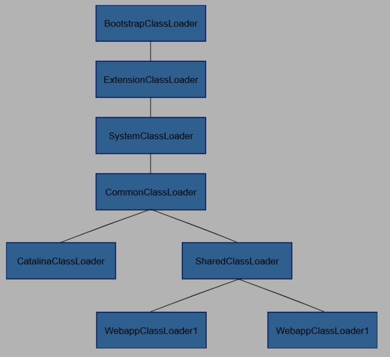

# JVM

## 简要介绍JVM

JVM是Java Virtual Machine（Java虚拟机）的缩写，JVM是一种用于计算设备的规范，它是一个虚构出来的计算机，是通过在实际的计算机上仿真模拟各种计算机功能来实现的。    

引入Java语言虚拟机后，Java语言在**不同平台上运行时不需要重新编译**。Java语言使用**Java虚拟机屏蔽了与具体平台相关的信息**，使得Java语言编译程序**只需生成在Java虚拟机上运行的目标代码（字节码）**，就可以在多种平台上不加修改地运行。  

## 内存划分与OOM
### 内存划分
JVM将其管理的内存划分为以下**七个**区域
* 程序计数器 —— **程序控制流的指示器**，线程私有

* Java虚拟机栈 —— 描述方法执行时的线程内存模型，**方法加载**时创建一个**栈帧**，存储**局部变量表、操作数栈、动态链接、方法出入口**等。其中局部变量表存储**基本数据类型、对象引用（reference类型，指针或句柄）、returnAddress**，他们都以局部变量槽的形式存储。线程私有

* 本地方法栈 —— 对应本地方法，线程私有

* Java堆 —— 存放**对象实例**，GC管理的区域。线程共享

* 方法区 —— 存放**虚拟机加载的类型信息、常量、静态变量、即时编译器编译后的代码缓存**等，JDK8之前在堆上的永久代中，JDK8开始在本地内存上的元空间中。线程共享

* 运行时常量池 —— 方法区的一部分，**存放编译器生成的各种字面量和符号引用**

* 直接内存 —— 堆外内存，不归JVM管理，相当于直接在内存上分配。DirectByteBuffer，NIO。避免在Java堆和Native堆之间复制数据，比较快。

**其实主要就是程序计数器，堆，栈（分为Java方法的和Native方法的），方法区四部分，线程共享的有Java堆，方法区，运行时常量池，直接内存**

### 对象的创建过程

1. 遇到一条new指令，检查指令参数能否在**常量池中定位**到一个类的符号引用，并检查是否已经被加载、解析、初始化
2. 如果找不到，则执行**类加载**
3. 为新生对象**分配内存**。CAS分配保证原子性
4. **初始化**分配的内存全部为零
5. 对对象进行**必要设置**（对象是哪个类的实例，如何找到类的元数据，哈希码，但哈希码实际上lazy了，GC分代设置，存放在对象头中）
6. **执行构造函数**
### OOM
内存相关主要两种异常，StackOverFlow和OutOfMemory，前者是压栈太多，栈存不下栈帧，后者是内存不够  

**OOM的几种场景**  

* **Java堆溢出**：利用-Xms和-Xmx设置成一样的20MB防止堆自动扩展，通过参数-XX:HeapDumpOnOurOfMemoryError让虚拟机在OOM时Dump出当前内存的堆转储快照。不断在堆上分配对象，使其OOM。  
* **方法区和运行时常量池溢出**：JDK7之前：String.intern()方法会将新字符串添加到常量池，并返回对象引用，不断开辟新字符串，则会导致OOM。  
**JDK8开始，字符串常量池移到堆中**，则上面方法不能导致方法区的OOM
* **直接内存溢出**：通过反射Unsafe类，调用其直接分配内存的方法allocateMemory()，导致直接内存溢出。直接内存可通过-XX:MaxDirectMemorySize参数来指定，如果不指定则与Java堆最大值一致。

**StackOverFlow的场景**  

* 虚拟机栈和本地方法栈溢出：-Xss减少栈容量，不断递归调用一个方法，会导致。或者局部变量太大，比如将栈容量设置的很小，然后方法中声明100个long，则也会SOF
## GC与内存分配
### 如何判定对象已死？
#### 引用计数
对象被引用一次，计数器就加一，反之减一。这种方法**很难解决对象循环引用**的问题，比如A引用B，B也引用A，则两者都不会被判定为死亡。
#### 可达性分析
通过**GC Roots**，沿着引用关系向下搜索，若某个对象没有与任何引用链相连，或者说从GC Roots到该对象不可达，则表示该对象没有被使用。  

**GC Roots包括：**

* 虚拟机栈（栈帧中本地变量表）中引用的对象
* 方法区中类静态属性引用的对象
* 方法区中常量引用的对象
* JNI中引用的对象
* Java虚拟机内部引用，如基本类型对应的Class，常驻内存的异常对象，系统类加载器等
* 被synchronized同步锁持有的对象
* 反映Java虚拟机内部情况的JMXBean、JVMTI中注册的回调、本地代码缓存等
* **临时性加入**的，比如分代回收或局部回收时，被其他代或其他部分所引用的对象
#### 引用分级
* 强引用：new出来的，前面的可达性分析所分析的就是强引用，**只要引用存在，就不会被回收**。
* 软引用：SoftReference类，还有用但非必须，**OOM之前会回收**
* 弱引用：WeakReference类，下次**被GC扫描到就死**
* 虚引用：PhantomReference，不影响其生存时间，对象被GC时会收到一个系统通知
#### 自救
对象可以通过复写finalize()方法，在其中给自己挂上一个引用来自救（也叫做逃逸），但finalize只会被调用一次，第二次就会被直接回收。这个方法不需要会。  
#### 回收方法区

**方法区中主要存储虚拟机加载的类型信息，静态变量，常量，即时编译器编译后的代码缓存等**。  

方法区GC主要分为两部分：**废弃的常量、不再使用的类型**  

对于**常量，没有地方在使用这个字面量则被判定废弃**  

对于类，条件比较苛刻：    

* **该类所有实例，以及任何派生子类已被GC**
* **该类的类加载器已被GC**
* **该类的反射Class对象没有被引用，不会在任何地方反射该类或其中的方法**

在Spring等大量使用反射、动态代理、CGLib等字节码框架，动态生成自定义类加载器的场景中，都需要JVM具备类型卸载的能力，以保证不会对方法区造成过大的内存压力。
### 垃圾回收算法
大类上分为引用计数式和追踪式，下面都属于**追踪式**
#### 分代收集理论
大部分GC器都遵循分代收集，其建立在三个分代假说之上：

* 弱分代假说：绝大多数对象朝生夕灭
* 强分代假说：熬过越多次GC的对象就越难消亡
* 跨代引用假说：跨代引用相比同代引用仅占极少数

由此派生了多款GC一致的设计原则：   

* 垃圾收集器应该将Java堆划分出不同区域，将对象**按照其年龄分配到不同区域中存储**
* 每次只回收其中一部分区域 —— Minor GC/Major GC/Full GC，并且根据不同区域以及其中对象的特征安排不同的收集方法：**“标记—复制” “标记—清除” “标记—整理”**
* 一般区分为新生代，老年代。Minor GC面向新生代，Major GC面向老年代，Mixed GC面向整个新生代以及部分老年代（G1），Full GC面向整个Java堆和方法区
* 区域收集时需要向GC Roots中添加其他区域中引用本区域对象的对象，而遍历老年代开销很大，则有了**记忆集**。在新生代建立一个全局数据结构-记忆集，把老年代分成若干小块，**记录老年代中哪一块存在跨代引用**。
#### 标记—清除算法
1. 标记所有需要回收的对象
2. 回收掉所有被标记的对象

此方法会产生大量**内存碎片**。
#### 标记—复制算法
早期有半区复制，先使用一半内存，将活下来的对象复制到另一半，然后直接清除原本的一半内存。这种方法解决了碎片问题，但是一直只能使用50%内存，太浪费。  

后期出现**Appel式回收，沿用至今**：

1. 将内存分为三份：一个较大的Eden和两个较小的Survivor，比例默认是8：1：1
2. 先使用1E+1S，回收时将活着的对象复制到另外一个S上，然后直接清理原本的1E+1S
这种设计的支撑是普通场景下新生代98%的对象会被回收，而发生特殊状况，超过10%的对象没有被回收怎么办？逃生门  

逃生门设计：当Survivor不足以容纳一次MinorGC之后存活的对象，则依赖其他内存区域作为**分配担保**（多数是老年代），超出的对象直接进入老年代。
#### 标记—整理算法
移动式的，老年代存活的对象太多，一般不用这个。  

对象移动是很重的操作，需要**Stop The World**

### 分代原则
JVM将堆内存分为新生代和永久代。  

#### 新生代
新生成的对象优先存放在新生代中，新生代对象朝生夕死，存活率很低，在新生代中，常规应用进行一次垃圾收集一般可以回收70% ~ 95% 的空间，回收效率很高。  

#### 老年代
在新生代中经历了多次（具体看虚拟机配置的阀值）GC后仍然存活下来的对象会进入老年代中。老年代中的对象生命周期较长，存活率比较高，在老年代中进行GC的频率相对而言较低，而且回收的速度也比较慢。  

#### 新生代中的对象什么时候进入老年代
1. 大对象直接进入老年代，JVM提供了一个阈值参数。
2. 新生代对象有一个年龄计数器，每熬过一次GC就年长一岁，到达阈值（默认15岁）之后进入老年代
3. 动态年龄判断：假如当前放对象的Survivor，一批对象的总大小大于这块Survivor内存的50%，那么大于这批对象年龄的对象，就可以直接进入老年代了。无需等待15岁
4. Eden区满时，进行Minor GC，当Eden和一个Survivor区中依然存活的对象无法放入到Survivor中，则通过逃生门、分配担保机制提前转移到老年代中。 

### HotSpot虚拟机GC实现细节
#### 根节点枚举
**所有收集器在枚举GCRoots时都需要Stop The World（暂停用户线程）**，目前可达性分析已经可以与用户线程并发，但根节点枚举必须在一个能保障一致性的快照中进行。

#### 安全点和安全区域
用户线程并不是任何时候都能停下来，需要到达安全点。  

中断方式分为主动式和抢先式（不常用），抢先式就是先全部停掉，然后如果发现有的用户线程不在安全点，则恢复其运行到安全点。  

主动式就是各个线程会主动轮询中断标志，如果发现中断标志为真则在最近的安全点主动挂起。  

安全点有一个问题，就是如果要中断时，某个线程已经处于Sleep状态或者Blocked状态，那么此线程无法响应虚拟机的中断请求，不能走到安全的地方去中断自己，就需要引入安全区域。  

**安全区域是指确保在某一代码片段中引用关系不发生变化，那么在这个区域中GC都是安全的**。线程走到安全区域时，会标识自己在安全区域中，当线程要离开开安全区域时，要检查虚拟机是否完成了根节点枚举或者其他需要STW的过程，如果完成了那么线程就正常运行，否则它就一直等待，直到收到可以离开安全区域的信号为止。  


#### 记忆集与卡表
之前我们说的**为解决跨代引用**，新生代建立了记忆集，以避免整个老年代加入GCRoots扫描范围。事实上不止跨代，G1中使用的区域收集也有这个问题。  

**记忆集是用于记录从非收集区域指向收集区域指针集合的抽象数据结构。**其最简单的实现是一个非收集区域中所有含有跨代引用的对象数组。  

记录集有三个粒度：字长精度，每个记录精确到一个机器字长，即可以记录每一个跨代引用指针；对象精度，记录到哪个对象中有跨代指针；**卡精度**，记录到哪块内存区域中有跨代指针。  

* 卡精度使用卡表实现记忆集，卡表可以是一个字节数组（HotSpot实现方式），其每一个元素对应其标识的内存区域中特定大小的内存块，若该区域有跨代指针，则对应数组元素为1，称这个元素变脏。
* **在垃圾收集时，只要筛选出卡表中变脏的元素，就能得到哪些卡页内存块中包含跨代指针，把他们加入GCRoots中一并扫描。**
##### 写屏障
卡表对应元素何时变脏？  

其他分代区域中引用本区域对象时，本区域中的卡表元素变脏，时间点是引用类型字符赋值的那一刻。必须找到一个机器码层面的手段，把维护卡表的动作放在赋值操作中。  

**通过写屏障，在虚拟机层面对“引用类型字段赋值”操作进行AOP切面，在对象赋值时产生环形通知来实现的。**

#### 可达性分析
**寻找GCRoots必须要暂停用户线程STW**，时间固定且非常短暂（OopMap优化），而可达性分析，花费时间长，也需要优化。  

##### 三色标记法
可达性分析是使用三色标记：
* 白色表示**尚未被访问**的对象，分析结束后还是白色的说明不可达
* 黑色表示**所有引用都扫描过**并且将存活的对象
* 灰色表示**已经在扫描，但还有某些引用没扫描到**的对象


扫描过程就是一股灰色的从黑到白推进的波浪。如果收集线程单独工作，那么不会产生任何问题，但是如果用户线程和收集线程并发呢？在扫描过程中，用户线程也在修改引用关系，会导致结果不准确。
##### 并发的可达性分析。  
并发是指分析线程和用户线程并发，就需要在一个**能保证一致性的快照上进行对象遍历**。当分析结束，需要**解决“对象消失”问题**：原本应该是黑色的被误标为白色（可能原因是赋值器并发插入了一条新引用；并且赋值器删除了某条灰色到白色的直接/间接引用，以上两条件对一个节点同时满足，则该节点会发生对象消失）   

两种方法：

* **增量更新**：黑色对象插入指向白色对象的引用时，记录这个引用（**可以理解为黑色对象插入对白色对象的引用时，重新变回了灰色**），在并发扫描结束后，再以这些被记录的黑色引用为Root，重新扫描。
* **原始快照**：当灰色对象删除指向白色对象的引用时，将要删除的引用记录下来，再并发扫描结束之后，再将这些记录过的引用关系中的灰色对象为根，重新扫描一次。
* 二者区别是增量更新会将本次GC并发新加入的引用重新扫描，保存下并发时新添加的对象；而原始快照会保存下并发GC时断开的对象，并忽略他们被并发断开，当作他们没有被断开，不回收。CMS用的增量更新，G1用的原始快照。
### 经典的垃圾收集器
1.8及之前JVM默认Parallel Scavenge （新生代）+ Serial Old（老年代）  

1.9开始默认G1

#### 收集器的关注点

不同收集器，关注优化的目标不同，主要是以下两方面：

* 缩短STW的时间
* 控制吞吐量：处理器用于用户代码的时间和处理器总耗时的比值
#### Parallel Scavenge
新生代，标记—复制，并行收集，多线程，吞吐量优先
#### Serial Old
老年代，单线程，标记—整理  
#### CMS
**老年代收集器，缩短STW优先，标记—清除，增量更新**  

其分为四个阶段：

1. 初始标记  STW
2. 并发标记
3. 重新标记 STW **增量更新**
4. 并发清除 会产生**大量碎片**，当无法找到足够大的空间时会不得不触发Full GC

CMS在Full GC时会进行碎片整理，也会STW

### G1 Garbage First
**新生代+老年代，停顿时间模型，整体上看是标记—整理，局部上是标记—复制，原始快照**    

为控制停顿时间，建立停顿时间模型：指定在一个长度为M毫秒的时间片段内，垃圾回收的时间不超过N毫秒的目标。  

* 之前的收集器都是面向一整个代或者全量收集，G1面向堆内存的任何部分组成回收集，标准不再是分代，而是哪块内存中垃圾数量最多，回收数量最大，这就是G1的Miaxed GC  
* **G1把连续的Java堆划分成多个大小相等的独立区域（Region）**，每一个区域都可以扮演Eden，Survivor，或者老年代。还有一块特殊的**Humongous区域，专门存储大对象**，G1大多数情况下把H区域作为老年代。G1虽然还有新生代老年代的概念，但不是固定的了，而是一系列区域的动态集合。“化整为零”  
* 每个Region都有自己的记忆集。

G1的垃圾回收分为四个阶段：
1. 初始标记 STW
2. 并发标记
3. 最终标记 STW **原始快照（SATB）**
4. 筛选回收 更新Region的统计数据，**根据用户指定的停顿时间来制定回收计划，组成回收集**，将需要回收的回收集中的Region中的存活对象复制到空Region，然后清除原本的Region。  

* 这里涉及到指定停顿时间，这个停顿时间不能过短，否则会引发GC不充分，堆会被占满导致Full GC降低性能。一般一两百、两三百毫秒是合理取值。  
#### G1和CMS对比
G1的优点：

* 可以指定最大停顿时间
* 分Region的内存布局
* 按收益动态确定回收集
* 标记—整理和标记—复制结合，不会产生内存碎片

G1的缺点：

* 比起CMS，G1垃圾回收时产生的内存占用（每个Region维护卡表）和程序运行时的执行负载（卡表更复杂，原始快照负载也更大）都要更高

**综合来看，小内存应用上CMS大概率优于G1，大内存上G1优势更大，这个分界的Java堆大小大概在6~8GB**  

## JVM性能监控与调优
### 常用工具
* jps：虚拟机进程状况工具
* jstat：虚拟机统计信息监视工具（类加载、gc、内存、即时编译等运行时信息）
* jinfo：Java配置信息工具
* jmap：内存映像工具
* jhat：与jmap搭配使用，web分析工具
以及后面还有一系列可视化工具
### 调优
IDEA如何调优？  

参考https://blog.csdn.net/qz_zhiren/article/details/88372084  

IDEA默认的是

```
-Xms128m
-Xmx1024m
-XX:ReservedCodeCacheSize=240m
#-XX:+UseConcMarkSweepGC
-XX:SoftRefLRUPolicyMSPerMB=50
-ea
-XX:CICompilerCount=2
-Dsun.io.useCanonPrefixCache=false
-Djdk.http.auth.tunneling.disabledSchemes=""
-XX:+HeapDumpOnOutOfMemoryError
-XX:-OmitStackTraceInFastThrow
-Djdk.attach.allowAttachSelf=true
-Dkotlinx.coroutines.debug=off
-Djdk.module.illegalAccess.silent=true
```
1. 原本的JVM参数导致IDEA启动时，新生代一直不够用，然后扩展了一次又一次，最后扩展到230M，所以把默认的启动堆大小改成512m就应该够用，另外堆最大值我改成了4G，这样肯定够了，电脑内存大不怕！  

2. 另外文章中把GC改成G1了，但G1在1G左右的小内存并没有优势，所以**保留了原本的UseConcMarkSweepGC**，这个GC用的是ParNew+CMS+Serial Old（CMS执行失败时会切换到Serial Old）  

3. 另外**去除字节码检查-Xverify:none，去除依据是，相信IDEA作为大型付费软件的稳定性。**

```
-Xms1024m
-Xmx4000m
-Xmn512m
-XX:ReservedCodeCacheSize=240m
-XX:+UseConcMarkSweepGC
-XX:SoftRefLRUPolicyMSPerMB=50
-Xverify:none
-ea
-XX:CICompilerCount=2
-Dsun.io.useCanonPrefixCache=false
-Djdk.http.auth.tunneling.disabledSchemes=""
-XX:+HeapDumpOnOutOfMemoryError
-XX:-OmitStackTraceInFastThrow
-Djdk.attach.allowAttachSelf=true
-Dkotlinx.coroutines.debug=off
-Djdk.module.illegalAccess.silent=true
Xlog:gc*=debug:file=D:\portal_gc.log:utctime,level,tags:filecount=50,filesize=100M
```
**最终IDEA启动时间从230s来到了43.42s（查询方式是jstat -class port）**

## 类文件结构
### 意义
类文件是Java代码被jdk编译后产生的`.class`文件，是一种与操作系统和机器指令集无关的，平台中立的格式作为程序编译后的存储格式。  

JVM不与Java在内的任何一种编程语言相关联，其只与Class文件这种特定的二进制文件相关联。  

Class文件中包含了Java虚拟机指令集、符号表以及若干其他辅助信息。  

### 类文件的结构
先不写吧。
### 字节码指令
包括了数据类型、加载与存储、运算、类型转化、对象创建与访问、控制转移、方法调用和返回、异常处理、同步等。这里重点看一下同步  
#### 同步指令
JVM支持两种同步：
* 方法级的同步
* 方法内部一段指令序列的同步

这两种同步都是通过**管程Monitor，更常见的称它为锁**来实现的  

##### 方法级
方法级的同步是隐式的，不通过字节码指令控制，而是在方法常量池的方法表中设置ACC_SYNCHRONIZED标志来确定一个方法是否为同步方法。  

* 如果设置了，执行线程会先持有管程，才能执行方法，方法完成（正常或非正常）时释放管程。  
* 执行线程持有了管程，则其他任何线程都不能获取同一个管程。  
* 如果同步方法抛出了异常，且方法内部无法捕获处理，那么这个同步方法持有的管程会在异常抛到同步方法边界之外时自动释放。  

##### 一段指令集序列
通过两条指令：`monitorenter`和`monitorexit`来实现synchronized关键字的语义。  

方法中每条`monitorenter`都必须有对应的`monitorexit`，为了保证方法异常完成时的正确配对，编译器会自动产生一个异常处理程序，可以处理所有的异常，目的就是为了配对`monitorexit`  

以上代码示例见JVM第三版P258  

## 虚拟机类加载机制
Class文件需要加载到虚拟机中才能被运行和使用，**Java类加载、连接和初始化都是在程序运行期间完成的，提高了扩展性和灵活性，这种方式叫做运行期动态加载和动态连接**
### 类加载的时机
#### 类型生命周期
加载 ——> 验证 ——> 准备 ——> 解析 ——> 初始化 ——> 使用 ——> 卸载  

验证 ——> 准备 ——> 解析 合称为连接  

#### 六种情况下对类进行初始化
* 遇到new、getstatic、putstatic、invokestatic四条字节码
	1. new实例化对象
	2. 读取或设置一个类型的静态字段
	3. 调用类型的静态方法
* 用java.lang.reflect对类型**反射**时
* 初始化子类时发现其**父类**没初始化过
* 虚拟机启动时初始化**主类**main
* 使用JDK7加入的**动态语言支持**时。java.lang.invoke.MethodHandle
* **接口中定义了default方法**，且其实现类发生了初始化时，接口要在其之前初始化
除此之外所有引用类型的方式都不会触发初始化，称为被动引用  
* **通过子类引用父类的静态字段，不会导致子类初始化**
* **通过数组定义来引用类型，不会发生此类的初始化**
* 常量在编译阶段进入调用类的常量池，本质上没有直接引用定义常量的类，此时也不会触发定义常量的类的初始化。
### 类加载的过程
**类加载的全过程即加载 ——> 验证 ——> 准备 ——> 解析 ——> 初始化**

#### 加载
加载阶段JVM做三件事：
1. 通过**类的全限定名**获取定义此类的**二进制字节流**
2. 将字节流代表的静态存储结构转化为**方法区的运行时数据结构**
3. **在内存中生成java.lang.Class对象，作为方法区中此类数据结构的访问入口**


注意：这里字节流可以从很多地方获取，很多技术都建立在这一基础上：  

* ZIP压缩包：JAR、EAR、WAR
* 网络获取
* 运行时计算生成：动态代理技术，在java.lang.reflect.Proxy中用ProxyGenerator.generateProxyClass()来生成"\*$Proxy"代理类的二进制字节流
* 由其他文件生成：JSP
* 数据库中读取
* 加密文件中获取

**非数组类型的加载阶段（准确的说是获取二进制字节流的动作）是开发人员最可控的阶段，可以用虚拟机内置的引导类加载器，也可以用户自定义类加载器。注意数组类不通过类加载器创建**  

#### 验证
验证Class文件的字节流中包含的信息符合《Java虚拟机规范》的全部约束要求，保证运行后不会危害虚拟机自身安全  

包含文件格式验证、元数据验证、字节码验证、符号引用验证

#### 准备
**为类中定义的静态变量（static修饰）分配内存并设置类变量初始值 ** 

* 注意：
```
	public static int value = 123;
```

在**这个阶段被准备的初始值为0**，而不是123，因为赋值为123的动作是在程序被编译后，存放在类构造器的\<clinit\>()方法中，到初始化阶段才会执行。但如果是下面情况  

```
	public static final int value = 123;
```

则编译时javac会为value生成ConstantValue，准备阶段虚拟机就会根据ConstantValue将value赋值为123.
#### 解析
**JVM将运行时常量池中的符号引用替换为直接引用**的过程。  

* 符号引用：以一组**符号描述所引用的目标**，要求无歧义定位，**与内存布局无关**  
* 直接引用：**直接指向目标的指针**、相对偏移量、简介定位目标的句柄

解析动作主要针对类或接口、字段、类方法、接口方法、方法类型、方法句柄、调用点限定符这7类符号引用  

#### 初始化
JVM真正开始执行类中编写的Java程序代码，将主导权交给应用程序。抽象的说是根据程序员根据编码指定的主观计划去初始化类变量和其他资源，具体地说就是**执行类构造器\<clinit\>()**的过程  

* \<clinit\>()由**编译器自动收集所有类变量赋值动作、静态代码块合并产生**，顺序是文件中出现的顺序。
* **\<clinit\>()与java类构造函数(在JVM中是\<init\>())不同**，它不需要显式调用父类构造器，JVM会保证子类\<clinit\>()执行前父类\<clinit\>()已经执行完毕  
* \<clinit\>()对于类或接口不是必须的，如果没有类变量、静态代码块，则不生成\<clinit\>()
* JVM保证\<clinit\>()在多线程环境中正确加锁同步，如果多线程同时初始化一个类，那么只有一个线程会执行这个类的\<clinit\>()方法，其他线程都阻塞等待。
### 类加载器
JVM设计时有意将 “通过一个类的全限定名来获取描述该类的二进制字节流” 这个动作放在JVM外部，让应用程序自己决定如何获取，实现这个动作的代码称为“类加载器”。    
#### 类与类加载器
**类 + 类加载器确定一个类型。每一个类加载器都有独立的类名称空间**。  

比较两个类是否相等，条件是来源于同一个Class文件，被同一个JVM加载，加载使用同一个类加载器。  

这里的**相等包括Class对象的equals()方法，isAssignableFrom()方法，isInstance()方法，instanceof关键字做对象所属关系判定**。

#### 双亲委派模型

如果不是同一个类加载器加载，即使是相同的class文件，也会出现判断不相同的情况，从而引发一些意想不到的情况，**为了保证相同的class文件，在使用的时候，是相同的对象**，jvm设计的时候，采用了双亲委派的方式来加载类。

##### 类加载器
JVM中，存在两种类加载器：  
* **启动类加载器 Bootstrap ClassLoader**，是虚拟机自身的一部分
* 其他类加载器，由Java语言实现，独立于JVM，**全部都继承自java.lang.ClassLoader**

JDK9之前，Java保持三层类加载器的双亲委派的类加载架构，使用以下三个系统提供的类加载器进行加载：  

* **启动类加载器**，加载\<JAVA_HOME\>\\lib目录中的而且是JVM能够识别的类
* **扩展类加载器**，sun.misc.Launcher$ExtClassLoader中以Java代码形式实现，加载\<JAVA_HOME\>\\lib\\ext目录中的类，是一种Java系统类库的扩展机制
* **应用程序类加载器**，sun.misc.Launcher$AppClassLoader。由于应用程序类加载器是ClassLoader类中的getSystemClassLoader()方法的返回值，所以有时也成为系统类加载器。其加载用户类路径下的所有类库  
* 另外还可以通过自定义类加载器，步骤如下
	1.继承ClassLoader
	2.重写findClass()
	3.调用defineClass()
##### 双亲委派


工作过程：如果一个类加载器收到了类加载请求，它**首先不会自己尝试加载，而是将请求委派给父类加载器去完成**，每一个层次的类加载器都是如此，因此所有加载请求都会传送给最顶层的启动类加载器中，只有当类加载器反馈自己无法完成加载（搜索范围没有找到所需的类）时，子类加载器才会尝试自己去完成加载。  

具体到代码上如下

```
    protected Class<?> loadClass(String name, boolean resolve)
        throws ClassNotFoundException
    {
        synchronized (getClassLoadingLock(name)) {
            // First, check if the class has already been loaded
            Class<?> c = findLoadedClass(name);
            if (c == null) {
                long t0 = System.nanoTime();
                try {
                    if (parent != null) {
                        c = parent.loadClass(name, false);
                    } else {
                        c = findBootstrapClassOrNull(name);
                    }
                } catch (ClassNotFoundException e) {
                    // ClassNotFoundException thrown if class not found
                    // from the non-null parent class loader
                }

                if (c == null) {
                    // If still not found, then invoke findClass in order
                    // to find the class.
                    long t1 = System.nanoTime();
                    c = findClass(name);

                    // this is the defining class loader; record the stats
                    sun.misc.PerfCounter.getParentDelegationTime().addTime(t1 - t0);
                    sun.misc.PerfCounter.getFindClassTime().addElapsedTimeFrom(t1);
                    sun.misc.PerfCounter.getFindClasses().increment();
                }
            }
            if (resolve) {
                resolveClass(c);
            }
            return c;
        }
    }
```
优点：
* 具有优先级的层次关系，使得Object类在程序各种类加载器环境中都保证是同一个类
##### 破坏双亲委派

因为在某些情况下父类加载器需要委托子类加载器去加载class文件。受到加载范围的限制，父类加载器无法加载到需要的文件，此时就需要打破双亲委派模型。  

**双亲委派只是建议，并非强制**，而事实上只要重写loadClass，不将请求优先转发给父类加载器，就是破坏双亲委派。  

1. 重写loadClass()，JDK1.2后面为了防止被破坏，添加了一个新的protected方法findClass()，让用户重写这个方法而不是loadClass。**Tomcat中由CatalinaClassLoader，SharedClassLoader，每个Webapp对应一个自己实现的WebappClassLoader，加载请求不会传递给父类加载器，目的有三个（1）隔离class和共享lib，不会出现一个应用中加载的类库影响其他应用，而又可以多个应用共享lib。（2）避免装载恶意类破坏jvm（3）热部署**  

>https://blog.csdn.net/qq_38182963/article/details/7866077  

  

2. SPI加载。举例说明：
    比如JDBC要加载Driver时，通过SPI，将驱动放在类加载路径中会被自动加载。此时根据类加载机制，**被加载的类引用另一个类的时候，虚拟机会使用加载第一个类的类加载器加载被引用的类**，也就是说BootStrap加载了DriverManager后还要加载Driver，但Bootstrap找不到它，只能由应用类加载器来加载。**也就是此时父类加载器要请求子类加载器来加载类，破坏了双亲委派**。Java设计团队采取的方案是设置线程上下文类加载器，通过java.lang.Thread类的setContextClassLoader()方法进行设置。**默认是系统类加载器AppClassLoader**
##### 如何破坏
（1）继承ClassLoader  

（2）重写findClass()方法  

（3）调用defineClass()方法  

3. 实现热部署
### 字节码生成技术与动态代理的实现
动态代理的“动态”在于，**还未知原始类和接口的情况下，就确定代理类的代理行为**。意思就是先确定代理类要做什么事情，然后把被代理的类给进去，使被代理类达到增强的效果。  
```
public class DynamicProxyTest {

    interface IHello {
        void sayHello();
    }

    static class Hello implements IHello {

        @Overridex
        public void sayHello() {
            System.out.println("Hello World");
        }
    }

    static class DynamicProxy implements InvocationHandler {

        Object orginalObj;

        Object bind(Object orginalObj) {
            this.orginalObj = orginalObj;
            return Proxy.newProxyInstance(orginalObj.getClass().getClassLoader(), orginalObj.getClass().getInterfaces(), this);
        }

        @Override
        public Object invoke(Object proxy, Method method, Object[] args) throws Throwable {
            System.out.println("welcome");
            return method.invoke(orginalObj, args);
        }
    }

    public static void main(String[] args) {
        IHello hello = (IHello)new DynamicProxy().bind(new Hello());
        hello.sayHello();

    }
}
```
Spring AOP 属于**运行时增强**，而 AspectJ 是**编译时增强**。 Spring AOP 基于**代理(Proxying)**，而 AspectJ 基于**字节码操作(Bytecode Manipulation)**。  

## Java内存模型与线程

### 概述
由于计算机运算速度与存储和通信子系统的速度差距太大，大量时间都花费在磁盘I/O，网络通信或者数据库访问上，所以想到让计算机同时处理几项任务，即多线程。另外由于速度差异大，现代计算机不得不**加入一层或多层读写速度尽可能接近处理器运算速度的高速缓存来作为内存与处理器之间的缓冲**，将运算需要使用的数据复制到缓存中，运算快速进行，结束后再从缓存同不会内存，这样处理器就无需等待缓慢的内存读写了。  

这就引入了新的问题：**缓存一致性**。在共享内存多核系统中，当多个处理器的运算任务都涉及同一块主内存区域时，将可能导致各自缓存的数据不一致。  

**指令重排序优化**：除了高速缓存，为了处理器内部的运算单元能尽量被充分利用，**处理器可能会对输入代码进行乱序执行**，保证结果与顺序结果是一致的，因此如果一个计算任务依赖另一个计算任务的中间结果，那么其顺序性不能靠代码的先后顺序来保证。  

要保证程序并发执行的结果是我们希望的，就要利用JVM提供的并发模型。下面我们来看一下JVM中要如何解决这些问题。  

### Java内存模型
JMM用来屏蔽硬件和操作系统的内存访问效果，实现让Java在各种平台上达到一致的内存访问效果。  
#### 主内存和工作内存
* JMM规定**所有变量存储在主内存**
* **每条线程有自己的工作内存**，工作内存中保存了线程使用的变量的主内存副本，**所有的操作都必须在工作内存中进行，不能直接读写主内存。**
* **线程间变量值的传递均需要通过主内存完成**
#### 内存间的交互操作
JVM通过下面的原子操作实现内存间交互。  
* lock：将主内存变量标识为一条线程独占

* unlock：释放主内存中的变量

* read：将变量值从主内存读到线程的工作内存

* load：将read读进来的变量值放入工作内存中的变量副本

* use：将工作内存中的变量值传递给执行引擎

* assign：执行引擎将变量值赋给工作内存

* store：工作内存中的变量值传递到主内存

* write：store传递到主内存的变量值放入主内存的变量中
  后来Java团队又将其化简为read write lock unlock四种原子操作。  

  但对于程序员来说，只需要理解Java内存模型的定义，理解等效的判断原则——先行发生原则  
#### volatile
轻量级同步机制。  
1. 保证此变量对所有线程的**可见性**。volatile变量对所有线程的工作内存不存在一致性问题，但Java中的运算符操作并非原子操作，所以并发下不安全。
2. **禁止指令重排序优化**，在赋值语句后加`lock addl &0x0,(%esp)`语句，相当于一个内存屏障，不能把后面的指令重排序到内存屏障之前。lock标识会将本处理器的缓存写入内存，同时引起别的处理器或者内核无效化其缓存，所以这个空操作也实现了可见性。
#### long double
没有被volatile修饰的64位数据类型划分为两次32位的操作来进行，在开发中，如果有明确的线程竞争，需要将其声明为volatile。
#### 原子性、可见性、有序性
* 原子性：JMM直接使用read、load、use、assign、store、write来保证基本数据类型的原子性，对于更大范围，JMM提供lock和unlock，这两个并不直接开房给用户，而是提供了更高层次的字节码monitorenter和monitorexit来隐式使用这两个操作。这两个字节码反映到Java代码就是synchronized同步代码块。
* 可见性：volatile、synchronized和final保证可见性
* 有序性：天然的有序性可以总结为”如果在本线程内观察，所有操作都是有序的；如果在一个线程中观察另一个线程，所有操作都是无序的“；Java中可以用volatile和synchronized来保证操作的有序性，volatile禁止指令重排序，synchronized是”一个变量在同一时刻只允许一条线程对其进行lock操作“来实现了持有同一个锁的两个同步块只能串行进入。
#### 先行发生原则
用来判断数据是否存在竞争，线程是否安全。依赖这个原则，我们可以通过几条简单的规则一揽子解决并发环境下两个操作之间是否可能存在冲突的所有问题。  
天然先行发生关系：

* 程序次序规则：按照控制流顺序，书写在前面的操作发生先于书写在后面的操作

* 管程锁定规则：unlock先行发生与后面对同一个锁的lock

* volatile变量规则：对一个volatile变量的写先行发生于后面对这个变量的读

* 线程启动规则：Thread对象的start先行发生于此线程的任何动作

* 线程终止规则：Thread的所有操作先行发生于对此现成的终止检测

* 线程中断规则：对线程interrupt()方法的调用先行发生于被中断线程的代码检测到中断事件发生

* 对象中介规则：一个对象初始化完成先行发生于其finalize()方法的开始

* 传递性：如果A先行于B，B先行与C，那么A先行于C
  以上这些天然的happens-before是无需任何同步手段保障就能成立的，有且只有这些。  

  注：上面的”后面“指时间上的后面  
### Java与线程
实现线程主要有三种方式：
1. 内核线程实现 1：1
2. 用户线程实现 1：N
3. 混合实现 N：M

**Java主流的JVM都采用内核线程实现**，抢占式调度，但可以”建议“系统给线程分配时间的比例。  

#### Java线程状态转换
六种状态：
1. 新建状态New：创建后尚未启动
2. 运行Runnable：可能正在运行或等待操作系统分配执行时间
3. 无限期等待Waiting：不会被分配处理器执行时间，等待被其他线程显式唤醒
4. 限期等待Timed Waiting：不会被分配处理器执行时间，无需等待显式唤醒，超过一定时间后会由系统自动唤醒
	进入限期等待的方式：
	* Thread::sleep()
	* 设置了Timeout参数的Object::wait()
	* 设置了Timeout的Thread::join()
	* LockSupport::parkNanos()
	* LockSupport::parkUnit()
5. 阻塞Blocked：等待获取一个排他锁，程序等待进入同步区域时将进入这种状态。与等待状态取得区别是等待状态时在等待一段时间或者唤醒状态的发生；而阻塞是在等待获取一个排他锁，这个事件将在另一个线程放弃一个排他锁时发生
6. 结束Terminated：已终止的线程状态，已经结束运行。
（线程状态关系转换图）
## 线程安全与锁优化
### 概述
当多个线程访问同一个对象时，如果不用考虑这些线程在运行时环境下的调度和交替进行，也不需要进行额外的同步，或者在调用方进行任何其他的协调操作，**调用这个对象的行为都可以获得正确的结果**，那就称这个对象是线程安全的。
### Java中的线程安全
将Java中各种操作共享的数据分为以下五类：
* 不可变：final，最直接最纯粹
* 绝对线程安全
* 相对线程安全：单次调用时线程安全的，但对于一些特定顺序的连续调用，就可能需要再调用段使用额外的同步手段来保证正确性。Vector，HashTable
* 线程兼容：对象本身不是线程安全的，但可以通过在调用端正确使用同步手段来保证并发环境下安全使用
* 线程对立：不管调用端是否采取同步，都无法保证并发环境下正确性。如Thread的suspend和resume方法。
### 线程安全的实现方法
1. 互斥同步，悲观
	采用synchronized关键字，形成monitorenter和monitorexit指令，对一个reference类型的参数锁定和解锁来实现互斥同步。可重入，锁升级，非公平
	采用AQS实现的ReentrantLock同步，相比synchronized关键字，增加的功能有：等待可终端，公平锁，锁绑定多个条件
	
2. 非阻塞同步，乐观
	基于冲突检测的乐观并发策略，不断重试直到出现没有竞争的共享数据。  
	
	要求操作和冲突检测具备原子性，故硬件上提供了常用的原子指令：
	
	* 测试并设置Test-and-Set
	* 获取并增加Fetch-and-Increment
	* 交换Swap
	* 比较并交换Compare-and-Swap
	* 加载链接/条件存储Load-Linked/Store-Conditional
#### CAS
CAS需要三个操作数：内存位置，旧的预期值，准备设置的新值。  

在Unsafe类中包装了方法。  

ABA问题。JUC中提供了带有标记的原子引用类AtomicStampedReference解决这个问题。  

3. 无同步方案
    同步只是保障存在共享数据争用时正确性的手段，而如果一段代码不涉及共享数据，那么自然不需要同步措施去保证正确性。  

  可重入代码。  
### 锁优化
#### 自旋锁与自适应自旋
互斥同步对性能最大的影响是**阻塞**的实现，挂起线程和恢复线程的操作都需要转入内核态完成，都给JVM的并发性能造成了巨大的压力。  

如果我们在多核处理器上，**那么就可以让后请求锁的线程”稍等一会“，不放弃处理器的执行时间，看持有锁的线程是否很快会释放锁。为了让线程等待，我们需要让该线程执行一个忙循环（自旋），这就是自旋锁**。默认关闭  

自旋等待需要有一定的限度，否则会占用CPU时间，浪费资源。**自旋默认次数是十次**。JDK6中引入了**自适应自旋，自旋时间不固定，由前一次在同一个锁上的自旋时间和锁的拥有者的状态来综合决定**。  

#### 锁消除
JVM的即时编译器在运行时，对**被检测到不可能存在共享数据竞争的锁进行消除**
#### 锁粗化
我们在编写代码时，推荐将同步块的作用范围限制的尽量小，但在一些特定情况，如果一些连续操作需要对同一个锁反复进行加锁解锁，比如加锁解锁发生在循环体内部，那么即使没有竞争，也会带来不必要的性能损耗。由此JVM会将加锁范围粗化到整个操作外部，减少加解锁次数。
#### 轻量级锁 00
代码即将进入同步块的时候，如果同步对象没有被锁定，**虚拟机则CAS更新对象的MarkWord为指向LockRecord的栈帧，并将锁标志位转为00，如果成功，则此对象进入轻量级锁状态**；若失败，意味着有其他线程在竞争该对象的锁，那么**检查MarkWord是否指向当前线程的栈帧**，如果是，则当前线程拥有了这个对象的锁，否则锁对象已经被其他线程抢占，**锁升级为重量级锁**。  

轻量级锁提升性能的依据是：**对于绝大部分的锁，整个同步周期内不存在竞争**  

如果没有竞争，轻量级锁则通过CAS避免了互斥量的开销；如果存在竞争，在互斥量的开销外，还发生了CAS的开销，则轻量级锁比重量级锁更慢。  

#### 偏向锁 01
**持有偏向锁的线程以后每次进入这个锁相关的同步块时，JVM都不再做任何同步操作。**  

如果有另一个线程尝试获取这个锁，偏向模式结束，**升级为轻量级锁** 