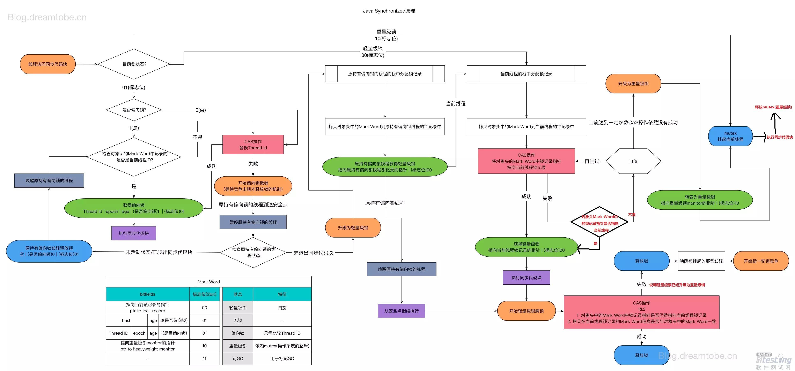

# Java多线程
## 概述
* 多线程的核心目的就是提高资源利用率
* 发挥多处理器的强大能力
* 令某些问题的建模更加简单
* 异步事件的简化处理
* 但同时也会带来一些线程共享资源的安全问题
* 线程活跃性问题
* 性能问题
## Java内存模型
### JMM
Java内存模型的抽象结构就是那张经典图

**每个线程有自己的工作内存，线程不能直接访问主内存，必须先将数据拷贝到工作内存，工作完成后再刷新回主内存。线程之间通信也只能依靠共享内存。  **

### 实现内存交互
工作内存和主内存的交互操作要符合**原子性**。  

JVM通过下面的原子操作实现内存间交互。  

* lock：将主内存变量标识为一条线程独占

* unlock：释放主内存中的变量

* read：将变量值从主内存读到线程的工作内存

* load：将read读进来的变量值放入工作内存中的变量副本

* use：将工作内存中的变量值传递给执行引擎

* assign：执行引擎将变量值赋给工作内存

* store：工作内存中的变量值传递到主内存

* write：store传递到主内存的变量值放入主内存的变量中
  后来Java团队又将其化简为read write lock unlock四种原子操作。  
  
  但对于程序员来说，只需要理解Java内存模型的定义，理解等效的判断原则——先行发生原则  
### 指令重排序
处理器、编译器为了提高性能，常常会对指令做重排序。指令级别的重排序和内存系统的重排序属于处理器重排序，对于处理器重排序，JMM会要求JVM生成指令序列时插入特定的内存屏障指令，禁止特定类型的处理器重排序。  

**重排序会导致多线程程序的结果很奇怪。**

### happens-before
是JMM对程序员的承诺  

**意味着一个操作的结果要对另一个操作可见，并不意味着前一个操作必须在后一个操作之前执行。**

### as-if-serial
**在一个线程内**，不管指令怎么重排序，**对外看起来结果都是顺序执行**的结果。  

在不改变结果的前提下，尽可能提高并行度。为了遵守这个规则，处理器和编译器不会对有数据以来的指令做重排序。  

## Java并发基础
### 概述
多线程环境下，会出现的问题就是当多个线程同时修改、写入、读取共享数据时，本来几个一起发生的操作被中间穿插了其他操作，或者不同线程中结果没有互相同步，导致的结果错误。  

要解决多线程问题，就是两个大方向：

1. **把几个必须要一起执行的操作绑定在一起成为原子操作**
2. 不同线程中对共享数据依赖的操作，一定要实时更新，包括要用值时实时取，用完了实时放回去，即**保证可见性**  
### 线程
#### 构建线程
1. 通过创建Thread类的子类，并重写run方法，通过start()方法开启线程
2. 实现Runnable接口（Thread本身实现了Runnable接口）
#### 线程的状态
* NEW 初始状态
* RUNNABLE 运行状态
* BLOCKED 阻塞状态
* WAITING 等待状态，等待notify或中断
* TIME_WAITING 超时等待
* TERIMNATED 终止状态

#### 中断
中断可以理解为线程的一个标志位，他表示一个运行中的线程是否被其他线程进行了中断操作。**线程通过调用isInterrupted()方法判断自己是否被中断**，也可以调用Thread.interrupted()方法对中断标志复位。  

### volatile
volatile的实现方式就是在读写操作前后加屏障，具体到X86平台，就是在写操作后面加一个StoreLoad屏障，其他屏障都可以省略。这个屏障的实现方式是加一个`lock addl &0x0,(%esp)`lock的空操作，利用了**lock的两个特点：lock后面的指令不能重排序到lock前面、lock会将本线程的工作内存写入主内存，并引起其他线程无效化该值对应的工作内存。**  

由此可见，加了这个屏障之后，volatile可以实现我们上面所说的内存可见性，**但不能实现原子性。如果要实现原子性，就要用CAS。**    

### synchronized
#### 代码块
synchronized同步代码块的实现方式是在**被加锁的代码款前面加monitorenter，后面加monitorexit**，就实现了一个同步代码块。  

同步代码块中的代码具有**原子性**，涉及到的数据具有**可见性**。  

我们可以看到这里有一个监视器的概念，就是加锁要有一个被加锁的目标，目标相同的同步块才有竞争关系。  

* 对于普通同步方法，锁是当前实例对象
* 对于静态同步方法，锁是当前类的Class对象
* 对于同步方法块，锁是Synchonized括号里配置的对象
#### 方法
synchronized方法的实现方式是该方法在常量池中多了**ACC_SYNCHRONIZED标识符**，调用指令观察方法的ACC_SYNCHRONIZED标志是否被设置，如果设置就要先获取monitor。
#### Java对象头
每个对象分为三块区域:对象头、实例数据和对齐填充。  

* 对象头包含两部分  

第一部分是Mark Word，用于存储对象自身的运行时数据，如哈希码（HashCode）、GC分代年龄、锁状态标志、线程持有的锁、偏向线程 ID、偏向时间戳等等，这一部分占一个字节。  

第二部分是Klass Pointer（类型指针），是对象指向它的类元数据的指针，虚拟机通过这个指针来确定这个对象是哪个类的实例，这部分也占一个字节。(如果对象是数组类型的，则需要3个字节来存储对象头，因为还需要一个字节存储数组的长度)  

* 实例数据存放的是类属性数据信息，包括父类的属性信息，如果是数组的实例部分还包括数组的长度，这部分内存按4字节对齐。  

* 填充数据是因为虚拟机要求对象起始地址必须是8字节的整数倍。填充数据不是必须存在的，仅仅是为了字节对齐。  

  

对象未被锁定的状态下，Mark Word的32个Bits空间中的25Bits用于存储对象哈希码(HashCode)，4Bits用于存储对象分代年龄，2Bits用于存储锁标志位，1Bit固定为0    

当加锁时，Java对象头中的锁标志位会被设置为对应的加锁状态，指针指向monitor。  

#### monitor
monitor是一个同步工具，是由ObjectMonitor实现的，其中属性记录
* \_count用来记录该线程**获取锁的次数**
* \_WaitSet存放处于**wait状态的线程队列**
* \_EntryList存放处于**等待获取锁block状态的线程队列，即被阻塞的线程**
* \_owner指向**持有ObjectMonitor对象的线程**


当多个线程同时访问一段同步代码时，**首先会进入\_EntryList队列中**，当某个线程获取到对象的monitor后进入\_Owner区域并把monitor中的\_owner变量设置为当前线程，同时monitor中的计数器\_count加1，**若线程调用wait()方法，将释放当前持有的monitor**，\_owner变量恢复为null，\_count自减1，同时该线程**进入\_WaitSet集合中等待被唤醒**。若当前线程执行完毕也将释放monitor(锁)并复位变量的值，以便其他线程进入获取monitor(锁)。
#### 锁优化

> https://www.zhihu.com/question/53826114 看答案！！！

* 线程阻塞唤醒需要时间长
* 锁竞争也需要消耗资源，且同一个锁在大多数情况下被同一个线程获取
* 另外编译器会在加锁范围上对程序员编写的代码进行优化
##### 偏向锁
故引入锁升级。锁有四种级别：**从低到高是无锁状态，偏向锁状态，轻量级锁状态，重量级锁状态**。  
* 偏向锁状态：会在对象头和栈帧中的锁记录里存储锁偏向的线程ID，下次同一个线程加锁解锁无需CAS，直接执行同步块，无需解锁，**当产生竞争时才解锁**。
	1. 检测Mark Word是否为可偏向状态，即是否为偏向锁1，锁标识位为01；
	2. 若为可偏向状态，则测试线程ID是否为当前线程ID，如果是，则执行步骤(5)，否则执行步骤(3)；
	3. 如果线程ID不为当前线程ID，则通过CAS操作竞争锁，竞争成功，则将Mark Word的线程ID替换为当前线程ID，否则执行步骤(4)；
	4. 通过CAS竞争锁失败，证明当前存在多线程竞争情况，当到达全局安全点，获得偏向锁的线程被挂起，**偏向锁升级为轻量级锁**，然后被阻塞在安全点的线程继续往下执行同步代码块；
	5. 执行同步代码块
##### 轻量级锁
* 轻量级锁：绝大部分的锁，在整个同步周期内都不存在竞争，而是交替获取锁然后执行。**使用轻量级锁时，不需要申请互斥量，仅仅将Mark Word中的部分字节CAS更新指向线程栈中的Lock Record，如果更新成功，则轻量级锁获取成功，记录锁状态为轻量级锁；否则，说明已经有线程获得了轻量级锁，目前发生了锁竞争（不适合继续使用轻量级锁），接下来膨胀为重量级锁。减少传统重量级锁使用操作系统信号量造成的性能消耗。如果存在多个线程同一时间访问同一锁的场合，就会导致轻量级锁膨胀为重量级锁。**  

加锁步骤如下：  

1. 判断当前对象是否处于无锁状态（hashcode、0、01），若是，则JVM首先将**在当前线程的栈帧中建立一个名为锁记录（Lock Record）**的空间，用于存储锁对象目前的Mark Word的拷贝（官方把这份拷贝加了一个Displaced前缀，即Displaced Mark Word）；否则执行步骤（3）；
2. JVM利用**CAS操作尝试将对象的Mark Word更新为指向Lock Record的指针**，如果成功表示竞争到锁，则将锁标志位变成00（表示此对象处于轻量级锁状态），执行同步操作；如果失败则执行步骤（3）；
3. **判断当前对象的Mark Word是否指向当前线程的栈帧**，如果是则表示当前线程已经持有当前对象的锁，则直接执行同步代码块；**否则只能说明该锁对象已经被其他线程抢占了，这时轻量级锁需要膨胀为重量级锁，锁标志位变成10**，后面等待的线程将会进入阻塞状态；

释放锁步骤如下:  

1. 取出在获取轻量级锁保存在Displaced Mark Word中的数据；
2. 用CAS操作将取出的数据替换当前对象的Mark Word中，如果成功，则说明释放锁成功，否则执行（3）；
3. 如果CAS操作替换失败，说明有其他线程尝试获取该锁，则需要在释放锁的同时需要唤醒被挂起的线程。
##### 自旋锁与自适应自旋
互斥同步对性能最大的影响是**阻塞的实现，挂起线程和恢复线程的操作都需要转入内核态完成，都给JVM的并发性能造成了巨大的压力。**  

如果我们在多核处理器上，那么就可以让后请求锁的线程”稍等一会“，不放弃处理器的执行时间，看持有锁的线程是否很快会释放锁。为了让线程等待，我们需要让该线程**执行一个忙循环（自旋），这就是自旋锁**。默认关闭  

自旋等待需要有一定的限度，否则会占用CPU时间，浪费资源。自旋默认次数是十次。JDK6中引入了**自适应自旋，自旋时间不固定，由前一次在同一个锁上的自旋时间和锁的拥有者的状态来综合决定**。

##### 锁消除
JVM的即时编译器在运行时，对被检测到不可能存在共享数据竞争的锁进行消除
##### 锁粗化
我们在编写代码时，推荐将同步块的作用范围限制的尽量小，但在一些特定情况，如果一些连续操作需要**对同一个锁反复进行加锁解锁**，比如加锁解锁发生在循环体内部，那么即使没有竞争，也会**带来不必要的性能损耗**。由此JVM会将加锁范围粗化到整个操作外部，减少加解锁次数。  

  

### final
final修饰的变量会产生同步效果如下  
1. JMM禁止编译器把**final域的写**重排序到构造函数之外
2. 编译器会在final域的写之后，构造函数**return之前添加一个StroeStore屏障**，禁止处理器把final域的写重排序到构造函数之外（X86中不会加入屏障）  
3. final保证构造函数中**初始化该变量完成之前**，该变量不会被其他位置访问到，即不会被重排序出构造函数，即不会逃逸出构造函数。
### wait()/notify()
方法有wait(),wait(long),wait(long,int),notify(),notifyAll()，调用wait()方法**进入WAITING状态，释放锁，且调用wait和notify之前都要先获取锁，可以被interrupt ** 

这几个方法是定义在java.lang.Object类上的，每个对象都具备。  

#### wait和sleep的区别
1. 属于不同的两个类，sleep()方法是**线程类（Thread）的静态**方法，wait()方法是**Object类**里的方法。
2. **sleep()方法不会释放锁，wait()方法释放对象锁**。
3. sleep()方法可以在任何地方使用，**wait()方法则只能在同步方法或同步块中**使用。
4. sleep()必须捕获异常，wait()方法、notify()方法和notiftAll()方法不需要捕获异常。
5. **sleep()使线程进入阻塞状态（线程睡眠，线程状态是TIMED_WAITING），wait()方法使线程进入等待队列（线程挂起，线程状态是WAITING，但带时限的wait方法进入的也是TIMED_WAITING状态）**，也就是阻塞类别不同。它们都可以被interrupted方法中断。
### join()
如果线程A执行了线程B的join()方法，那么**线程A将等待线程B终止**之后才从join()方法返回。另外还提供了超时方法。  

join方法是一个同步方法，内部循环判断线程isAlive。  

### ThreadLocal
ThreadLocal是线程变量，以ThreadLocal对象为键，任意对象为值，通过set，get方法访问。  

ThreadLocal出现的目的是为了**线程安全**，即实现一个线程安全的内部静态map，每个线程只能获取自己线程的值，既线程安全，又在本线程内全局共享。  

#### ThreadLocal的实现原理
> https://my.oschina.net/u/4504531/blog/4807522  
>
> https://blog.csdn.net/weixin_43863054/article/details/108986687  

ThreadLocal是**独立于Thread之外**的类，ThreadLocalMap是ThreadLocal的内部类。  

Thread中有一个局部变量ThreadLocal.ThreadLocalMap。 这样构成了三者的关系。  

Thread中通过调用ThreadLocal的set方法创建ThreadLocalMap并附在Thread上，构建了一个自定义的HashMap（和Map接口没关系）。这个ThreadLocalMap用Entry存储信息，Entry继承于WeakReference

#### ThreadLocal为什么要自定义Map
* 为了限制key的类型为ThreadLocal
* Map的Entry可以实现为WeakReference
* 为了节省开销，自定义一个的Map更简单，作用更专一
#### Entry中的Key为什么设置成弱引用？ 内存泄漏问题
**弱引用低于软引用，当被GC线程发现时，无论内存是否满，都会被回收。 ** 

举个例子：假设我们现在Entry中ThreadLocal设置成强引用。如果我们在使用线程池，要复用其中的线程，线程A上次在使用时被设置了ThreadLocal，但是没有清理掉，目前A被拿出来第二次使用，其中ThreadLocal还在被线程A中的ThreadLocalMap强引用，不会被回收，导致**内存泄漏**。  

我们将其设置为弱引用后，当A被放回线程池时，**key除了Map中的这个弱引用，其他的强引用都已经断掉了，只剩下这个弱引用**，当被GC扫描到回收，不会产生Key的内存泄漏问题  

**但是**，这里**Value还是被强引用着**，而且对应的Key被回收了之后已经访问不到了，产生了**内存泄漏**。解决方法是，**ThreadLocal用完之后，一定要在到最后调用remove()方法清空Entry**  

## Lock接口和AQS
### Lock接口
提供了以下方法
|方法|作用|
|----|----|
|void lock();|阻塞获取锁，锁获取后方法返回|
| void lockInterruptibly() throws InterruptedException;|阻塞获取锁，可以被中断|
|boolean tryLock();|尝试**非阻塞**获取锁，调用后立刻返回，能获取则返回true，不能获取则返回false|
|boolean tryLock(long time, TimeUnit unit) throws InterruptedException;|超时获取锁，三种情况返回 <br> 1. 超时时间内获取了锁 2. 超时时间内被中断 3. 超时时间结束，fanhuifalse|
|void unlock();|释放锁|
|Condition newCondition();|获取等待通知组件，与当前锁绑定。只有先获取锁，才能调用该组建的wait()方法，并且调用后当前线程将释放锁|
**以上方法给Lock提供了比synchronized不具备的特性：**

1. 尝试非阻塞获取锁
2. 能被中断的获取锁
3. 超时获取锁
4. 另外还提供了公平锁的实现方式
### AbstractQueuedSynchronizer 队列同步器
AQS是用来构建锁或者其他同步组件的基础框架，其中使用了一个int成员state来表示同步状态，内置一个FIFO队列来完成资源获取线程的排队工作。  

使用同步器的主要方式是**继承**，通过重写提供的**模板方法**来实现同步组件。  

#### 方法
* 可重写的方法如下：
|方法|作用|
|----|----|
|boolean tryAcquire(int arg)|独占获取同步状态，实现该方法需要查询当前状态并判断是否符合预期，然后CAS设置同步状态|
|boolean tryRelease(int arg)|独占式释放同步状态|
|int tryAcquireShared(int arg)|共享式获取同步状态，返回大于等于0的值表示获取成功|
|boolean tryReleaseShared(int arg)|共享式释放同步状态|
|boolean isHeldExclusively()|判断当前同步器是否在独占模式下被线程占用，一般表示是否被当前线程独占|
* 可见实现以上方法需要查询状态、设置状态，故AQS提供了以下方法
|方法|作用|
|----|----|
|int getState()|获取当前同步状态|
|setState(int newState)|设置当前同步状态|
|compareAndSetState(int expect, int update)|使用CAS设置同步状态，保证原子性|
* 另外模板方法模式中提供的模板方法如下：
|方法|作用|
|----|----|
|void acquire(int arg)|独占获取同步状态，如果成功则返回；如果失败则进入同步队列等待，待成功后方法返回。该方法会调用复写后的tryAcquire()|
|void acquireInterruptibly(int arg)|调用该方法独占获取同步状态失败后，可响应中断|
|boolean tryAcquireNanos(int arg, long nanos)|超时，可中断|
|void acquireShared(int arg)|共享式的获取同步状态，若未获取到，则进入同步队列。同一时刻可以有多个线程获取到同步状态|
|acquireSharedInterruptibly(int arg)|共享式，响应中断|
|boolean tryAcquireSharedNanos(int arg, long nanos)|共享式，超时，可中断|
|boolean release(int arg)|独占释放，释放同步状态后将唤醒同步队列中的第一个节点包含的线程|
|boolean releaseShared(int arg)|共享式释放|
|Collection\<Thread\> getQueuedThreads()|获取等待在同步队列上的线程集合|

一般AQS源码解析也都是解析的以上方法。

#### AQS实现概要
同步器依赖内部的FIFO双向的同步队列来完成同步状态管理。当前线程获取同步状态失败时，同步器会将当前线程及等待状态等信息构造成一个节点（Node）并尾插入同步队列，同时阻塞当前线程，当同步状态释放时，会把**首结点**中的线程唤醒，使其再次尝试获取同步状态  
##### Node
Node中保存了：
* waitStatus：
	1. CANCELLED，1 等待的线程超时或被中断
	2. SIGNAL，-1 后继节点将在当前节点释放同步状态时被唤醒
	3. CONDITION，-2 节点在等待队列中，等待在Condition上，如果其他线程对该线程调用了signal(),那么该节点将从等待队列转入同步队列
	4. PROPAGATE，-3 表示该线程以及后续线程进行无条件传播（CountDownLatch中有使用）共享模式下， PROPAGATE 状态的线程处于可运行状态 
	5. INITIAL， 0 初始状态
* Node prev：指向前驱节点
* Node next：指向后继节点
* Node nextWaiter：等待队列中的后继节点
* Thread thread：正在等待获取同步状态的被包装线程
##### 同步队列
同步队列包含了头节点和尾结点的引用。  
* 首结点的设置只能通过上一个同步状态获取成功的线程来完成，由于只有一个线程能获取同步状态，所以并不需要CAS  
* 尾结点的设置通过CAS方法：compareAndSetTail(Node expect, Node update)
##### 独占式同步状态获取和释放
**这部分主要分析acquire方法和release方法**  

* acquire方法流程：先调用tryAcquire尝试获取，失败的话就将线程包装为Node，然后通过addWaiter方法添加进同步队列尾部，最后调用acquireQueued方法使结点以死循环方式获取同步状态，获取不到的话就**阻塞**节点中的线程，被阻塞的线程**唤醒依靠前驱节点出队或者被中断**。  
* addWaiter方法主要通过CAS添加尾结点，**这也是不用LinkedList而自己实现链表的原因之一**
* addWaiter中如果添加失败，则通过enq方法反复添加，同步器通过死循环中**CAS保证节点正确添加**
* 加入同步队列后，**通过acquireQueued自旋，获取不到同步就阻塞，被前驱节点唤醒或者被中断就继续自旋**。
* 同步状态获取成功后，当前线程从acquire方法返回，获取了锁。
* 执行完成后调用release方法释放锁，并且调用unpark方法使用LockSupport唤醒等待状态的线程
##### 共享式同步状态获取与释放
**多个线程可以同时获取到同步状态，以读写为例，读操作可以多个线程共享式访问，而写操作需要被阻塞，而写操作获取到同步状态时需要阻塞后面所有的读写操作**  

* acquireShared中，如果调用tryacquireShared结果大于0，则可以获取到同步状态，否则跟独占一样，阻塞，自旋，获取到同步状态则返回。
* 释放同步状态是，唤醒后续等待的节点。对于支持多线程同时访问的并发组件，一般通过循环+CAS来保证资源释放线程安全。（这点与独占式不同）
##### 独占式超时获取同步状态
**超时获取提供了传统的synchronized不具备的特征**  

* doacquireNanos通过记录一下开始时间点，让线程睡眠nanosTimeout，来到达超时时间；如果park过程中被中断了，则计算一下剩余的timeout，继续睡眠，直到被唤醒。被唤醒时用当前时间减去开始时间，看一下是否超时，如果没有超时则获取锁。
### 重入锁 ReentrantLock
AQS实现的重入锁，可以对同一个线程重复加锁，并且**支持公平和非公平**  
* **公平锁往往没有非公平锁效率高，但公平锁可以减少“线程饥饿”发生的概率**
#### 实现重进入
实现重进入需要解决两个问题：  
1. 线程再次获取锁：锁需要识别获取锁的线程是否为当前占据锁的线程
2. 锁的最终释放：线程重复获取了n次锁，就随后在第n次释放该锁后，其他线程能够获取到该锁。要求锁对获取次数**计数自增**
* ReentrantLock中nonfairTryAcquire(int acquires)方法为例，判断当前线程是否为获取锁的线程，如果是，则将同步状态值增加并返回true，表示获取同步状态获取成功。
* 如果该锁被获取了n次，那么前(n - 1)次tryRelease都必须返回false，当完全释放后才返回true
#### 公平与非公平锁
公平锁：
* 如果锁是公平的，那么**锁的获取顺序就应该符合请求的绝对时间顺序，也就是FIFO**
* 在公平方法tryAcquire中，请求线程需要判断前面是否有前驱节点已经在等待，如果有，那么需要等待前驱节点先获取。


非公平锁：  
* **非公平锁释放锁时并非所有线程一起竞争，而是在唤醒下一个节点的同时允许“插队”。**
* 刚释放锁的线程再次获取同步状态的几率会很大，所以可能产生**连续获取锁**的情况
### 读写锁 ReentrantReadWriteLock
* 读写锁可以允许多个读线程访问，而写操作开始时，所有晚于写操作的读操作都会进入等待状态，目的是使读操作能够读取到正确的数据，不会出现脏读
* 读写锁支持锁降级，即遵循获取写锁、获取读锁再释放写锁的次序，写锁降级为读锁
* 读写锁定义了readLock()和writeLock()方法，以及一些查询锁状态的方法，如查询读锁加锁次数、线程数、写锁是否锁定、写锁加锁次数
#### 读写锁的实现分析
* 读锁是一个支持重进入的共享锁，当没有写线程访问时，读锁总是可以成功获取
* **锁降级**可以保证数据可见性。如果线程A在释放写锁后，没有直接获取读锁而继续执行，同时线程B获取了写锁修改数据，那么线程A将无法感知到B修改了数据
### Condition
任意一个Java对象都有一组监视器方法，wait()/notify()，这些方法与synchronized配合可以实现等待/通知模式。  

**Condition接口提供了类似Object监视器方法，与Lock配合也可以实现等待/通知模式**。Condition对象是由Lock创建出来的，**调用方法时需要先获取锁**。  

线程中调用await()方法后，**释放锁**并再次等待；而其他线程调用Condition对象的signal()方法，即通知当前线程从await()返回，并且返回前已经获取了锁

#### Condition实现分析
Condition是AQS的内部类，每个Condition对象都包含一个**等待队列**。  
* 一个线程调用了Condition.await()方法，则释放锁，构造成节点并进入等待队列，进入等待状态（节点类型也是AQS的Node）
* 加入队列的过程没有CAS保证，**因为能调用await方法的线程已经获取了锁**
* Condition可以创建多个。在Object的监视器模型中，一个对象有一个同步队列和一个等待队列；而在**并发包Lock中拥有一个同步队列和多个等待队列**
* 当线程调用await()方法时，需要提前获取锁。可以理解为调用await()方法时，**同步队列的首结点移动到了Condition的等待队列尾结点**。注意这里的节点并非同一个，加入等待队列时会**重新构造一个Node节点**
* Condition的signal()方法会将等待时间最长的节点唤醒，并移动到同步队列。（调用signal的线程也需要获取锁）
* signalAll()方法相当于对等待队列中的每个节点调用一次signal()，将**所有节点全部移动到同步队列**
## 并发工具和框架
### ConcurrentHashMap
#### HashMap有什么问题？
HashMap的put方法在多线程环境下，1.7及之前使用**头插法会造成链表成环**，1.8之后改为**尾插法，但会造成值覆盖**。  

将get和put方法**直接用synchronized锁住可以保证安全，但是效率低下（Hashtable就是用这种方式实现线程安全的）**。把表拆开，分成N个部分分别加锁，是一种解决方案，所以JDK1.7之前都是用的这种**分段锁**的方式。

#### 1.7之前
链表+数组的形式存储键值对，为了提高并发，把整个table划分成了n个Segment，每个Segment里是由HashEntry组成的数组，数组的每一个元素是哈希冲突的HashEntry组成的链表。  

* put()方法中，首先通过计算hash值定位到segment，然后尝试获取锁，如果获取失败就自旋尝试，如果重试次数达到上限，则改为阻塞获取。
* get()方法中，将Key通过hash定位到Segment，再通过第二次Hash定位到元素。由于HashEntry中的value属性由volatile关键词修饰，保障了可见性，所以可以直接获取元素。**get方法全程都不需要加锁**

**存在的问题：虽然分段加锁提高了并发，但是数组加链表的方式，效率还是有些低**

#### 1.8之后
放弃了分段锁，还是用一个数组table来作为大结构，存储结构和HashMap是一样的数组+链表/红黑树，**采用CAS+synchronized保证并发安全性**。  

* put()流程：
	1. 根据key计算出hash
	2. 检查一下table是否需要初始化
	3. 根据hash定位，如果table中该位置为空，则CAS写入，失败则自旋保证成功
	5. 如果以上3，4的判断条件都不满足，说明定位出的位置已经有了元素，即哈希冲突。则对该位置的元素加synchronized锁，然后插入该位置。**每个位置在TREEIFY_THRESHOLD（默认8）以下，则为一个链表，超过则转为红黑树。**
	5. 在转换红黑树之前，先判断数组长度，**如果数组长度n小于阈值`MIN_TREEIFY_CAPACITY`，默认是64，则会调用`tryPresize`方法把数组长度扩大到原来的两倍，并触发`transfer`方法，重新调整节点的位置**。

#### 放弃Segment的优势
1. **锁粒度更细了**。Segment的数量在ConcurrentHashMap创建时已经确定了，扩容只改变Segment的大小，所以元素变多后，并发能力会降低，锁的粒度会有些太大了。
2. 1.7之前，通过两次hash，可以快速在Map中定位元素；1.8之后，通过链表转红黑树，也可以快速定位元素
3. JDK1.8中，在ConcurrentHashmap进行扩容时，其他线程可以通过检测数组中的节点决定是否对这条链表（红黑树）进行扩容，减小了扩容的粒度，提高了扩容的效率。


### ConcurrentLinkedQueue
线程安全的队列。  

实现线程安全的队列有两种方法：阻塞、非阻塞。阻塞方法可以入队和出队用同一把锁，或者入队出队各自一把锁来实现；非阻塞方法可以用循环CAS来实现。  

**ConcurrentLinkedQueue是基于链接节点的无界线程安全队列，采用CAS算法（“wait-free”）来实现**  

#### 入队列
1. 定位尾结点
2. CAS将入队节点设为尾结点
#### 出队列
CAS
### Java中的阻塞队列
阻塞队列是支持阻塞的插入和阻塞的移除的队列。阻塞队列在生产者消费者模型中就是用来存放、获取元素的容器。  

在阻塞队列不可用时，两个附加操作提供了四种处理方式  

|方法/处理方式|抛出异常|返回特殊值|一直阻塞|超时退出|
|----|----|----|----|----|
|插入方法|add(e)|offer(e)|put(e)|offer(e, time, unit)|
|移除方法|remove()|poll()|take()|poll(time, unit)|
|检查方法|element()|peek()|不可用|不可用|
Java中提供7个阻塞队列：   
* ArrayBlockingQueue：由数组实现的有界阻塞队列，不保证公平
* **LinkedBlockingQueue：由链表实现的无界阻塞队列，最常用**
* PriorityBlockingQueue：支持优先级的无界阻塞队列，自定义compareTo()方法来指定元素排序规则
* DelayQueue：延时获取元素的无界阻塞队列，使用PriorityQueue来实现，队列中的元素 实现Delay接口，只有在延迟期满才能从队列中提取元素
* SynchronousQueue：不存储元素的阻塞队列，每一个put操作必须等待take操作，1对1传递性
* LinkedTransferQueue：链表组成的无界阻塞队列，多了tryTransfer方法和transfer方法。如果当前有消费者正在等待接收元素(take()或者带时间限制的poll()方法)，transfer方法可以把生产者传入的元素立即transfer给消费者；否则将元素存放在队列的tail节点。
* LinkedBlockingDeque：由链表组成的双向阻塞队列
#### 实现方式
阻塞队列使用**通知模式**来实现。就是生产者往满的队列里添加元素时会阻塞生产者，当消费者消费了一个队列的元素时，会通知生产者当前队列可用；消费者也是一样。JDK中ArrayBlockingQueue使用了Condition来实现。
### Fork/Join框架
Fork/Join框架是Java提供的用于并行执行任务的框架，把大任务分割成若干小任务，最终结果再汇总的框架。
#### 工作窃取算法
工作窃取算法是指某个线程从其他队列里窃取任务执行。大任务分割出的小任务，会放到线程自己的队列中，如果线程A做完了自己队列里的任务，会去其他线程**双端队列的队尾偷取**一个任务执行。
#### Fork/Join框架

TODOTODO

### 原子操作类
基本都是Unsafe实现的包装类
#### 原子更新基本类型
* AtomicBoolean
* AtomicInteger
* AtomicLong

以AtomicInteger为例，int addAndGet(int delta)方法以原子方式将输入数值加载原数字上并返回结果；compareAndSet；getAndIncrement()，lazySet(int newValue)。  
这些方法都是用Unsafe包里的CAS方法来进行的原子操作。  
AtomicBoolean是将Boolean转为整形，再利用CASInt进行操作的   
#### 原子更新数组
* AtomicIntegerArray
* AtomicLongArray
* AtomicReferenceArray

AtomicIntegerArray提供原子方式更新数组中的整型，方法由addAndGet(int i, int delta);boolean compareAndSet(int i, int expect, int update)，基本上跟整型的差不多
#### 原子更新引用类型
* AtomicReference
* AtomicReferenceFieldUpdater
* AtomicMarkableReference
#### 原子更新字段类
原子更新某个类里的某个字段  

* AtomicIntegerFieldUpdater
* AtomicLongFieldUpdater
* AtomicStampedReference：**更新带版本号的引用类型，解决ABA问题**
### CountDownLatch
**允许一个线程或多个线程等待其他线程完成操作**  

当调用CountDownLatch的countDown方法时，N就会减一，await回族桑当前线程，直到其他线程将N减到0。另外还提供了超时等待方法

### 同步屏障CyclicBarrier
**实现让一组线程到达一个屏障（或者叫同步点）时被阻塞，直到最后一个线程到达该屏障，屏障才会开门，所有被屏障拦截的线程才会继续执行。**  

可以用于多线程计算数据，最后合并计算结果的场景  

对比：**CountDownLatch的计数器只能使用一次，而CyclicBarrier的计数器可以通过reset()方法重置。**

### Semaphore信号量
用来控制并发线程数，即**控制同时访问特定资源的线程数量**。  

通过new Semaphore(10)；允许最大10个并发执行，线程利用s.acuqire()获取一个许可证，通过s.release()归还许可证。

### Exchanger
用于进行线程间的数据交换，它提供一个**同步点**，在这个点，两个线程可以交换彼此的数据
## 线程池
线程池可以：
1. **降低资源消耗**，通过**重复利用**已创建的线程降低线程创建和销毁造成的消耗
2. 提高响应速度，任务到达时**无需等待线程创建**
3. 提高线程的可管理性，线程是稀缺资源，如果无限制创建，不仅会消耗系统资源，也会降低系统的稳定性。所以需要线程池来统一分配、调优和管理。  
### ThreadPoolExecutor的七个参数
基本的线程池类，有七个参数：
1. corePoolSize：线程池基本大小。当一个新任务提交到线程池时，会创建一个新线程，当线程数量到达corePoolSize时就不再创建新线程，而将没来得及执行的任务加入队列。基本线程也可以调用prestartAllCoreThread()方法提前创建。
2. runnableTaskQueue任务队列：用于保存等待执行的任务，可以选择以下阻塞队列（**阻塞队列无非几个维度：有界/无界，数组/链表，公平FIFO/非公平，具有优先级/不具有优先级，存储元素/不存储元素**）
	* ArrayBlockingQueue：数组结构的有界阻塞队列FIFO
	* LinkedBlockingQueue：基于链表的无界阻塞队列。
	* SynchronousQueue：不存储元素的阻塞队列，每一个插入操作阻塞等待一个一处操作
	* PriorityBlockingQueue：具有优先级的无界阻塞队列
3. maximumPoolSize：线程池最大数量。如果2中用的有界队列，且队列满了，就会再core的基础上创建新线程，直到到达maximumPoolSize。**注意如果用的无界队列这个参数就没用了**
4. ThreadFactory：用来创建线程的工厂。***这个再查一下别的资料***
5. RejectedExecutionHandler：拒绝策略/饱和策略。当**队列也满了，线程池也满了，新任务来的时候的处理策略**。下面式JDK提供的四种策略，**默认是AbortPolicy**，也可以实现RejectedExecutionHnadler接口来自定义拒绝策略，比如记录日志或者持久化。
	* AbortPolicy：丢弃任务，直接抛出RejectedExecutionException异常
	* CallerRunsPolicy：用调用线程来运行任务
	* DiscardOldestPolicy：丢弃队列里最前面的任务（也就是最老的）并执行当前任务
	* DiscardPolicy：直接丢弃任务
6. keepAliveTime：线程活动时间。一般不对corePoolSize以内的线程起作用，超过core以外的线程才会被超时停止。但也可以调用allowCoreThreadTimeOut(boolean)方法让线程数量不大于core时，keepalive也起作用。
7. TimeUnit：keepAliveTime的时间单位，有天，小事，分钟，毫秒，微秒，千分之一毫秒，纳秒，千分之一微秒等可以选择
### 线程池工作原理
1. 任务提交：有execute()和submit()，execute()没有返回值，提交不需要返回值的任务，所以也无法判断任务是否执行；submit()返回一个Future类型的对象，可以通过它的get方法获取结果，判断是否执行成功，get方法会阻塞直到任务执行完成。
2. 任务提交之后，如果当前运行的线程少于corePoolSize，**则创建新线程来执行任务（需要全局锁）**。创建新线程时，会将线程封装成工作线程Worker，循环获取工作队列里的任务来执行。
3. 如果**线程数量大于等于corePoolSize，则将任务加入BlockingQueue**
4. 如果队列已满，那么**创建新的线程来处理任务（需要全局锁）**
5. 如果创建线程使**线程数量超出maximumPoolSize**，任务将调用拒绝策略的rejectedExecution()方法，从而拒绝任务。

   **ThreadPoolExecutor采取这样的设计思路，是为了尽量避免全局锁。当线程池完成预热（当前线程数量大于等于core）后，几乎所有execute调用都是执行步骤2，而步骤2不需要获取全局锁。**

6. 关闭线程池：通过调用shutdown或者shutdownNow，原理是遍历线程池中的工作线程，逐个interrupt来中断线程，所以无法响应中断的任务可能无法终结。
  * shutdownNow会将线程池状态设置成STOP，然后停止所有正在执行或者暂停任务的线程，并返回等待执行任务的列表。任务不需要执行完则调用这个。
  * shutdown只是将线程池状态设置成SHUTDOWN，然后中断没有在执行任务的线程。

### 线程池的合理配置
* 任务的性质：CPU密集型，IO密集型，混合型任务
* 任务的优先级：高，中，低
* 任务的执行时间：长，短，中
* 任务的依赖性：是否依赖其他系统资源，如数据库连接

性质不同，线程池配置不同：  

1. **CPU密集型任务应配置小线程池，如CPU核心数+1个大小；IO密集型任务由于不是一直在执行，应该配置尽可能多，如2N个大小；混合型任务尽量拆分成两个，一个CPU密集型，一个IO密集型。**  

2. **优先级不同的任务采取PriorityBlockingQueue来处理**  

3. **执行时间不同的任务交给不同规模的线程池，或者使用优先队列让执行时间短的任务先执行**  

4. **依赖数据库连接池的任务，由于需要等待数据库返回结果，CPU空闲时间长，则需要线程池设置得大，才能更好的利用CPU**  

5. **建议使用有界队列，增加系统稳定性。无界队列会让线程池里的队列越来越大，有可能撑坏内存**  

## Executor框架
Java中工作单元和执行机制分离，工作单元包括Runnable和Callable，执行机制由Executor提供。  

Executor将线程调度分为两级模型。在上层，程序将应用分解为若干个任务，使用用户级调度器（Executor）将任务映射到固定数量的线程；在底层，操作系统内核将这些线程映射到硬件处理器。Java线程1：1映射到操作系统。  

###  Executor框架的结构
Executor框架主要由三部分组成  

1. 任务：被执行的任务需要实现Runnable接口或者Callbale接口
2. 任务的执行：核心接口Executor，以及子接口ExecutorService接口。还有ExecutorService的两个关键实现类：ThreadPoolExecutor和ScheduledThreadPoolExecutor  
3. 异步计算的结果：Future接口和FutureTask类
### Executor框架的成员
#### ThreadPoolExecutor
通常使用工厂类Executors创建，可以创建以下三种

> 《阿里巴巴 Java 开发手册》中强制线程池不允许使用 Executors 去创建，而是通过 ThreadPoolExecutor 的方式，这样的处理方式让写的同学更加明确线程池的运行规则，规避资源耗尽的风险  

##### FixedThreadPool
固定线程数，使用无界队列LinkedBlockingQueue，由于无界队列，所以maximumPoolSize无效，keepAliveTime也无效，也不会拒绝任务，则拒绝策略也无效。
##### SingleThreadExecutor
使用单个worker线程，使用无界队列LinkedBlockingQueue
##### CachedThreadPool
corePoolSize被设置为0，maximunPoolSize被设置为Integer.MAX_VALUE，keepAliveTime设置为60秒。则CachedThreadPool会不断创建新线程，如果极端情况下，可能耗尽CPU和内存资源  

#### ScheduledThreadPoolExecutor
主要用来在给定的延迟之后运行任务，或者定期执行任务。可以在构造函数中指定多个后台线程数。  

ScheduledThreadPoolExecutor使用DelayQueue，无界队列。任务类ScheduledFutureTask包含三个成员变量：  

* long time：任务将要被执行的具体时间
* long sequenceNumber：任务被添加的序号
* long period：任务执行的间隔周期
DelayQueue封装了一个优先队列，会对队列中的ScheduledFutureTask进行排序，time小的排在前面

#### Future接口
Future代表的是异步执行的结果。当我们执行一个长时间运行的任务时，使用Future就可以让我们暂时去处理其他的任务，等长任务执行完毕再返回其结果。  

##### 创建Future
将Callable利用submit()方法提交给线程池的时候就会返回一个Future  

```
    <T> Future<T> submit(Callable<T> task);

```

##### 从Future获取结果
* 通过Future.isDone()判断异步操作是否执行完毕
* Future.get()可以获取到异步执行的结果，**该方法是一个阻塞方法，并有带超时时间的版本**  
* Future.cancel(Boolean )可以取消这个异步事件，通过boolean参数选择是否中断正在运行的task。cancel之后再次调用get方法，会抛出CancellationException

#### Runnable接口和Callable接口对比
相同点：
1. 都是接口
2. 都可以用来实现多线程程序
3. 都采用Thread.start()启动程序

不同点：
1. Runnable没有返回值；Callable可以返回执行结果，是一个Future的泛型
2. call允许抛出异常；run方法中的异常只能在内部消化
3. Callable+Future/FutureTask可以在等待时间太长没获取到需要的数据的情况下**取消该线程的任务**，非常有用。

#### Executors