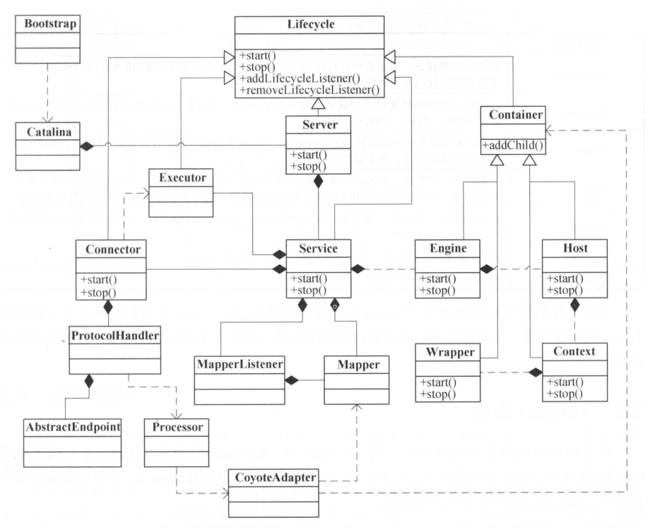
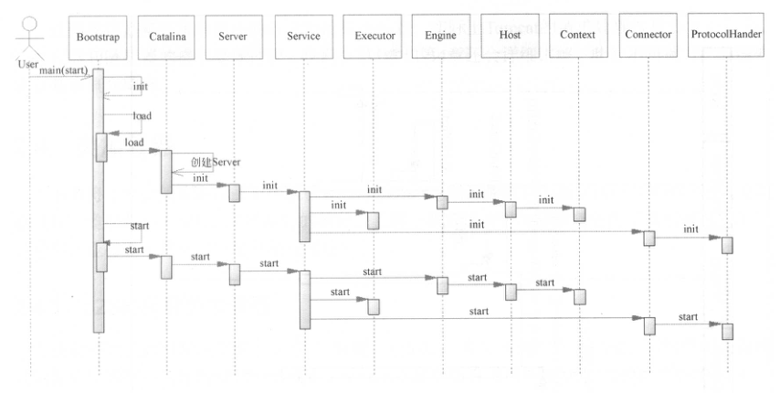
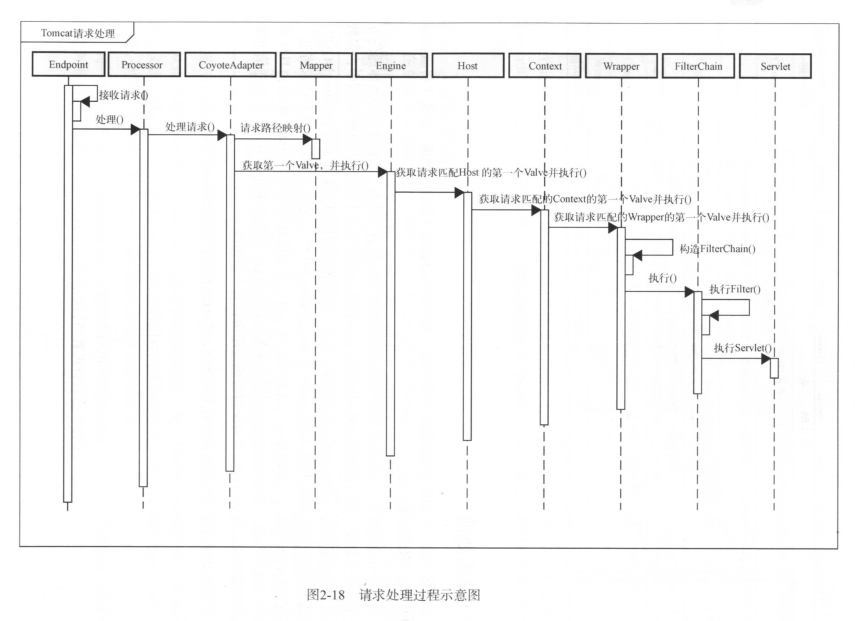
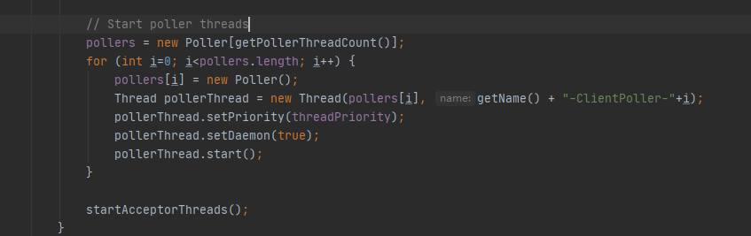
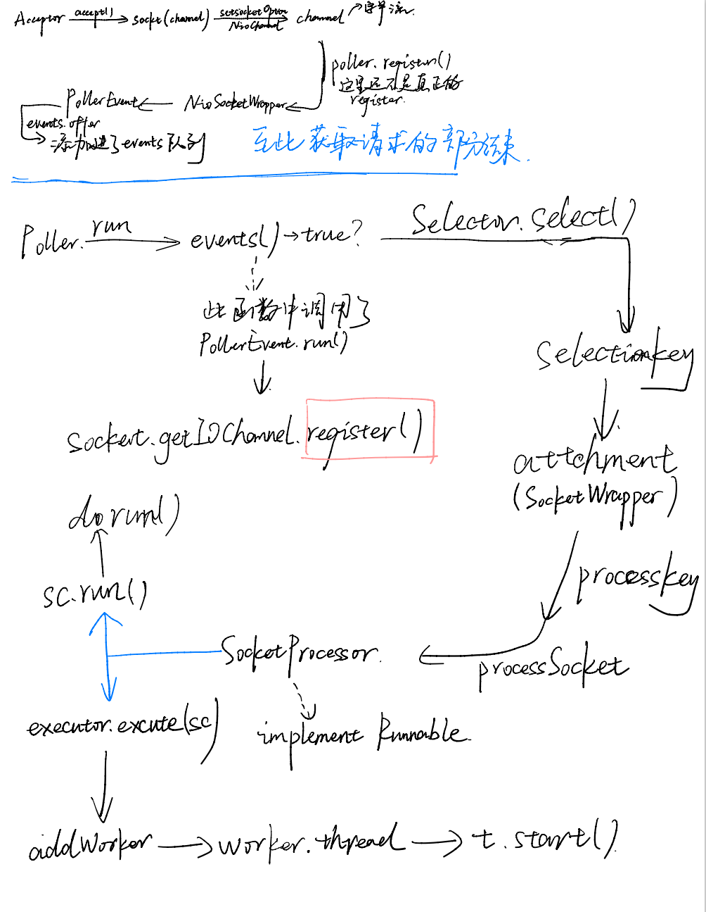

# Tomcat概要
> 《How Tomcat Works》 《深入剖析Tomcat》 《Tomcat架构解析》  </br>
> Tomcat是Apache开源的Web服务器，其以Catalina作为Servlet容器，采用Pipeline作为服务的连续触发，Lifecycle管理所有组件的生命周期。  </br>

对Tomcat的运行机制很感兴趣，凭着新手的理解，结合上面的书籍浅读了一下Tomcat源码下面进行一些个人理解的总结。  </br>
基于Tomcat8.5.57源码</br>
# Tocmat中的一些知识点
## Tomcat架构的简单描述

​    要理解Tomcat，就要理解Http，一次Http请求的过程中发生了什么，将要发生什么，可能会发生什么。</br>
​    跟着上面那张图，把Tomcat的基本架构理顺一下。首先，一个简单的服务器可以被描述为Server，它有启动和停止命令，能够使用Socket监听端口；我们的服务器需要处理连接和处理请求，将它们解耦，我们有了Connector和Container，其中Connector负责开启Socket并监听客户端请求、返回响应数据；Container负责处理请求。  </br>
​    在上面的模式中，如果我们需要让他们形成工作流，一个Server是无法管理多个Connector和Container的对应的，所以多了一层Service，用来管理多个Connector和一个Container的对应，而Server管理多个Service。</br>
​    接下来Tomcat把Container命名为了Engine，表示整个Servlet引擎。  </br>
​    一个Engine下面可以有多个应用，一个应用为一个Context，实际上对应的就是一个Web Application，我们可以在配置文件中修改端口配置多个Context，也就实现了一个Tomcat中运行多个项目的目的。  </br>
​    Host代表一个虚拟域名，内部嵌套Context。  </br>
​    一个Wrapper对应一个Servlet，Context中有多个Wrapper。  </br>
​    我们再次提起Container，这里以上提到的Engine，Host，Context，Wrapper均继承自Container。  </br>
​    再抽象一层，我们需要管理所有组件，包括Server和Service的生命周期，我们就让所有的组件都实现一个管理生命周期的接口，称之为LifeCycle。  </br>
​    从Engine到Host，再到Context，再到Wrapper，都维护了一个Pipeline，有基础Valve，其层级之间通过PipeLline连接，并可以通过Valve对请求处理进行扩展（比如密码校验等）。这里叫做责任链模式。  </br>
​    接下来我们再看Connector的设计，连接器完成的任务有  </br>
​        1，监听端口，读取请求  </br>
​        2，将请求数据按照指定协议解析  </br>
​        3，根据请求地址匹配正确的容器进行处理  </br>
​        4，容器处理完成后，将响应返回客户端  </br>
​    从这里我们可以看到，连接其需要判断不同的协议，还要选择不同的容器。这里Tomcat对其进行了解耦，设计了Endpoint作为IO，监听请求；Processor按照请求地址映射到容器进行处理（Mapper）。Tomcat通过适配器模式实现了Connector与Mapper、Container的解耦，默认为CoyoteAdapter。  </br>
​    为了解决并发问题，Tomcat设计了Executor作为可在组件间共享的线程池，实现了Lifecycle，可按照通用组件进行管理。Executor由Service维护，所以共享范围为同一个Service。  </br>
​    到这里Tomcat的基本结构就大概了解了。 </br>

## Tomcat初始化流程  

    Tomcat的主类在Bootstrap，初始化后进入Catalina类，在Catalina的load方法中的digester.parse(inputSource)中解析了配置文件，并初始化了Service（包括初始化了Connector、Endpoint等）。  
    注意，各种组件的初始化都是由从Lifecycle继承来的initInternal方法在做，且都要在函数中调用super.initInterval()(实际上是LifecycleMBeanBase类中的此方法)，用来注册Bean。在Catalina中getServer并初始化和启动了它。这里StandardServer主要用来监听Stop命令，真正的请求监听还是Endpoint在做。  

## 一次请求是如何被接收、处理、返回的，流程如何

## 如何处理并发请求的  
​    Tomcat处理并发的手段是通过线程池。  
​    各种组件被初始化之后,Lifecycle同样链式的调用了每个组件的startInternal()方法，其中包括Connector的，其中调用了protocalHandler的start方法，protocalHandler接口的实现类的start()被调用，并在其中调用了endpoint.start()方法，其中再调用了startIntenal方法，其实现类NioEndpoint在其startInternal()方法中实例化了一个东西叫Poller，这个东西看名字的意思，就知道他是从队列里面拉东西出来的。
​    我们可以看到，Endpoint有三个实现类，分别是Apr，Nio（默认的），Nio2
​        他们的区别是Apr是从操作系统级别解决异步IO；
​                                Nio是利用了Java的NIO实现非阻塞IO
​                                Nio2利用代码实现

> https://www.javadoop.com/post/tomcat-nio
> https://juejin.im/post/6844903874122383374
> 这两篇文章讲endpoint的细节讲的比较多，直接看文章+源码即可，这里重点说Poller。

​      我们可以看到Poller是NioEndpoint的内部类，其实现了Runnable接口。在endpoint的startinternal方法中，有这么一段。
  
​    我们可以看到初始化了一个pollers数组，这里默认长度是2，然后为每个poller启动了一个单独的线程并开启。
​    然后下面进入startAcceptorThreads方法，开启Acceptor。Poller是选择器，Acceptor是接收器。接收器不断接收请求，丢入Channel，channel和Poller绑定，Poller不断轮询里面有没有事件。这里应该知道了Poller要做的事情就是衔接请求接收和请求处理两个步骤，实际上poller会将channel中读出的字节流包装为NioSocketWrapper最终在processSocket中注册给Executor（线程池的接口），再丢给protocalProcessor解析，最后流转给Servlet。
​    为什么这么设计？因为Acceptor只处理接受请求，接收到之后，要赶紧把他丢进Channel回头再去接收新的请求，同时生成新的SocketChannel，与下一个空闲的Poller register，再有新的Poller。由Poller接手下面的工作，这样不仅可以解耦，也可以让每个组件的工作更加专注，分离，效率更高。

​    (Poller这段代码其实没太看懂，消息过来之后怎么包装的，怎么往下传的。后面有时间了再回来debug这段仔细研究一下吧。)

## Servlet的原理、加载机制

​    Servet的生命周期一直是一个重点，然而单纯的背知识点是没有有意义的。接下来从源码角度来看Servlet到底是什么，其生命周期有哪几个阶段，分别是什么时间开始和结束的。
​    1，我们前面讲到，Poller接手了Acceptor丢过来的Channel，封装成NioSocketWrapper，在内部类SocketProcessohttr的doRun方法中调用state = getHandler().process，一路调用process下去，最终调用service方法交给Http11Processor解析，并包装Request、Response对象，再调用service方法，在service方法中将request和response对象交给Adaptor.service()。
​    Adaptor这里，就是Servlet的入口点了。Adaptor的service()方法中，可以看到有一行connector.getService().getContainer().getPipeline().getFirst().invoke(request, response);这里的getContainer实际上get到的是Engine。从这里开始，开始进入了我们前面说的流水线Pipeline，顺序调用Engine，Context，Wrapper的invoke方法，将request和response一直往后传，期间经过了Filter等。
​    一直到StandardWrapperValve的invoke方法，这里初始化了Servlet，方法是通过wrapper.allocate()。同时，在StandardWrapperValve的invoke方法中，利用servlet实例化了FilterChain，还将request和response封装成了ServletRequest和ServletResponse，并调用了doFilter(ServletRequest, ServletResponse)，使得可以继续往下流转。
​    最终，在doFilter方法中，将设置的Filter全部都流转过一遍之后，进入了servlet.service(request, response);
​    以上Servlet的初始化时机、调用时机的源码解析就讲完了。总结一下的话，就是当该Servlet被调用时，请求进入Tomcat，流转到WrapperValve的invoke方法调用中，调用了wrapper.allocate()方法实例化了Servlet。其实Servlet还可以配置成Tomcat开启时直接初始化，但是这样比较耗费内存。同时我们上面还讲到了Servlet是什么时候开始service的，总结来说就是Filter流转完之后直接流转进入Servlet。
​    另外的，servlet的init方法也是在wrapper.allocate()中被调用的。关于这个allocate方法，需要注意的一点是，wrapper实际上维护了一个Stack中存放了Servlet，如果Tomcat开启的不是singleThreadModel的话，需要Servlet时都会先到pool中找。如果不够了，每次实例化Servlet，用完之后都会被回收进这个栈（名字叫instancePool），当然，有个最大限制，如果Servlet实例过多，新来的请求就只能等待了。
​    这里提到了singleThreadModel，如果开启了单线程模式，每次请求都会来进入这一个instance，它不会被回收，会重复利用。
​    2，接下来我们来看Servlet运转完之后，是什么时候开始销毁的。
​    Servlet的销毁方法的调用是从StandardWrapperValve的invoke方法中开始的，具体来说是在dofilter被调用，并返回之后，进入其finally代码块，首先release了filterChain，然后调用了wrapper.deallocate(servlet)方法。从名字也看得出，和allocate方法是相反作用。
​    deallocate方法就是做了上面我们提到的将Servlet回收进Pool的动作。
​    至于销毁的话，实际上这里关于这个请求的Servlet其实就已经被回收了，如果以destory方法被调用作为销毁的话，实际上是在servlet超时（Long.MAX_VALUE）或者Tomcat被关闭时。因为Servlet是单例的，这里涉及到了单例模式。

## Session和Cookie是怎么生成、使用、存储的

​    Session和Cookie作为后端维持会话信息的工具，是由后端生成，保存在后端的，返回给前端的。前端每次请求时带上Cookie，后端即认证这个用户。
​    1，session是什么时候被初次创建的？创建之后存在哪？
​    Session并不是请求一来就创建的，而是只有当后端调用getSession方法时才创建。
​    首先我们找到Request的getSession方法，方法里首先调用了doGetSession(true)，返回session，接下来在调用session的getSession方法，返回HttpSession。我们分别进去看一下，首先看doGetSession，其中首先去找Context获取了Manager（前面还没提到Manager，它是Tomcat专门管理Session的类），然后根据requestedSessionId去findSession，找到了就返回。如果没找到，就去调用manager.createSession(sessionId)，这里的sessionId是从Request中获取的。继续追溯下去，我们可以看到进去之后无非就是继续调用create方法，设置初始参数，最后调用到StandardSession的构造函数。
​    接下来我们再看session.getSession()，看起来这个方法就是为了将Session转为需要的HttpSession。但是我们不能直接让HttpSession实现Session然后Session转为HttpSession，因为父类不能向子类转型。事实上Session还是HttpSession的实现类呢。那我们能不能让StandardSession直接转为他的接口HttpSession类型呢    （StandardSession同时实现了Session接口和HttpSession接口）？语法上来说是可以的，但是这里有个巨大的问题，也就是，HttpSession接口中的方法都是用来操作Session的一个面向用户的属性的，而Session中的方法都是一些Tomcat用来管理Session的方法。如果我们将StandardSession直接转为HttpSession，那么它其中从Session继承来的方法其实还在里面，对Tomcat熟悉的人甚至可以直接强转回来操控Session，那么对于Tomcat来说是一个巨大的安全隐患。
​    那应该怎么办呢？这里Tomcat用到了外观模式，来解决这个问题设计了一个叫做StandardSessionFacade的类，它实现了HttpSession接口，同时又将HttpSession作为它的属性，我们将StandardSession传入它，包装一下，作为HttpSession返回，这样即使将他向下强转，最多也只能得到Facade，保障了安全性。
​    接下来我们再来看Session创建之后存在哪。找到ManagerBase类中的createSession方法，其中调用了session.setId(id)方法，点进去之后发现，里面调用了manager的方法，如果manager中存在就先删除，然后再add，在add中我们可以看到sessions.put(session.getIdInternal(), session)。这里我们可以知道，session是存储在一个map中的，这个map是一个ConcurrentHashMap。
​    2，Session是怎么匹配的？什么时候被删除？
​    我们可以看到在ManagerBase的createSession方法中调用了generateSessionId方法，生成了SessionId，然后这个id作为Key和Session一起保存在map中，后面还会定期更换、主动更换等方式更新sessionId。
​    所以我们现在找一下请求过来的时候，Tomcat是怎么拿到请求中的SessionId去查map的。
​    我们进入CoyoteAdapter类，记得这个类是用来处理请求的。我们看它的postParseRequest方法，顾名思义是用来解析Request的。其中SessionId的解析分为两步骤，第一步先去URL中找（8.5.57版本是713行开始），URL中如果找到了的话就将其保存进Request类；第二步骤再调用parseSessionCookiesId方法，去Cookies里面找SessionId，找到了的话也放进Request中。然后后面findSession我们在第一问已经讲过了。
​    Session的删除其实叫做过期，过期时间是在StandardContext中的sessionTimeout，默认是30分钟，每次Session初始化时设置进去的。过期时间是在最后一次访问这个Session之后开始计算。
​    3，cookie是怎么解析的？
​    其实这个问题上面已经说过了，是在Adaptor中解析的。

## 过滤器Filter是如何加载的

​    Filter过滤器前面有提到过，是在进入Servlet之前的最后一个组件。
​    总的来说就是配置上了Filter，会在StandardWrapperValve中被实例化为一个filterChain（数组形式存储了实例化的Filter），会在dofilter方法中按照配置文件中的配置顺序执行。

## 热加载

​    开启了热加载模式后，在WebappLoader中有一个backgroundProcess，定期会调用modified方法，检查是否有类被修改了，或者有新的类添加，如果有，则加载它们。
## NIO AIO BIO

​    IO是Web服务器的一个重点，采取什么样的网络IO，决定了服务器接收请求的效率。
#### 首先搞清楚名词：
* 同步：发出一个功能调用，调用者在没有得到结果之前，该调用就不返回。
* 异步：发出一个功能调用，不能立刻得到结果。实际处理调用的人处理完成后通过状态、通知和回调来通知调用者
* 阻塞：调用者发出一个功能调用，在调用结果返回前，调用者的线程挂起（进入非可执行状态，cpu不会给该线程分配时间片，该线程暂停运行），直到调用产生结果，阻塞状态解除，重新变成活动线程。
* 非阻塞：在调用结果返回前，该函数不会阻塞当前线程，而会立刻返回。
#### 根据以上理解：
* 同步IO和异步IO的区别在于：数据调用的时候进程是否阻塞。关注点在于消息通信机制
* 阻塞IO和非阻塞IO的区别在于：应用程序的调用是否立刻返回。关注点在于等待结果或返回值时的状态
* 同步和异步是针对调用结果如何返回给调用者来说的。即调用的结果是调用者主动去获取的（比如一直等待recvfrom或者设置超时等待select），则为同步，而调用结果是被调用者在完成之后通知调用者的，则为异步（比如windows的IOCP）。
* 阻塞和非阻塞是针对调用者所在的线程是否在发起调用之后挂起来说的。即如果在线程中调用者发出调用之后，再被调用这返回之前，该线程主动挂起，则为阻塞，若线程不主动挂起，而继续向下执行，则为非阻塞。
#### 结合以上几点，在网络IO中：
* 同步阻塞：调用者发出某调用后，如果函数不能立即返回，则挂起所在线程，等待结果。
* 同步非阻塞：调用者发出某调用后，如果有数据可读，则读取并返回；如果没有数据可读，则线程继续向下进行。在实际使用中，read会一直在一个循环中，这样就可以不断读取数据（尽管某次read可能并不能获得数据）。
* 异步阻塞：调用者发出调用后，线程挂起，被调用的读操作由系统（或者库）进行，等待有结果之后，系统（或者库）通过某种机制来通知调用者（在调用者获得结果之前，调用者所在线程一直阻塞，这个看起来和同步阻塞很像，但略有不同。但可以这样理解，同步阻塞相当于调用者A调用了一个函数F，F是在调用者A所在的线程中完成的，而异步阻塞相当于调用者A发出对F的调用，然后A所在线程挂起，而实际F是在另一个线程中完成，然后另一个线程通知给A所在的线程，更准确的是将两个线程分别换成用户进程和内核）。
* 异步非阻塞：调用者发出调用后，调用者线程继续进行别的操作，被调用的读操作由系统（或者库）来进行，等待有结果之后，系统（或者库）通过某种机制（一般为调用调用者设置的回调函数）来通知调用者。

#### 接下来结合Tomcat
​    以前Tomcat中所用的BIO时同步阻塞IO，对于每一个Socket，都要有一个线程专门处理，对于socket流要阻塞读。因为常常涉及线程开启和回收，所以一般会考虑线程池和连接池，维持一定数量的线程和连接，减少频繁调用系统接口的开销，也可以合理利用多线程来使用多核心CPU的资源。
​    BIO的优点是，事情发生了才使用资源，对于并发量特别大的场景，BIO的效率其实比NIO要高，且更节省系统资源。缺点就是当并发量过高，达到数万，十万级以上，阻塞难以处理。且对于连接数目不大且相对固定的场景，BIO比NIO更加合适。
​    
​    NIO是non-blocking I/O，非阻塞IO，在Tomcat实现中，读数据还是同步读，所以是同步非阻塞IO。在Tomcat8.5之后，BIO已经被完全抛弃了，NIO成为了默认的IO方式。下面来看一下Tomcat中的NIO是怎么实现的。

​    在Tomcat中，NIO的核心在于Selector选择器（http://ifeve.com/selectors/    https://www.jianshu.com/p/f26f1eaa7c8e） 。
​    Selector简要的来说就是一个类似注册中心，可能会发生事件的Channel注册到Selector中，当其中有Channel可以读时，就执行select，遍历出可以读数据的socket，进行读操作。
​    Selector在NioEndpoint中是以Poller实现的，它维护了一个Selector。Accptor中SocketChannel的生成，注册到selector；Poller中获取Channel，包装并交给线程池的总流程以下图所示。
  
​    对比BIO和NIO，实际具体到读数据，都是主动读数据，所以都是同步读；至于阻塞和非阻塞，BIO是每次来一个请求，都要阻塞在read()方法中读，而NIO来一起请求时，会将数据Channel注册到Selector中，相当于Selector维持了多个Channel，哪个来数据就去读哪个，就算读不到数据，Selector也一直在运行，所以是非阻塞。

> https://www.zhihu.com/question/266222348
> https://zhuanlan.zhihu.com/p/83597838
> https://www.zhihu.com/question/64862912
> https://www.iteye.com/blog/gearever-1844203  这个博客写的很好

## Tomcat中的设计模式
​    目前看到的Tomcat中的设计模式有单例模式，职责链模式，外观模式，适配器模式，组合模式
​    下面一个一个来说

#### 单例模式
​    单例模式的存在是为了保障一些在程序中只出现一次的资源，比如线程池、缓存、注册表等，只出现一次，也只能出现一次。通常我们可能会使用static变量作为全局变量使之全局唯一，但它需要在程序一开始就实例化，浪费资源。
​    单例模式采用private的构造器 + getInstance()延迟实例化的方式实现。下面贴代码

```
public class Single {
	// 静态的
    private static Single singleInstance = null;
	// 私有的构造器
    private Single() {
        // TODO
    }
	
    public static Single getInstance() {
    	// 判断是否已经实例化
    	if (singleInstance == null) {
            singleInstance = new Single();
        }
          return singleInstance;
      }
  }
```
​    以上方式就是单例模式，需要注意的点已经注释标注了。
​    采用了单例模式也并非完全安全，仅仅是在单线程情况下安全，下面我们来考虑一下多线程情况下。如果一个线程第一次调用getInstance()，此时没有实例化，该线程进入了方法，在if刚刚判断完成之后，线程执行切换到了另一个线程，其也判断了singleInstance==null，并实例化。再切换回第一个线程，此时就实例化了两个Single对象，如果接下来的方法必须顺序执行，那么会产生严重的线程安全问题。
​    那么怎么解决这个问题呢？当然就是线程同步。
​    首先我们考虑加锁

```
public class Single {
	// 静态的
    private static Single singleInstance = null;
	// 私有的构造器
    private Single() {
        // TODO
    }
	// 在这里将方法变成同步方法，在一个线程没有退出此方法之前
	// 其他线程无法进入该方法
    public static synchronized Single getInstance() {
    	// 判断是否已经实例化
    	if (singleInstance == null) {
            singleInstance = new Single();
        }
        return singleInstance;
    }
}
```
​    看起来同步代码块好像解决了问题，但是却造成了严重的性能问题。如果你的软件可以接受性能的缺陷，那就这么做吧，因为它最简单，也最容易理解。如果不能接受，那我们考虑下面的方式。
* 方式一：抛弃延迟实例化，采用“急切”的创建实例的方法
```
public class Single {
  // 在这里直接实例化
    private static Single singleInstance = new Single();
    
    private Single() {
        // TODO
    }
    // 当需要时，直接返回
    public static synchronized Single getInstance() {       
        return singleInstance;
  }
}
```
  方法一的优点很明确：快；缺点也显而易见，早早的实例化了类，会占用不小的系统资源。

* 方法二：用“双重检查加锁”，在getInstance()方法中减少同步
  我们可以想象到 只有第一次实例化Single类的时候才需要同步，所以我们需要一种机制，即时地知道single类有没有被实例化，所以我们利用volatile的可见性
```
public class Single {
    // 使用volatile的可见性
    private volatile static Single singleInstance = null;

    private Single() {
        // TODO
    }
    
    public static Single getInstance() {
        if (singleInstance == null) {
            // 只有第一次才彻底执行这里的代码
            synchronized (Single.class) {
                // 进入同步区块后双重检查
                if (singleInstance == null) {
                    singleInstance = new Single();
                }
            }
            singleInstance = new Single();
        }
        return singleInstance;
    }
}
```
  
  到这里，单例模式就讲的差不多了。

#### 职责链模式