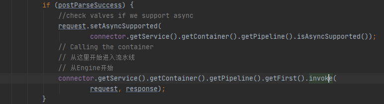
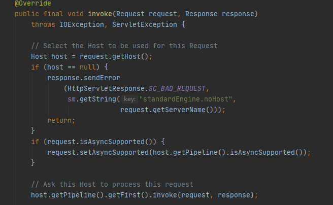
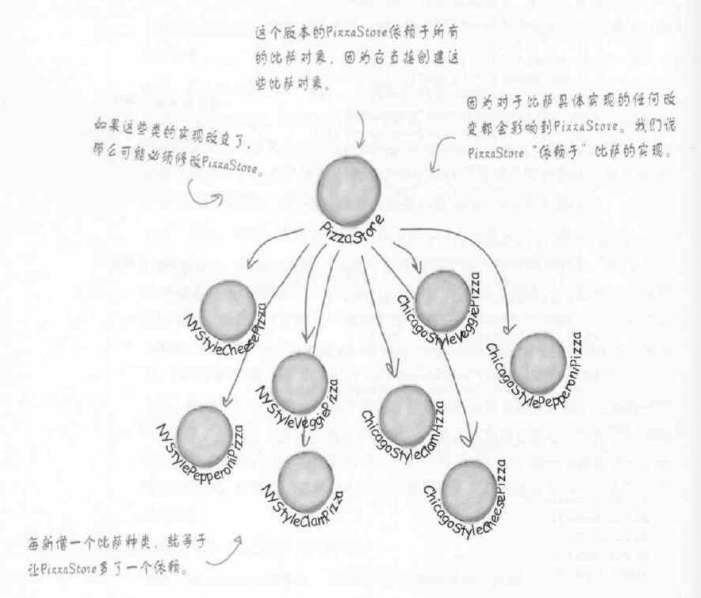
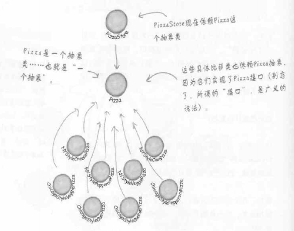
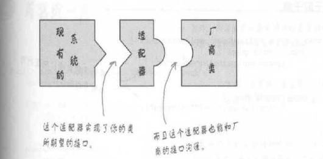
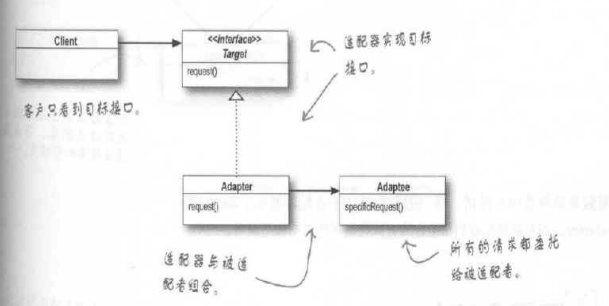

# Tomcat概要
> 《How Tomcat Works》 《深入剖析Tomcat》 《Tomcat架构解析》  </br>
> Tomcat是Apache开源的Web服务器，其以Catalina作为Servlet容器，采用Pipeline作为服务的连续触发，Lifecycle管理所有组件的生命周期。  </br>

对Tomcat的运行机制很感兴趣，凭着新手的理解，结合上面的书籍浅读了一下Tomcat源码下面进行一些个人理解的总结。  </br>
基于Tomcat8.5.57源码</br>
# Tocmat中的一些知识点
## Tomcat架构的简单描述

&emsp;要理解Tomcat，就要理解Http，一次Http请求的过程中发生了什么，将要发生什么，可能会发生什么。</br>
&emsp;跟着上面那张图，把Tomcat的基本架构理顺一下。首先，一个简单的服务器可以被描述为Server，它有启动和停止命令，能够使用Socket监听端口；我们的服务器需要处理连接和处理请求，将它们解耦，我们有了`Connector`和`Container`，其中Connector负责开启Socket并监听客户端请求、返回响应数据；Container负责处理请求。  </br>
&emsp;在上面的模式中，如果我们需要让他们形成工作流，一个`Server`是无法管理多个Connector和Container的对应的，所以多了一层`Service`，用来管理多个Connector和一个Container的对应，而Server管理多个Service。</br>
&emsp;接下来Tomcat把Container命名为了`Engine`，表示整个Servlet引擎。  </br>
&emsp;一个Engine下面可以有多个应用，一个应用为一个`Context`，实际上对应的就是一个Web Application，我们可以在配置文件中修改端口配置多个Context，也就实现了一个Tomcat中运行多个项目的目的。  </br>
&emsp;`Host`代表一个虚拟域名，内部嵌套Context。  </br>
&emsp;一个`Wrapper`对应一个Servlet，Context中有多个Wrapper。  </br>
&emsp;我们再次提起`Container`，这里以上提到的Engine，Host，Context，Wrapper均继承自Container。  </br>
&emsp;再抽象一层，我们需要管理所有组件，包括Server和Service的生命周期，我们就让所有的组件都实现一个管理生命周期的接口，称之为`LifeCycle`。  </br>
&emsp;从Engine到Host，再到Context，再到Wrapper，都维护了一个`Pipeline`，有基础`Valve`，其层级之间通过PipeLline连接，并可以通过Valve对请求处理进行扩展（比如密码校验等）。这里叫做责任链模式。  </br>
&emsp;接下来我们再看`Connector`的设计，连接器完成的任务有  </br>
&emsp;&emsp;1，监听端口，读取请求  </br>
&emsp;&emsp;2，将请求数据按照指定协议解析  </br>
&emsp;&emsp;3，根据请求地址匹配正确的容器进行处理  </br>
&emsp;&emsp;4，容器处理完成后，将响应返回客户端  </br>
&emsp;从这里我们可以看到，连接其需要判断不同的协议，还要选择不同的容器。这里Tomcat对其进行了解耦，设计了Endpoint作为IO，监听请求；Processor按照请求地址映射到容器进行处理（Mapper）。Tomcat通过适配器模式实现了Connector与Mapper、Container的解耦，默认为CoyoteAdapter。  </br>
&emsp;为了解决并发问题，Tomcat设计了Executor作为可在组件间共享的线程池，实现了Lifecycle，可按照通用组件进行管理。Executor由Service维护，所以共享范围为同一个Service。  </br>
&emsp;到这里Tomcat的基本结构就大概了解了。 </br>

## Tomcat初始化流程  

&emsp;Tomcat的主类在Bootstrap，初始化后进入Catalina类，在Catalina的load方法中的digester.parse(inputSource)中解析了配置文件，并初始化了Service（包括初始化了Connector、Endpoint等）。  </br>
&emsp;注意，各种组件的初始化都是由从Lifecycle继承来的initInternal方法在做，且都要在函数中调用super.initInterval()(实际上是LifecycleMBeanBase类中的此方法)，用来注册Bean。在Catalina中getServer并初始化和启动了它。这里StandardServer主要用来监听Stop命令，真正的请求监听还是Endpoint在做。  </br>

## 一次请求是如何被接收、处理、返回的，流程如何

## 如何处理并发请求的  
&emsp;Tomcat处理并发的手段是通过线程池。  </br>
&emsp;各种组件被初始化之后,Lifecycle同样链式的调用了每个组件的startInternal()方法，其中包括Connector的，其中调用了protocalHandler的start方法，protocalHandler接口的实现类的start()被调用，并在其中调用了endpoint.start()方法，其中再调用了startIntenal方法，其实现类NioEndpoint在其startInternal()方法中实例化了一个东西叫Poller，这个东西看名字的意思，就知道他是从队列里面拉东西出来的。</br>
&emsp;我们可以看到，Endpoint有三个实现类，分别是Apr，Nio（默认的），Nio2</br>
&emsp;他们的区别是Apr是从操作系统级别解决异步IO；</br>
&emsp;&emsp;&emsp;Nio是利用了Java的NIO实现非阻塞IO</br>
&emsp;&emsp;&emsp;Nio2利用代码实现</br>

> https://www.javadoop.com/post/tomcat-nio</br>
> https://juejin.im/post/6844903874122383374</br>
> 这两篇文章讲endpoint的细节讲的比较多，直接看文章+源码即可，这里重点说Poller。</br>

&emsp;我们可以看到Poller是NioEndpoint的内部类，其实现了Runnable接口。在endpoint的startinternal方法中，有这么一段。</br>
  
&emsp;我们可以看到初始化了一个pollers数组，这里默认长度是2，然后为每个poller启动了一个单独的线程并开启。</br>
&emsp;然后下面进入startAcceptorThreads方法，开启Acceptor。Poller是选择器，Acceptor是接收器(**一个请求就是从这里进的Tomcat**)。接收器不断接收请求，丢入Channel，channel和Poller绑定，Poller不断轮询里面有没有事件。这里应该知道了Poller要做的事情就是衔接请求接收和请求处理两个步骤，实际上poller会将channel中读出的字节流包装为NioSocketWrapper最终在processSocket中注册给Executor（线程池的接口），再丢给protocalProcessor解析，最后流转给Servlet。</br>
&emsp;为什么这么设计？因为Acceptor只处理接受请求，接收到之后，要赶紧把他丢进Channel回头再去接收新的请求，同时生成新的SocketChannel，与下一个空闲的Poller register，再有新的Poller。由Poller接手下面的工作，这样不仅可以解耦，也可以让每个组件的工作更加专注，分离，效率更高。</br>

&emsp;(Poller这段代码其实没太看懂，消息过来之后怎么包装的，怎么往下传的。后面有时间了再回来debug这段仔细研究一下吧。)</br>

## Servlet的原理、加载机制

&emsp;Servet的生命周期一直是一个重点，然而单纯的背知识点是没有有意义的。接下来从源码角度来看Servlet到底是什么，其生命周期有哪几个阶段，分别是什么时间开始和结束的。</br>
1.  我们前面讲到，Poller接手了Acceptor丢过来的Channel，封装成NioSocketWrapper，在内部类SocketProcessohttr的doRun方法中调用state = getHandler().process，一路调用process下去，最终调用service方法交给Http11Processor解析，并包装Request、Response对象，再调用service方法，在service方法中将request和response对象交给Adaptor.service()。</br>
&emsp;Adaptor这里，就是Servlet的入口点了。Adaptor的service()方法中，可以看到有一行connector.getService().getContainer().getPipeline().getFirst().invoke(request, response);这里的getContainer实际上get到的是Engine。从这里开始，开始进入了我们前面说的流水线Pipeline，顺序调用Engine，Context，Wrapper的invoke方法，将request和response一直往后传，期间经过了Filter等。</br>
&emsp;**一直到StandardWrapperValve的invoke方法，这里初始化了Servlet，方法是通过wrapper.allocate()**。同时，在StandardWrapperValve的invoke方法中，利用servlet实例化了FilterChain，还将request和response封装成了ServletRequest和ServletResponse，并调用了doFilter(ServletRequest, ServletResponse)，使得可以继续往下流转。</br>
&emsp;**最终，在doFilter方法中，将设置的Filter全部都流转过一遍之后，进入了servlet.service(request, response);**</br>
&emsp;以上Servlet的初始化时机、调用时机的源码解析就讲完了。总结一下的话，就是当该Servlet被调用时，请求进入Tomcat，流转到WrapperValve的invoke方法调用中，调用了wrapper.allocate()方法**判断是否是SingleThreadModel单线程模式**决定如何实例化Servlet。（**单线程模式：Tomcat默认一个路径对应一个Servlet实例，这个Servlet会被多线程访问。如果配置了单线程模式，则一个路径会对应一个ServletPool，，如果，如果不是，那么全局只有一个Servlet，每次请求都复用这个，默认第一次访问这个路径时初始化，也可以配置Tomcat启动时全部Servlet初始化；如果是单线程模式，那么会先去池子里面找有没有Free的Servlet，如果没有，就新建一个。**）其实Servlet还可以配置成Tomcat开启时直接初始化，但是这样比较耗费内存。同时我们上面还讲到了Servlet是什么时候开始service的，总结来说就是Filter流转完之后直接流转进入Servlet。</br>
&emsp;另外的，servlet的init方法也是在wrapper.allocate()中被调用的。关于这个allocate方法，需要注意的一点是，wrapper实际上维护了一个Stack中存放了Servlet，如果Tomcat开启的不是singleThreadModel的话，需要Servlet时都会先到pool中找。如果不够了，每次实例化Servlet，用完之后都会被回收进这个栈（名字叫instancePool），当然，有个最大限制，如果Servlet实例过多，新来的请求就只能等待了。</br>
&emsp;这里提到了singleThreadModel，如果开启了单线程模式，每次请求都会来进入这一个instance，它不会被回收，会重复利用。</br>
2. 接下来我们来看Servlet运转完之后，是什么时候开始销毁的。</br>
&emsp;Servlet的销毁方法的调用是从StandardWrapperValve的invoke方法中开始的，**具体来说是在dofilter被调用，并返回之后，进入其finally代码块，首先release了filterChain，然后调用了wrapper.deallocate(servlet)方法。从名字也看得出，和allocate方法是相反作用。**</br>
&emsp;deallocate方法就是做了上面我们提到的**将Servlet回收进Pool的动作。**</br>
&emsp;至于销毁的话，实际上这里关于这个请求的Servlet实就已经被**回收**了，如果以destory方法被调用作为**销毁**的话，实际上是在servlet超时（Long.MAX_VALUE）或者Tomcat被关闭时。因为Servlet是单例的，这里涉及到了单例模式。</br>

## Session和Cookie是怎么生成、使用、存储的

&emsp;Session和Cookie作为后端维持会话信息的工具，是由后端生成，保存在后端的，返回给前端的。前端每次请求时带上Cookie，后端即认证这个用户。</br>
&emsp;1，session是什么时候被初次创建的？创建之后存在哪？</br>
&emsp;Session并不是请求一来就创建的，而是只有当后端调用getSession方法时才创建。</br>
&emsp;首先我们找到Request的getSession方法，方法里首先调用了doGetSession(true)，返回session，接下来在调用session的getSession方法，返回HttpSession。我们分别进去看一下，首先看doGetSession，其中首先去找Context获取了Manager（前面还没提到Manager，它是Tomcat专门管理Session的类），然后根据requestedSessionId去findSession，找到了就返回。如果没找到，就去调用manager.createSession(sessionId)，这里的sessionId是从Request中获取的。继续追溯下去，我们可以看到进去之后无非就是继续调用create方法，设置初始参数，最后调用到StandardSession的构造函数。</br>
&emsp;接下来我们再看session.getSession()，看起来这个方法就是为了将Session转为需要的HttpSession。但是我们不能直接让HttpSession实现Session然后Session转为HttpSession，因为父类不能向子类转型。事实上Session还是HttpSession的实现类呢。那我们能不能让StandardSession直接转为他的接口HttpSession类型呢    （StandardSession同时实现了Session接口和HttpSession接口）？语法上来说是可以的，但是这里有个巨大的问题，也就是，HttpSession接口中的方法都是用来操作Session的一个面向用户的属性的，而Session中的方法都是一些Tomcat用来管理Session的方法。如果我们将StandardSession直接转为HttpSession，那么它其中从Session继承来的方法其实还在里面，对Tomcat熟悉的人甚至可以直接强转回来操控Session，那么对于Tomcat来说是一个巨大的安全隐患。</br>
&emsp;那应该怎么办呢？这里Tomcat用到了外观模式，来解决这个问题设计了一个叫做StandardSessionFacade的类，它实现了HttpSession接口，同时又将HttpSession作为它的属性，我们将StandardSession传入它，包装一下，作为HttpSession返回，这样即使将他向下强转，最多也只能得到Facade，保障了安全性。</br>
&emsp;接下来我们再来看Session创建之后存在哪。找到ManagerBase类中的createSession方法，其中调用了session.setId(id)方法，点进去之后发现，里面调用了manager的方法，如果manager中存在就先删除，然后再add，在add中我们可以看到sessions.put(session.getIdInternal(), session)。这里我们可以知道，session是存储在一个map中的，这个map是一个ConcurrentHashMap。</br>
&emsp;2，Session是怎么匹配的？什么时候被删除？</br>
&emsp;我们可以看到在ManagerBase的createSession方法中调用了generateSessionId方法，生成了SessionId，然后这个id作为Key和Session一起保存在map中，后面还会定期更换、主动更换等方式更新sessionId。</br>
&emsp;所以我们现在找一下请求过来的时候，Tomcat是怎么拿到请求中的SessionId去查map的。</br>
&emsp;我们进入CoyoteAdapter类，记得这个类是用来处理请求的。我们看它的</br>postParseRequest方法，顾名思义是用来解析Request的。其中SessionId的解析分为两步骤，第一步先去URL中找（8.5.57版本是713行开始），URL中如果找到了的话就将其保存进Request类；第二步骤再调用parseSessionCookiesId方法，去Cookies里面找SessionId，找到了的话也放进Request中。然后后面findSession我们在第一问已经讲过了。
&emsp;Session的删除其实叫做过期，过期时间是在StandardContext中的sessionTimeout，默认是30分钟，每次Session初始化时设置进去的。过期时间是在最后一次访问这个Session之后开始计算。</br>
&emsp;3，cookie是怎么解析的？</br>
&emsp;其实这个问题上面已经说过了，是在Adaptor中解析的。</br>

## 过滤器Filter是如何加载的

&emsp;Filter过滤器前面有提到过，是在进入Servlet之前的最后一个组件。</br>
&emsp;总的来说就是配置上了Filter，会在StandardWrapperValve中被实例化为一个filterChain（数组形式存储了实例化的Filter），会在dofilter方法中按照配置文件中的配置顺序执行。</br>

## 热加载

&emsp;开启了热加载模式后，在WebappLoader中有一个backgroundProcess，定期会调用modified方法，检查是否有类被修改了，或者有新的类添加，如果有，则加载它们。</br>
## NIO AIO BIO

&emsp;IO是Web服务器的一个重点，采取什么样的网络IO，决定了服务器接收请求的效率。</br>
#### 首先搞清楚名词：
* 同步：发出一个功能调用，调用者在没有得到结果之前，该调用就不返回。
* 异步：发出一个功能调用，不能立刻得到结果。实际处理调用的人处理完成后通过状态、通知和回调来通知调用者
* 阻塞：调用者发出一个功能调用，在调用结果返回前，调用者的线程挂起（进入非可执行状态，cpu不会给该线程分配时间片，该线程暂停运行），直到调用产生结果，阻塞状态解除，重新变成活动线程。
* 非阻塞：在调用结果返回前，该函数不会阻塞当前线程，而会立刻返回。
#### 根据以上理解：
* 同步IO和异步IO的区别在于：数据调用的时候进程是否阻塞。关注点在于消息通信机制
* 阻塞IO和非阻塞IO的区别在于：应用程序的调用是否立刻返回。关注点在于等待结果或返回值时的状态
* 同步和异步是针对调用结果如何返回给调用者来说的。即调用的结果是调用者主动去获取的（比如一直等待recvfrom或者设置超时等待select），则为同步，而调用结果是被调用者在完成之后通知调用者的，则为异步（比如windows的IOCP）。
* 阻塞和非阻塞是针对调用者所在的线程是否在发起调用之后挂起来说的。即如果在线程中调用者发出调用之后，再被调用这返回之前，该线程主动挂起，则为阻塞，若线程不主动挂起，而继续向下执行，则为非阻塞。
#### 结合以上几点，在网络IO中：
* 同步阻塞：调用者发出某调用后，如果函数不能立即返回，则挂起所在线程，等待结果。
* 同步非阻塞：调用者发出某调用后，如果有数据可读，则读取并返回；如果没有数据可读，则线程继续向下进行。在实际使用中，read会一直在一个循环中，这样就可以不断读取数据（尽管某次read可能并不能获得数据）。
* 异步阻塞：调用者发出调用后，线程挂起，被调用的读操作由系统（或者库）进行，等待有结果之后，系统（或者库）通过某种机制来通知调用者（在调用者获得结果之前，调用者所在线程一直阻塞，这个看起来和同步阻塞很像，但略有不同。但可以这样理解，同步阻塞相当于调用者A调用了一个函数F，F是在调用者A所在的线程中完成的，而异步阻塞相当于调用者A发出对F的调用，然后A所在线程挂起，而实际F是在另一个线程中完成，然后另一个线程通知给A所在的线程，更准确的是将两个线程分别换成用户进程和内核）。
* 异步非阻塞：调用者发出调用后，调用者线程继续进行别的操作，被调用的读操作由系统（或者库）来进行，等待有结果之后，系统（或者库）通过某种机制（一般为调用调用者设置的回调函数）来通知调用者。

#### 接下来结合Tomcat
&emsp;以前Tomcat中所用的BIO时同步阻塞IO，对于每一个Socket，都要有一个线程专门处理，对于socket流要阻塞读。因为常常涉及线程开启和回收，所以一般会考虑线程池和连接池，维持一定数量的线程和连接，减少频繁调用系统接口的开销，也可以合理利用多线程来使用多核心CPU的资源。</br>
&emsp;BIO的优点是，事情发生了才使用资源，对于并发量特别大的场景，BIO的效率其实比NIO要高，且更节省系统资源。缺点就是当并发量过高，达到数万，十万级以上，阻塞难以处理。且对于连接数目不大且相对固定的场景，BIO比NIO更加合适。</br>
​    
&emsp;**NIO是non-blocking I/O，非阻塞IO**，在Tomcat实现中，读数据还是同步读，所以是同步非阻塞IO。在Tomcat8.5之后，BIO已经被完全抛弃了，NIO成为了默认的IO方式。下面来看一下Tomcat中的NIO是怎么实现的。</br>

&emsp;在Tomcat中，NIO的核心在于Selector选择器（http://ifeve.com/selectors/   &emsp; https://www.jianshu.com/p/f26f1eaa7c8e） 。和Linux Poll是类似的东西，注意NioEndPoint的实现是返回有事件的数量，然后轮询所有Channel，看哪个可以读写的，这点跟Poll一样，跟EventPoll不同</br>
&emsp;Selector简要的来说就是一个类似注册中心，可能会发生事件的Channel注册到Selector中，当其中有Channel可以读时，就执行select，遍历出可以读数据的socket，进行读操作。</br>
&emsp;Selector在NioEndpoint中是以Poller实现的，它维护了一个Selector。Accptor中SocketChannel的生成，注册到selector；Poller中获取Channel，包装并交给线程池的总流程以下图所示。</br>
  
&emsp;对比BIO和NIO，实际具体到读数据，都是主动读数据，所以都是同步读；至于阻塞和非阻塞，BIO是每次来一个请求，都要阻塞在read()方法中读，而NIO来一起请求时，会将数据Channel注册到Selector中，相当于Selector维持了多个Channel，哪个来数据就去读哪个，就算读不到数据，Selector也一直在运行，所以是非阻塞。</br>

> https://www.zhihu.com/question/266222348</br>
> https://zhuanlan.zhihu.com/p/83597838</br>
> https://www.zhihu.com/question/64862912</br>
> https://www.iteye.com/blog/gearever-1844203  这个博客写的很好</br>

## Tomcat中的设计模式
&emsp;目前看到的Tomcat中的设计模式有单例模式，职责链模式，外观模式，适配器模式，工厂模式，组合模式</br>
&emsp;下面一个一个来说</br>

#### 单例模式
&emsp;单例模式的存在是为了保障一些在程序中只出现一次的资源，比如线程池、缓存、注册表等，只出现一次，也只能出现一次。通常我们可能会使用static变量作为全局变量使之全局唯一，但它需要在程序一开始就实例化，浪费资源。</br>
&emsp;单例模式采用private的构造器 + getInstance()延迟实例化的方式实现。下面贴代码</br>

```
public class Single {
	// 静态的
    private static Single singleInstance = null;
	// 私有的构造器
    private Single() {
        // TODO
    }
	
    public static Single getInstance() {
    	// 判断是否已经实例化
    	if (singleInstance == null) {
            singleInstance = new Single();
        }
          return singleInstance;
      }
  }
```
&emsp;以上方式就是单例模式，需要注意的点已经注释标注了。</br>
&emsp;采用了单例模式也并非完全安全，仅仅是在单线程情况下安全，下面我们来考虑一下**多线程情况**下。如果一个线程第一次调用getInstance()，此时没有实例化，该线程进入了方法，在if刚刚判断完成之后，线程执行切换到了另一个线程，其也判断了singleInstance==null，并实例化。再切换回第一个线程，此时就实例化了两个Single对象，如果接下来的方法必须顺序执行，那么会产生严重的线程安全问题。</br>
&emsp;那么怎么解决这个问题呢？当然就是线程同步。</br>
&emsp;首先我们考虑加锁</br>

```
public class Single {
	// 静态的
    private static Single singleInstance = null;
	// 私有的构造器
    private Single() {
        // TODO
    }
	// 在这里将方法变成同步方法，在一个线程没有退出此方法之前
	// 其他线程无法进入该方法
    public static synchronized Single getInstance() {
    	// 判断是否已经实例化
    	if (singleInstance == null) {
            singleInstance = new Single();
        }
        return singleInstance;
    }
}
```
&emsp;看起来同步代码块好像解决了问题，但是却造成了严重的性能问题。如果你的软件可以接受性能的缺陷，那就这么做吧，因为它最简单，也最容易理解。如果不能接受，那我们考虑下面的方式。</br>
* 方式一：抛弃延迟实例化，采用“急切”的创建实例的方法
```
public class Single {
  // 在这里直接实例化
    private static Single singleInstance = new Single();
    
    private Single() {
        // TODO
    }
    // 当需要时，直接返回
    public static synchronized Single getInstance() {       
        return singleInstance;
  }
}
```
  方法一的优点很明确：快；缺点也显而易见，早早的实例化了类，会占用不小的系统资源。

* 方法二：**用“双重检查加锁”，在getInstance()方法中减少同步**
&emsp;我们可以想象到 只有第一次实例化Single类的时候才需要同步，所以我们需要一种机制，即时地知道single类有没有被实例化，所以我们利用volatile的可见性</br>
```
public class Single {
    // 使用volatile的可见性
    private volatile static Single singleInstance = null;

    private Single() {
        // TODO
    }
    
    public static Single getInstance() {
        if (singleInstance == null) {
            // 只有第一次才彻底执行这里的代码
            synchronized (Single.class) {
                // 进入同步区块后双重检查
                if (singleInstance == null) {
                    singleInstance = new Single();
                }
            }
            singleInstance = new Single();
        }
        return singleInstance;
    }
}
```

&emsp;到这里，单例模式就讲的差不多了。</br>

#### 职责链模式

在Tomcat中，非常核心的设计就是采用Pipeline + Valve形成的职责链（或者叫责任链）模式，其特征是链式的对信息进行处理，常用在消息解析、邮件过滤等。</br>
CoyoteAdapter的service中可以看到有一行代码：</br>

从这里的invoke方法进去，就开始了职责链。</br>
这里的Pipeline是Container的一个属性，Pipeline中维护了第一个Valve作为first，其后每一个Valve都维护了一个next。若要插入一个新的Valve，则要递归的寻找此时链表的尾部插入。</br>
每进入一个新的Valve，都要通过调用其接口Valve中定义的invoke方法，每一个invoke的最后都调用下一个Valve的invoke，当到达Pipeline尾部之后，若后面还有新的Pipeline（比如Engine后面要调用Host的），则调用下一个起始Container的getPipeline继续往下执行。


#### 工厂模式

工厂模式可以说是OO设计的精华之一，可以将“初始化”“实例化”任务从主要代码中解耦，重点解决代码中依赖的问题。接下来我们将初始化任务一步一步解耦。**所有的工厂模式都用来封装对象的创建。**下面主要来自Head First设计模式</br>
通常我们需要实例化一个新的对象时，我们通常需要使用其类的构造器</br>
```
	Pizza p = new Pizza();
```
通常我们这样new对象没有什么错误，但在工程中，尤其是有可能要修改的地方，大量使用对具体类的实例化会让你的代码“对修改关闭”，想修改或添加新的具体类型来扩展代码到新的环境，必须要重新打开代码找到修改的地方。所以，我们需要一个方法增加扩展性。</br>
假如我们现在有三种匹萨可供客户选择，在点单方法里判断类型肯定是不符合程序设计要求的，也对点单本身的程序流程可读性、扩展性有很大的破坏，所以我们需要一个**简单工厂**（简单工厂其实并不是设计模式，而是一种解耦的编程习惯）
```
public class PizzaStore {
    SimplePizzaFactory factory;

    PizzaStore(SimplePizzaFactory factory) {
        this.factory = factory;
    }

    public Pizza orderPizza(String type) {
        Pizza pizza;
        // 利用工厂传入所需类型，解耦
        pizza = factory.createPizza(type);

        pizza.prepare();
        pizza.bake();
        pizza.cut();
        pizza.box();
        return pizza;
    }
}
```
```
// 定义简单工厂
public class SimplePizzaFactory {

    public Pizza createPizza(String type) {
        Pizza pizza = null;

        if (type.equals("cheese")) {
            pizza = new CheesePizza();
        } else if (type.equals("pepperoni")) {
            pizza = new PepperoniPizza();
        } else if (type.equals("clam")) {
            pizza = new ClamPizza();
        } else if (type.equals("veggie")) {
            pizza = new VeggiePizza();
        }
        return pizza;
    }
}
```
利用以上方法我们就可以使用简单工厂来解耦实例化的过程，我们可以创建一些不同的PizzaFactory，来为每个不同需求的PizzaStore构造披萨工厂。</br>

----------------------------------------------------

刚才我们通过单独定义工厂类的方法解耦了实例化的流程，**而PizzaStore中要用到的Factory还是被直接实例化，并没有做到PizzaStore和披萨种类之间的扩展性。**下面我们再考虑一个问题，如果我们希望将工厂绑定在构造者中，并保有一定的扩展性，使得后续类可以实现继承构造者PizzaStore而实现不同种类的披萨店铺的问题。需要用到**工厂方法模式**</br>
让后续披萨店只需要继承就可以获得所有的功能，并且披萨的种类由子类决定，我们要将PizzaStore变为接口，而点单代码在每个披萨店中是相同的，我们并不想让加盟店自己复写实现，所以我们将PizzaStore变为抽象类。</br>
我们将createPizza合并到PizzaStore中，但其只定义方法签名，让子类自己实现自己的披萨类型，所以createPizza方法要是一个抽象方法。</br>

```
public abstract class PizzaStore {

    public Pizza orderPizza(String type) {
        Pizza pizza;
        // 利用工厂传入所需类型，解耦
        pizza = createPizza(type);

        pizza.prepare();
        pizza.bake();
        pizza.cut();
        pizza.box();
        return pizza;
    }

    abstract Pizza createPizza(String type);
}
```

所以此时子类可以实现PizzaStore抽象类，实现自己的**披萨工厂方法**。
```
public class NYPizzaStore extends PizzaStore{
    @Override
    Pizza createPizza(String type) {
        Pizza pizza = null;

        if (type.equals("cheese")) {
            pizza = new CheesePizza();
        } else if (type.equals("pepperoni")) {
            pizza = new PepperoniPizza();
        } else if (type.equals("clam")) {
            pizza = new ClamPizza();
        } else if (type.equals("veggie")) {
            pizza = new VeggiePizza();
        }

        return pizza;
    }
}
```
现在如果我想点一家来自纽约口味的披萨，那我需要做下面的事。
```
	// 注意这里的句柄其实是父类的句柄
	PizzaStore store = new NYPizzaStore();
	Pizza pizza = store.orderPizza("cheese");
```
同时接下来Pizza也可以通过工厂方法模式解耦为不同口味的Pizza创建

我们可以分析一下这里是怎么解耦的。首先点单程序在父类和每个子类中都是相同的，当我们实例化父类的PizzaStore句柄来实例化子类时，我们调用的orderPizza("cheese")方法实际上并**不知道**实际要找哪种类型的披萨来生产。**具体来说就是由于Pizza对象是抽象的，order并不知道哪些实际具体的类参与了生产过程，这就是解耦。这里也就解耦了超类中的公用代码和子类独特的生产代码。**</br>

我们定位到这种披萨是因为客户端程序实例化的PizzaStore句柄是指向NY的，也就是说，orderPizza最终会找到的是哪种披萨是由子类决定的，而子类是由客户决定的，所以是顾客决定了到哪家店去生产披萨。</br>

**工厂方法模式**通过让子类决定该创建的对象是什么，来达到将对象创建的过程封装的目的。工厂方法模式通过抽象的Product和Creator方法来封装具体类型的实例化，而只有子类真正实现工厂方法并创建产品。对比简单工厂，工厂方法模式实现了Creator和Product之间的松耦合。简单工厂不具有工厂方法的弹性，因为简单工厂不能变更正在创建的产品。所以我们讲简单工厂并不是设计模式，而只是一种编程习惯而已。</br>

下面我们再从OO设计的角度去理解工厂方法。当我们不用任何工厂，直接再PizzaStore中用new创建Pizza时，披萨店和披萨是紧耦合的，披萨店紧紧依赖披萨。

这样的依赖方式会给我们的代码扩展性带来不小的麻烦，所以**代码里减少对具体类的依赖是件好事**，遵循**要依赖抽象，不要依赖具体类，这样的OO设计叫做依赖倒置原则**。高层组件要依赖高层组件，不要依赖具体的底层组件。</br>

所以我们利用工厂模式，让PizzaStore（高层）依赖Pizza抽象类/接口（高层），实现类NYPizzaStore（低层）依赖CheesePizza（低层），而NY和Cheese的实现都依赖于高层的抽象类，看起来像下面这样。

有了这样的依赖倒置的思想，当我们在设计披萨店的时候，就可以不用考虑具体的披萨种类，专心于披萨店自己的流程了。下面是几个指导方针，帮助你遵循此原则（***并非完全必须遵守***）。</br>
1. 变量不可以持有具体类的引用。如果使用new，就会持有，你可以改用工厂来避免。</br>
2. 不要让类派生于具体类。派生于具体类就会以来具体类，请派生于抽象类或接口。</br>
3. 不要覆盖基类中已经实现的方法。如果或需要覆盖，就说明你的基类不是一个是个被继承的抽象。基类中的方法应该由所有子类共享。</br>

--------------------------------------------------------

上面我们用工厂方法模式**将客户代码从需要实例化的具体类中解耦**，其只生产了一类产品，且创建新的类型的工厂需要继承整个客户代码。下面我们来看看一种新的工厂模式叫做**抽象工厂模式**，它能够创建一个产品家族或者将一系列产品的生产过程集合起来。</br>

我们以披萨的原材料作为举例。我们都知道同一种披萨，比如芝士披萨，在不同的地区有不同的配料，有些地方可能会放甜芝士，有些地方放咸芝士，有些地方放蘑菇，有些地方放蔬菜。我们刚才用工厂方法模式解耦出来了披萨的生产环境，但如果为每种同名的披萨再创建一种创建披萨的工厂方法，那简直太复杂了。所以我们需要**将生产披萨的原料工厂化**，对于不同地区的披萨，创建不同的工厂，这就是抽象工厂模式了。</br>

我们还利用上面工厂方法模式已经抽象出的工厂方法继续向下解耦。</br>
> ```
> public abstract class PizzaStore {
>
>    public Pizza orderPizza(String type) {
>       Pizza pizza;
>        // 利用工厂传入所需类型，解耦
>       pizza = createPizza(type);
>
>       pizza.prepare();
>       pizza.bake();
>       pizza.cut();
>       pizza.box();
>       return pizza;
>   }
>   
>   abstract Pizza createPizza(String type);
> }
> ```
>
> 所以此时子类可以实现PizzaStore抽象类，实现自己的**披萨工厂方法**。
> ```
> public class NYPizzaStore extends PizzaStore{
>    @Override
>   Pizza createPizza(String type) {
>       Pizza pizza = null;
>       
>       if (type.equals("cheese")) {
>           pizza = new CheesePizza();
>       } else if (type.equals("pepperoni")) {
>           pizza = new PepperoniPizza();
>       } else if (type.equals("clam")) {
>           pizza = new ClamPizza();
>       } else if (type.equals("veggie")) {
>           pizza = new VeggiePizza();
>       }
>   
>       return pizza;
>   }
>}
>
>```

上面的代码方式**只能创建Pizza这一种产品的工厂，而不能创建多种Pizza原料的工厂**
我们下面看看如何为每种不同地区、不同口味的披萨创建原料工厂</br>

```
public interface IngredentFactory {

    Dough createDough();

    Sauce createSauce();

    Cheese createCheese();

    Veggies[] createVeggies();

    Pepperoni createPepperoni();

    Clam createClam();
}

```
然后创建工厂实现类</br>
```
public class NYIngredentFactory implements IngredentFactory{
    @Override
    public Dough createDough() {
        return new ThinCrustDought();
    }

    @Override
    public Sauce createSauce() {
        return new MarinaraSauce();
    }

    @Override
    public Cheese createCheese() {
        return new ReggianoCheese();
    }

    @Override
    public Veggies[] createVeggies() {
        return new Veggies[]{
                new Garlic(),
                new Onion(),
                new Mushroom()
        };
    }

    @Override
    public Pepperoni createPepperoni() {
        return new SlicedPepperoni();
    }

    @Override
    public Clam createClam() {
        return new FreshClams();
    }
}

```

现在看看我们怎么生产一个纽约口味的CheesePizza</br>

```
public abstract class Pizza {
    String name;
    Dough dough;
    Sauce sauce;
    Veggies veggies[];
    Cheese cheese;
    Pepperoni pepperoni;
    Clam clam;


    abstract void prepare();

    void cut() {
        System.out.println("cut");
    }

    void bake() {
        System.out.println("bake");
    }
    void box() {
        System.out.println("box");
    }

}
```
实现CheesePizza，公用的，要实现哪个口味的，仅需要传入不同的原料工厂.
即使是根据个人口味定制，也并不费事，只需要实现一种新的原料工厂传入</br>

```
public class CheesePizza extends Pizza{
    // 每种Pizza都有自己独特的原料工厂来生产多种原料
    IngredentFactory ingredentFactory;
    // 传入所需的工厂
    CheesePizza(IngredentFactory ingredentFactory) {
        this.ingredentFactory = ingredentFactory;
    }

    @Override
    void prepare() {
        System.out.println("prepare");
        dough = ingredentFactory.createDough();
        cheese = ingredentFactory.createCheese();
        clam = ingredentFactory.createClam();
        pepperoni = ingredentFactory.createPepperoni();
        veggies = ingredentFactory.createVeggies();
        sauce = ingredentFactory.createSauce();
    }
}

```

现在NYPizzaStore变成什么样子了？</br>
```
public class NYPizzaStore extends PizzaStore{
    @Override
    Pizza createPizza(String type) {
        Pizza pizza = null;
        // 原料工厂
        IngredentFactory ingredentFactory = new NYIngredentFactory();

        if (type.equals("cheese")) {
            pizza = new CheesePizza(ingredentFactory);
        } else if (type.equals("pepperoni")) {
            pizza = new PepperoniPizza(ingredentFactory);
        } else if (type.equals("clam")) {
            pizza = new ClamPizza(ingredentFactory);
        } else if (type.equals("veggie")) {
            pizza = new VeggiePizza(ingredentFactory);
        }

        return pizza;
    }
}

```
**抽象工厂模式**就是这样。
两种工厂模式现在也许比较混乱了，下面我们来对比一下。

##### 对比工厂方法模式和抽象模式工厂
* 第一点我们可以看到，工厂方法其实隐藏在抽象工厂模式中。我们抽象工厂继承了一系列产品，但其中的具体产品还是需要工厂方法来创建的，甚至，抽象工厂本身也可能需要工厂方法来创建。
* 利用工厂方法来创建对象，需要扩展一个类，并覆盖他的工厂方法；利用抽象工厂来创建对象，要为对象实例化一个工厂，然后将它传入针对抽象类型船舰的代码。
* 工厂方法模式的一个抽象产品类，可以派生多个具体产品类；一个抽象工厂类，可以派生出多个具体工厂类，每个具体工厂类只能创建一个具体产品类的实例。
* 抽象工厂模式中有多个抽象产品类，可以派生多个具体产品类；一个抽象工厂类可以派生多个具体工厂类，每个具体工厂类可以创建多个具体产品类的实例。
* 要隐藏创建一个对象的复杂创建代码时，可以使用工厂方法。要隐藏一系列产品或者将相关产品的复杂创建代码集合起来时，可以使用抽象工厂。
* 抽象工厂类似一个大的工厂，而工厂方法类似大工厂里的一台流水线。
* 工厂模式无论哪种，本质就是**利用多态，对获取对象的过程抽象**，避免**new的时候是啥就是啥**
* 上面的披萨的例子其实并不恰当，具体写代码也不需要拘泥于两种工厂模式，要根据场景去理解是否需要工厂，需要什么样的工厂。多写代码去理解吧。
>https://www.zhihu.com/question/42975862</br>
>https://www.zhihu.com/question/27125796


#### 适配器模式
适配器模式顾名思义，就是将改变A与B不适配的问题，使之适配。

适配器模式的目的是**使接口适配**，分为类适配器和对象适配器。

* 类适配器
由于Java中不支持多继承，所以对于两个类的适配只能采用组合的方式，不过对于接口和类之间的适配还是可以通过**继承**来完成的。
```
// 鸭子的叫声是quack
public interface Duck {
    public void quack();
}
```

```
// 火鸡的叫声是gobble
public class Turkey {
    public void gobble() {
        System.out.println("Gobble Gobble");
    }
}

```
```
// 我们用类适配器把火鸡伪装成鸭子
public class TurkeyAdaptor extends Turkey implements Duck{
    @Override
    public void quack() {
        super.gobble();
    }
}
```
下面测试一下
```
public class Test {
    public static void main(String[] args) {
        Duck turkey = new TurkeyAdaptor();
        testDuck(turkey);
    }

    public static void testDuck(Duck duck) {
        for (int i = 0; i < 5; i++) {
            duck.quack();
        }
    }
}

运行结果：
Gobble Gobble
Gobble Gobble
Gobble Gobble
Gobble Gobble
Gobble Gobble
```
看起来testDuck根本看不出这是一只伪装成鸭子的火鸡。类适配器一般要继承被适配的，将被适配的类实现到要伪装的接口上。
* 对象适配器
对象适配器一般采用组合的方式。我们还是用刚才的鸭子和火鸡。
```
public class TurkeyAdaptor implements Duck{

    private Turkey turkey;

    TurkeyAdaptor(Turkey trukey) {
        this.turkey = trukey;

    }
    @Override
    public void quack() {
        turkey.gobble();
    }
}
```
```
public class Test {
    public static void main(String[] args) {
        Duck turkey = new TurkeyAdaptor(new Turkey());
        testDuck(turkey);
    }

    public static void testDuck(Duck duck) {
        for (int i = 0; i < 5; i++) {
            duck.quack();
        }
    }
}
```

对象适配器通过**将被适配的对象传入**来将对象转为要实现的接口。</br>
总结一下的话就是，适配器模式通过继承或者组合的方式将一个类的接口转换成客户期望的另一个接口，适配器让原本接口不兼容的类可以合作。
**适配器模式和装饰者模式、外观模式三者之间要注意区分，明确场景**


#### 外观模式
外观模式与适配器模式经常放在一起说，这两个模式都是面向接口，将接口或对象包装起来的设计模式，但解决的问题截然不同。下面我们来看一下。</br>

外观模式的宗旨是让接口更简单。遵守**最少知识原则**。
给出一个例子，比如说我们要在电脑上看电影，需要电脑和音响两个类

```
public class Computer {

    void open(){}
    void findMovie(){}
    void openMovie(){}

    void closeMovie(){}
    void closeComputer(){}
}
```
```
public class Sound {

    void open(){}
    void upper(){}
    void lower(){}
    void close(){}
}
```
我们看电影之前可能需要打开电脑，寻找电影，打开电影，打开音响，调高音量等，非常麻烦，我们就可以用外观模式来解决这个问题。
```
public class MovieFacade {
    Computer computer;
    Sound sound;

    MovieFacade(Computer computer, Sound sound) {
        this.computer = computer;
        this.sound = sound;
    }

    public void watchMovie() {
        computer.open();
        computer.findMovie();
        computer.openMovie();

        sound.open();
        sound.upper();
    }
}
```
这样我们就可以通过一个方法来操作电脑和音响了。</br>
>在Tomcat中，外观模式最重要作用是包装一些需要向上转型（不安全）的子类。比如在StandardWrapperValve类的invoke方法中，Request类型的request需要被向上转型传递给接收ServletRequest类型的doFilter方法。如果我们直接向上转型，那么知道Tomcat中类继承关系的程序员可以直接通过向下转型访问到我们不想让他访问到的方法。</br>
所以这里Tomcat在getRequest()方法中将Request包装为了RequestFacade类型，Facade实现了HttpServletRequest（ServletRequest的子接口），将Facade传递给doFilter方法，这样程序员从Facade就没有办法向下转型，访问到能破坏Request安全性的方法了。

* 最少知识原则
我们希望在OO设计中，不要让太多的类耦合在一起，利用外观模式可以良好的解决这个问题。

#### 组合模式

组合模式是OO设计中利用多态将类进行组合的一种设计模式。当你有一些对象的集合，他们彼此之间有“整体/部分”的关系，部分对象之间的实现又有不同，并且你想用一致的方式去对待这些对象时，你就需要组合模式来完成任务。</br>
组合模式模式以**树形**结构表示部分与整体的层次结构，使得用户对整个对象和组合对象的使用具有一致性。

##### 组成元素：
* 抽象构件角色(Composite)：是组合中对象声明接口，实现所有类共有接口的默认行为。
* 树叶构件角色(Leaf)：上述提到的单个对象，叶节点没有子节点。
* 树枝构件角色(Composite)：定义有子部件的组合部件行为，存储子部件，在Component接口中实现与子部件有关的操作。
* 客户端(Client)：使用 Component 部件的对象。


下面我们代码看一下实例。我们设计一个文件系统，文件夹中可能包含文件夹或文件。
首先实现一个抽象根节点Dir作为Component

```
public abstract class Dir {

    protected List<Dir> mDirs = new ArrayList<>();

    protected String name;

    public Dir(String name) {
        this.name = name;
    }

    public abstract void addDir(Dir dir);

    public abstract void removeDir(Dir dir);

    public abstract void clear();

    public abstract void print(int deep);

    public abstract List<Dir> getFiles();

    public String getName() {
        return name;
    }
}
```
具体文件夹类作为Composite。
```
public class Folder extends Dir {

    public Folder(String name) {
        super(name);
    }

    @Override
    public void addDir(Dir dir) {
        mDirs.add(dir);
    }

    @Override
    public void removeDir(Dir dir) {
        mDirs.remove(dir);
    }

    @Override
    public void clear() {
        mDirs.clear();
    }

    // 重点
    @Override
    public void print(int deep) {
        for (int i = 0; i < deep; i++) {
            System.out.print(" ");
        }
        System.out.println(getName() + " (");
        Iterator<Dir> iterator = mDirs.iterator();
        while (iterator.hasNext()) {
            Dir dir = iterator.next();
            for (int i = 0; i < deep; i++) {
                System.out.print(" ");
            }
            dir.print(deep + 1);
            if (iterator.hasNext()) {
            }
        }
        for (int i = 0; i < deep; i++) {
            System.out.print(" ");
        }
        System.out.println(")");
    }

    @Override
    public List<Dir> getFiles() {
        return mDirs;
    }
}
```

具体文件类作为Leaf
```
public class File extends Dir{

    public File(String name) {
        super(name);
    }

    @Override
    public void addDir(Dir dir) {
        throw new UnsupportedOperationException("文件对象不支持该操作");
    }

    @Override
    public void removeDir(Dir dir) {
        throw new UnsupportedOperationException("文件对象不支持该操作");
    }

    @Override
    public void clear() {
        throw new UnsupportedOperationException("文件对象不支持该操作");
    }

    @Override
    public void print(int deep) {
        for (int i = 0; i < deep; i++) {
            System.out.print(" ");
        }
        System.out.println("name: "+name);
    }

    @Override
    public List<Dir> getFiles() {
        throw new UnsupportedOperationException("文件对象不支持该操作");
    }
}
```
这样就实现了对Folder和File管理的组合模式。下面写一个测试类测试一下
```
public class Test {
    public static void main(String[] args) {
        testComponent2();
    }

    public static void testComponent2(){
        //构造一个目录对象表示 sdcard 盘跟目录
        Dir diskSdcard = new Folder("sdcard");

        // sdcard 下有一个文件
        diskSdcard.addDir(new File("bug.log"));

        //sdcard 下还有一个子目录  android
        Dir android =  new Folder("android");
        //android 目录下有一个目录
        Dir data = new Folder("data");
        data.addDir(new File("2019-09-14.log"));
        android.addDir(data);
        diskSdcard.addDir(android);

        //sdcard 下还有一个子目录 baidu
        Dir baidu =  new Folder("baidu");
        //android 目录下有一个目录
        Dir cache = new Folder("cache");
        cache.addDir(new File("offline.baidu"));
        baidu.addDir(cache);
        diskSdcard.addDir(baidu);

        //sdcard 下还有一个子目录 downloads
        Dir downloads =  new Folder("downloads");
        //android 目录下有一个目录
        Dir f360 = new Folder("360");
        f360.addDir(new File("360.log"));
        f360.addDir(new File("test.txt"));
        downloads.addDir(f360);
        diskSdcard.addDir(downloads);

        //打印文件结构
        diskSdcard.print(0);
    }
}

测试结果：
sdcard (
 name: bug.log
 android (
   data (
     name: 2019-09-14.log
  )
 )
 baidu (
   cache (
     name: offline.baidu
  )
 )
 downloads (
   360 (
     name: 360.log
     name: test.txt
  )
 )
)
```
组合模式中的每个类都要管理该类的内部组件，还要管理后继节点，所以组合模式是**以破坏单一责任设计原则换取透明性。**让客户端在操作组件时，一个元素是组合还是叶子节点，完全是透明的。
且简化了高层模块的代码，使得其不必关心处理的是单个对象还是整个组合结构。在组合模式中增加了新的枝干构件和叶子构件都很方便，**无须对现有类库进行任何修改，符合 "开闭原则"。**
通过递归，实现了复杂的树形结构，但其控制却极为简单。</br>
组合模式的缺点也很明确，新增构建时不方便对构件类型进行限制，在进行一些叶子节点不具有或者组合节点不具有的操作时，必须进行类型检查，这个实现过程比较麻烦。