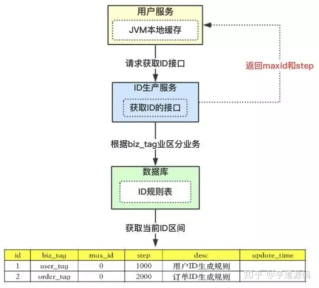

# 分布式唯一ID
## 为什么需要唯一ID？
分布式环境下需要全局订单唯一，从而实现幂等去重  
需要保证：
* 全局唯一
* 趋势递增：方便聚簇索引，有序的主键插入保证写入性能
* 单调递增：版本号、增量消息等，排序需求
* 信息安全

## 数据库自增长
设置主键auto_increment（自增）便可以实现，但在数据库**水平拆分时会造成ID重复**的问题。  
**数据库水平拆分，设置初始值和相同的自增步长**，比如将数据库水平拆分为三个，则分别设置初始值为1，2，3；自增步长为3，就可以防止ID重复问题。  
**如果后续又要增加新机器怎么办？可以预留一些初始值给后续扩容使用**  

## UUID
生成一个32位16进制字符串（16字节的128位数据，通常以32位长度的字符串表示）**「机器的网卡、当地时间、一个随机数」来生成UUID**，当前机器mac地址+当前时间戳+一个随机数，可以确定UUID全球唯一。  

优点：
* 性能好
* 扩展性高
* 本地生成，无网络消耗
缺点：
* 无法保证趋势递增，索引中插入复杂度高
* UUID过长，存储在数据库中建立索引效率低

## Redis生成
Redis本身有incr和increby 这样自增的命令，保证原子性，生成的ID也是有序的。Redis基于内存操作，**性能高效，不依赖于数据库，数据天然有序，利于分页和排序**。  
缺点是增加了系统复杂度，占用带宽，每次要向Redis请求；另外还要考虑持久化的问题，否则如果Redis挂了会丢失之前已经生成的数据。  

## Snowflake
Twitter开源，生成一个64bit（0和1）字符串（1bit不用，41bit表示存储时间戳，10bit表示工作机器id（5位数据标示位，5位机器标识位），12bit序列号）
结构：

* 首位符号位，一般为正数，0
* 41位符号戳(毫秒级)：时间戳并不是当前时间戳，而是存储时间戳的差值（**当前时间戳-起始时间戳，起始时间戳由程序指定**），理论可以使用(1<<41)/(1000x60x60x24x365)，**69年**。
* 10位数据机器位（逻辑分片ID，具体实现和机器本身无关系）：包括**5位数据标识位和5位机器标识位**，理论可以最多部署点位1 << 10 = 1024
* 12位毫秒内的序列号：**同一节点，同一时刻（每毫秒内）**最多生成ID数1 << 12  - 1= 4095。   
** 最后生成64位Long型数值**

优点：
* 趋势递增，按时间有序
* 性能高，稳定性高，不依赖数据库等第三方系统
* 可以按照自身业务特性灵活分配bit位
缺点：
* **依赖机器时钟**。**时钟回拨**会造成暂不可用或重复发号（分布式系统中，每台机器上的时钟不可能完全同步。在同步各个服务器的时间时，有一定几率发生时钟回拨（时间超了，往回拨））
### 时钟回拨
时钟回拨发生的原因：硬件时钟可能会因为各种原因发生不准的情况，网络中提供了**ntp服务**来做**时间校准**，做校准的时候就会发生时钟的跳跃或者回拨的问题。  

解决方法：记录上一次生成ID的时间lastEpoch，在传入新的生成ID的时间epoch时，如果epoch小于lastEpoch，则说明发生了时钟回拨，那么处理方式为：抛出异常，不生成ID；或者打印warn日志，将epoch设为lastEpoch，生成一个跟上一时间相同序列号不同的ID。  
代码如下：  

```
public class SnowFlakeID {

    // 初始时间戳
    private final static long twEpoch = 1530051700000L;

    // 序列号长度
    private final static long SEQUENCE_ID = 12;
    // 机器ID长度
    private final static long WORKER_ID = 5;
    // 数据中心ID长度
    private final static long DATACENTER_ID = 5;

    // 最大的机器ID,31
    private final static long MAX_WORKER_ID = -1L ^ (-1L << WORKER_ID);
    // 最大的数据中心ID,31
    private final static long MAX_DATACENTER_ID = -1L ^ (-1L << DATACENTER_ID);
    // 最大的序列号,4096
    private final static long MAX_SEQUENCE_ID = -1L ^ (-1L << SEQUENCE_ID);

    // 机器ID向左移的位数
    private final static long WORKER_ID_SHIFT = SEQUENCE_ID;
    // 数据中心ID向左移的位数
    private final static long DATACENTER_ID_SHIFT = SEQUENCE_ID + WORKER_ID_SHIFT;
    // 时间戳向左移的位数
    private final static long TIMESTAMP_SHIFT = SEQUENCE_ID + WORKER_ID_SHIFT + DATACENTER_ID;

    // 工作机器ID
    private long workerId;
    // 数据中心ID
    private long datacenterId;
    // 毫秒内序列号
    private long sequence = 0L;

    // 记录上次生成的时间戳
    private long lastTimestamp = -1L;

    public SnowFlakeID(long workerId, long datacenterId) {
        if (workerId > MAX_WORKER_ID || workerId < 0) {
            throw new IllegalArgumentException("Worker ID is Illegal");
        }
        if (datacenterId > MAX_DATACENTER_ID || datacenterId < 0) {
            throw new IllegalArgumentException("Datacenter ID is Illegal");
        }

        this.workerId = workerId;
        this.datacenterId = datacenterId;
    }

    /**
     * 获取下一个SnowFlakeID（此方法应该是线程安全的）
     * @return SnowFlakeId
     */
    public synchronized long nextId() {
        long timestamp = getCurrentTime();
        // 如果发生了时钟回拨
        if (timestamp < lastTimestamp) {
            throw new RuntimeException("System Time Error");
        }
        // 如果同一毫秒生成ID
        if (timestamp == lastTimestamp) {
            // 防止序列号溢出
            sequence = (sequence + 1) & MAX_SEQUENCE_ID;
            // 如果序列号和掩码与之后为0，说明溢出了，当前毫秒内不能再生成唯一ID了，则等待下一个时间戳再生成
            if (sequence == 0) {
                timestamp = tilNextMillis(lastTimestamp);
            }
        } else {
            sequence = 0L;
        }

        lastTimestamp = timestamp;

        // 移位拼接
        return ((timestamp - twEpoch) << TIMESTAMP_SHIFT)
                | (datacenterId << DATACENTER_ID_SHIFT)
                | (workerId << WORKER_ID_SHIFT)
                | sequence;
    }

    protected long tilNextMillis(long lastTimestamp) {
        long timeStamp = getCurrentTime();
        while (timeStamp <= lastTimestamp) {
            timeStamp = getCurrentTime();
        }
        return timeStamp;
    }

    protected long getCurrentTime() {
        return System.currentTimeMillis();
    }
}

```

## 数据库主键自增2
上面的数据库主键自增是水平扩容时使用，还可以利用数据库自增生成ID，应用服务来数据库申请这个自增ID，作为分布式唯一ID。  
### 改造
原来的方案有两个问题  :
* 步长定下来不容易扩容
* 数据库压力大
### 数据库压力大问题
为了**解决数据库压力大**的问题，设计一个ID规则表：
1. id为主键，无业务含义
2. biz_tag 为了表示业务，因为整体系统中会有很多业务需要生成ID，这样可以共用一张表维护
3. max_id表示现在整体系统中已经分配的最大ID
4. update_time表示每次取的ID时间
5. desc是tag描述  
  

整体流程：
1. 比如现在有【用户id】服务需要向【生成ID服务】申请唯一id，则设置一个user_tag的id，现在max_id = 0，step=1000
2. 【生成ID服务】会去查数据库，找到user_tag的id，把max_id和step返回给【用户id服务】，并且把max_id更新为max_id + step，即1000
3. 此时【用户id服务】获取到的max_id = 0，step=1000，数据表中user_tag对应的max_id=1000
4. **【用户id服务】可用的id是0~1000，这个区间缓存在JVM内部，需要ID时在这个区间内获取，可采用AtomicLong的getAndIncrement保证并发**
5. 如果缓存的值用完了，再去数据库中请求。

### 竞争问题
上面的方法有一个问题，多个【用户id服务】并发请求时，在获取max_id时会发生并发问题。  
可以加分布式锁，也可以加数据库自身的锁

```
begin 
	update t_id_rule set max_id = max_id + step where biz_tag = user_tag
	select biz_tag,max_id,step from t_id_rule where biz_tag = user_tag
commit
```
**利用事务加行锁，阻塞后续的请求，保证原子性**。  

### 阻塞问题
如果100个用户服务同时用完了缓存，会同时去请求ID服务，只有第一个到达的可以请求成功，后面99个都会被暂时阻塞，严重影响效率。  
怎么解决呢？
**双Buffer方案**  
  

在设计的时候，采用双buffer方案，上图的流程：
1. 当前获取ID在buffer1中，每次获取ID在buffer1中获取
2. 当buffer1中的Id已经使用到了100，也就是达到区间的10%
3. **达到了10%**，先判断buffer2中有没有去获取过，如果没有就立即发起请求获取ID线程，此线程把获取到的ID，设置到buffer2中。
4. 如果buffer1用完了，会自动切换到buffer2
5. buffer2用到10%了，也会启动线程再次获取，设置到buffer1中
6. 依次往返

这种方案每次切换新buffer都是在本地JVM中切换，允许数据库阻塞的时间更长。不过需要另一个线程去观察什么时候切换buffer，什么时候提前去数据库取。  


## 参考

https://www.liaoxuefeng.com/article/1280526512029729  
https://zhuanlan.zhihu.com/p/140078865  
https://blog.csdn.net/c364902709/article/details/84667627  
https://www.cnblogs.com/liaoyanglong/p/11912635.html  
