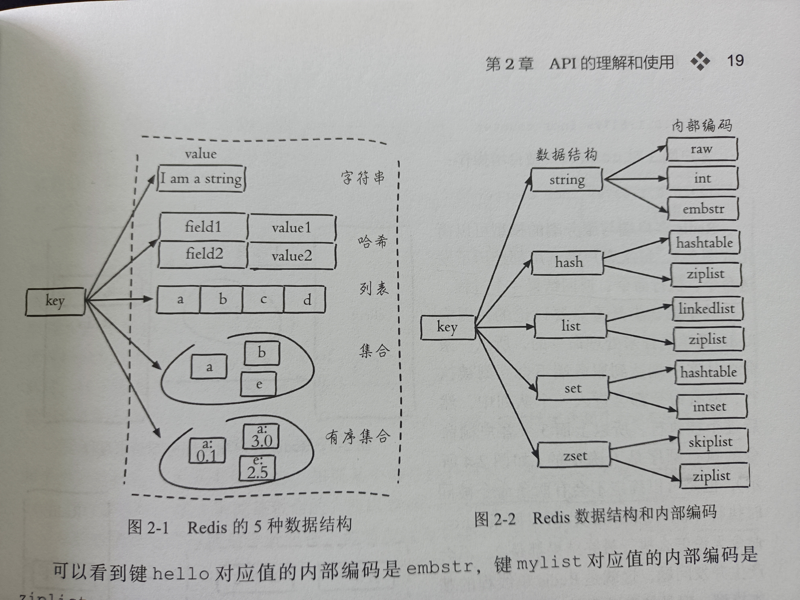

# Redis

## 简单介绍Redis
* C语言开发的数据库
* 数据存在内存中，读写速度非常快，广泛运用于缓存
* 除**缓存**外，也经常用来做**分布式锁、消息队列**
* Redis提供了多种数据类型。另外还支持**事务、持久化、Lua、多种集群**方案

## 分布式缓存的常见技术选型
Redis和Memcached，一般常用Redis

## Redis和Memcached的比较
### 共同点：
1. 都基于内存，一般用作缓存
2. 都有过期策略
3. 两者性能都非常高

### 区别：
1. Redis支持**更丰富的数据类型**，而Memcached只支持最简单的K-V
2. Redis支持数据的**持久化**，可以将内存中的数据保持在磁盘上，**重启的时候再次加载使用**；而Memcached的数据只能存在内存中，挂掉就没了
3. Redis有**灾难恢复机制**，将混村中的数据持久化到磁盘上
4. Redis在服务器内存用完之后，**可以将不用的数据放到磁盘上**，但是Memcached在内存用完之后会直接报异常
5. Redis支持**原生的cluster模式**；但是Memcached没有原生的集群，需要依靠客户端往集群中分片写入数据
6. Redis使用**单线程的IO多路复用模型**（Redis 6.0引入了多线程IO）；Memcached是多线程，非阻塞IO复用的网络模型
7. Redis支持**发布订阅模型，Lua脚本，事务**等功能；Memcached不支持。
8. Redis**同时使用了惰性删除和定期删除**；Memcached过期数据的删除策略只用了惰性删除

## 为什么要用缓存
### 高性能：

用户访问的数据属于高频数据并且不会经常改变的话，那么我们就可以很放心地将该用户访问的数据存在缓存中。保证用户下一次再访问这些数据的时候就可以直接从缓存中获取了。操作缓存就是**直接操作内存，所以速度相当快。**  

不过，要保持数据库和缓存中的数据的一致性。 如果数据库中的对应数据改变之后，同步改变缓存中相应的数据即可！

### 高并发：
> QPS（Query Per Second）：服务器每秒可以执行的查询次数  


Mysql一般QPS大概在1w左右（4核8G），但是使用Redis缓存之后很容易到达10w+，甚至最高能达到30w+（单机，集群的话会更高）  

## Redis常用的数据结构及使用场景

    

### string
string数据结构式简单的key-value类型。虽然Redis是用C语言写的，但是Redis并没有直接使用C语言的字符串表示，而是自己构建了一种**SDS（simple dynamic string，简单动态字符串）**  

相比于C原生字符串，SDS不光可以保存文本数据还可保存二进制数据，并且获取字符串长度复杂度为O（1）（C的字符串为O（n））。另外，Redis的SDS API是安全的，不会造成缓冲区溢出  

**常用命令**：set，get，strlen，exists，dect，incr，setex等  

**应用场景**：一般常用在需要计数的场景，比如用户的访问次数，热点文章的点赞转发数量等等  

### list
list即是**链表**。链表易于插入、删除、灵活调整链表长度，但随机访问困难。C语言没有实现链表，所以Redis实现了自己的链表数据结构。Redis的list实现为**双向链表**，支持**反向查找核遍历**，更方便操作，不过带来部分额外的内存开销。  

**常用命令**：rpush，rpop，lpush，lpop，lrange，len等  

**应用场景**：发布与订阅或者说消息队列，慢查询  

### hash
hash类似于**JDK1.8之前的hashmap，内部实现差不多是数组+链表，不过Redis做了更多优化**  

hash是一个string类型的field和value的映射表，**特别适合用于存储对象**。  

**常用命令**：hset,hmset,hexists,hget,hgetall,hkeys,hvals   

**应用场景**：系统中对象数据的存储  

### set
set类似Java中的HashSet。Redis中的set是一种无序集合，当你需要存储一列数据，但不希望出现重复数据时，set是一个很好的选择。并且set提供了判断某个成员是否在一个set内的重要接口，这个也是list没有提供的。可以基于set轻易实现**交集、并集、差集**的操作  

**常用命令**：sadd, spop, smember, sismember, scard, sinterstore, sunion等  

**应用场景**：需要存放的数据不能重复以及需要获取多个数据源交集和并集等场景  

### sorted set（zset）
和set相比，sorted set增加了一个**权重参数score**，使得集合中的元素能够按照score进行有序排列。还可以通过score的范围来获取元素的列表。  

**常用命令**：zadd, zcard, zscore, zrange, zrevrange, zrem等  

**应用场景**：需要对数据根据某个权重进行排序的场景。比如在直播系统中，实时排行信息包含直播间在线用户列表，各种礼物排行榜，弹幕消息（可以理解为按消息维度的消息排行榜）等信息。  

### bitmap  
bitmap存储的时连续的二进制数字，通过bitmap，只需要一个bit位来表示某个元素对应的值或者状态，key就是对应元素本身。我们知道八个bit组成一个byte，所以bitmap本身会极大节省存储空间。  

**常用命令**：setbit, getbit, bitcount, bitop  

**应用场景**：适合需要保存状态信息（比如是否签到、是否登录...）并需要进一步对这些信息进行分析的场景。比如用户签到情况、活跃用户情况、用户行为统计（比如是否点赞过某个视频）。  

**关于以上数据结构的详细用法和使用场景，看这个https://github.com/Snailclimb/JavaGuide/blob/master/docs/database/Redis/redis-all.md#1-%E7%AE%80%E5%8D%95%E4%BB%8B%E7%BB%8D%E4%B8%80%E4%B8%8B-redis-%E5%91%97  **  

## 底层数据结构

https://juejin.cn/post/6844903936520880135

## Redis单线程模型详解
**Redis基于Reactor模式设计开发了自己的一套高效的事件处理模型**。（Netty的线程也基于Reactor模式，它真是高性能I/O的基石），这套事件处理模型对应的是Redis中的**文件事件处理器（file event handler）。由于文件事件处理器是单线程方式运行的，所以我们一般说Redis是单线程模型**。  

**既然是单线程，怎么监听大量的客户端链接呢？**  

Redis通过**IO多路复用**来监听来自客户端的大量连接，它会将感兴趣的事件及类型注册到内核中，并监听每个事件是否发生。  

**I/O 多路复用技术的使用让 Redis 不需要额外创建多余的线程来监听客户端的大量连接，降低了资源的消耗（和 NIO 中的 Selector 组件很像）。**  

另外，Redis服务器是一个事件驱动程序，服务器需要处理两类事件：1. 文件事件 2. 时间事件  

我们接触多的是**文件事件** （客户端进行读取写入等操作，涉及一系列网络通信）  

**可以看出，文件事件处理器（file event handler）主要是包含 4 个部分：**  

* 多个 socket（客户端连接）
* IO 多路复用程序（支持多个客户端连接的关键）
* 文件事件分派器（将 socket 关联到相应的事件处理器）
* 事件处理器（连接应答处理器、命令请求处理器、命令回复处理器）


  

## Redis没有多线程吗？ 为什么不用多线程？

虽然说Redis是单线程模型，但是Redis在**4.0版本之后就加入了对多线程的支持**  

不过，Redis 4.0 增加的多线程主要是针对一些大键值对的删除操作的命令，使用这些命令就会使用主处理之外的其他线程来“异步处理”。**大体上，6.0之前主要还是单线程处理**  

**为什么6.0之前不使用多线程？**  

1. 单线程编程容易，并且易维护
2. Redis的性能瓶颈不在于CPU，主要在于**内存和网络**
3. 多线程会存在死锁、上下文切换等问题，甚至会**影响性能** 

## Redis 6.0 之后为什么引入多线程？
**Redis6.0 引入多线程主要是为了提高网络 IO 读写性能**，因为这个算是 Redis 中的一个性能瓶颈（Redis 的瓶颈主要受限于内存和网络）。  

Redis虽然引入了多线程，但只是在**网络数据的读写这类耗时操作上使用了，执行命令仍然是单线程顺序执行，所以不需要担心线程安全问题**  

## Redis给缓存设置过期时间有啥用 
1. 内存是有限的，如果所有数据一直存在内存中，会OOM
2. 另外可以帮助实现一些只需要在一段时间内生效的数据，比如短信验证码，或者用户登录的token  

## Redis是如何判断数据是否过期的？
Redis维持了一个**过期字典**，可以看作是hash表，保存数据过期的事件。过期字典的键指向Redis数据库中的某个key；值是一个longlong类型的正数，其中保存了过期时间（毫秒精度的UNIX时间戳）  

  

## 过期时间的删除策略
**重要！自己造缓存轮子的时候需要格外考虑的东西**  

1. **惰性删除**：只会在取出key对数据进行过期检查，这样对CPU最友好，但是可能造成太多过期的key没有被删除  
2. **定期删除**：每隔一段时间抽取一批key执行删除过期key操作。并且，Redis底层会通过限制删除操作执行的时长和频率来减少删除操作对CPU时间的影响。  

定期删除对内存更友好，惰性删除对CPU更友好，两者各有优点，所以**Redis采用了定期删除+惰性/懒汉式删除的方式**  

还是可能存在定期删除和惰性删除漏掉了很多过期 key 的情况。这样就导致大量过期 key 堆积在内存里，然后就 Out of memory 了。**通过内存淘汰机制解决**

## Redis的内存淘汰机制
>相关问题：MySQL 里有 2000w 数据，Redis 中只存 20w 的数据，如何保证 Redis 中的数据都是热点数据?

Redis提供8种数据淘汰策略
1. volatile-lru（least recently used）：从已设置过期时间的数据集（server.db[i].expires）中挑选**最近最少使用的数据**淘汰
2. volatile-ttl：从已设置过期时间的数据集（server.db[i].expires）中挑选**将要过期的数据**淘汰
3. volatile-random：从已设置过期时间的数据集（server.db[i].expires）中**任意选择数据**淘汰
4. allkeys-lru（least recently used）：当内存不足以容纳新写入数据时，在键空间中，移除最近最少使用的 key**（这个是最常用的）**
5. allkeys-random：从数据集（server.db[i].dict）中任意选择数据淘汰
6. no-eviction：**默认的**，**禁止驱逐数据**，也就是说当内存不足以容纳新写入数据时，新写入操作会报错。这个应该没人使用吧！

4.0 版本后增加以下两种：  

7. volatile-lfu（least frequently used）：从已设置过期时间的数据集(server.db[i].expires)中挑选**最不经常使用（这里看的是频率）的数据**淘汰
8. allkeys-lfu（least frequently used）：当内存不足以容纳新写入数据时，在键空间中，移除最不经常使用的 key

## LRU的实现

HashMap + 双向链表  

数据被查询，则提到链表表头；达到最大容量，则从链表尾部删除元素  

```
class LRUCache {
    // key -> Node(key, val)
    private HashMap<Integer, Node> map;
    // Node(k1, v1) <-> Node(k2, v2)...
    private DoubleList cache;
    // 最大容量
    private int cap;
    
    public LRUCache(int capacity) {
        this.cap = capacity;
        map = new HashMap<>();
        cache = new DoubleList();
    }
    
    public int get(int key) {
        if (!map.containsKey(key))
            return -1;
        int val = map.get(key).val;
        // 利用 put 方法把该数据提前
        put(key, val);
        return val;
    }
    
    public void put(int key, int val) {
        // 先把新节点 x 做出来
        Node x = new Node(key, val);
        
        if (map.containsKey(key)) {
            // 删除旧的节点，新的插到头部
            cache.remove(map.get(key));
            cache.addFirst(x);
            // 更新 map 中对应的数据
            map.put(key, x);
        } else {
            if (cap == cache.size()) {
                // 删除链表最后一个数据
                Node last = cache.removeLast();
                map.remove(last.key);
            }
            // 直接添加到头部
            cache.addFirst(x);
            map.put(key, x);
        }
    }
}
```


## Redis持久化机制（怎么保证 Redis 挂掉之后再重启数据可以进行恢复）

大部分原因是为了之后重用数据（比如重启机器、机器故障之后恢复数据），或者是为了防止系统故障而将数据备份到一个远程位置。  

Redis 的一种持久化方式叫快照（snapshotting，RDB），另一种方式是只追加文件（append-only file, AOF）。两种方法各有优点  

### 快照持久化 RDB
Redis 可以通过**创建快照来获得存储在内存里面的数据在某个时间点上的副本**。Redis 创建快照之后，可以对快照进行备份，**可以将快照复制到其他服务器从而创建具有相同数据的服务器副本（Redis 主从结构，主要用来提高 Redis 性能），还可以将快照留在原地以便重启服务器的时候使用。**  

RDB是Redis**默认**的持久化方式，可以在配置文件中配置创建快照触发的条件

```
save 300 10          #在300秒(5分钟)之后，如果至少有10个key发生变化，Redis就会自动触发BGSAVE命令创建快照。
```

#### RDB触发机制

* save：阻塞Redis服务器，直到RDB过程完成，对内存比较大的实例会长时间阻塞
* bgsave：fork一个子进程，由子进程完成RBD。阻塞只发生在fork阶段。目前一般都是用bgsave

RDB恢复数据远快于AOF  


### AOF（append-only file）持久化

AOF持久化的**实时性更好**，已成为**主流的持久化方案**，可以通过`appendonly yes`开启  

开启 AOF 持久化后**每执行一条会更改 Redis 中的数据的命令，Redis 就会将该命令写入硬盘中的 AOF 文件**。AOF 文件的保存位置和 RDB 文件的位置相同，都是通过 dir 参数设置的，默认的文件名是 appendonly.aof。

Redis可以配置三种不同的AOF方式：
```
appendfsync always    #每次有数据修改发生时都会写入AOF文件,这样会严重降低Redis的速度
appendfsync everysec  #每秒钟同步一次，显示地将多个写命令同步到硬盘
appendfsync no        #让操作系统决定何时进行同步
```

为了兼顾数据和写入性能，可以考虑每秒同步一次。这样不会受到性能影响，而且系统崩溃，用户最多丢失一秒钟的数据。  

### 补充
#### Redis 4.0开始支持RDB和AOF的混合持久化

如果把混合持久化打开，**AOF 重写的时候就直接把 RDB 的内容写到 AOF 文件开头**。这样做的好处是可以结合 RDB 和 AOF 的优点, 快速加载同时避免丢失过多的数据。当然缺点也是有的， AOF 里面的 RDB 部分是压缩格式不再是 AOF 格式，可读性较差。  

#### AOF重写
AOF 重写可以**产生一个新的 AOF 文件**，这个新的 AOF 文件和原有的 AOF 文件所保存的数据库状态一样，但体积更小。

1. 超时数据不再写入AOF
2. 旧的AOF中的无效命令都被剔除，只保存最终数据的写入命令
3. 多条写数据可以合为一条

AOF 重写是一个有歧义的名字，该功能是通过读取数据库中的键值对来实现的，程序无须对现有 AOF 文件进行任何读入、分析或者写入操作。

在执行 BGREWRITEAOF 命令时（写时符置），Redis 服务器会维护一个**AOF 重写缓冲区**，该缓冲区会在子进程创建新 AOF 文件期间，记录服务器执行的所有写命令。当子进程完成创建新 AOF 文件的工作之后，服务器会**将重写缓冲区中的所有内容追加到新 AOF 文件的末尾**，使得新旧两个 AOF 文件所保存的数据库状态一致。最后，**服务器用新的 AOF 文件替换旧的 AOF 文件，以此来完成 AOF 文件重写操作**

重启恢复时，如果Redis开启了AOF，则将只恢复AOF  


## Redis事务
Redis可以通过**MULTI, EXEC, DISCARD, WATCH** 等命令来实现事务的功能  

使用 MULTI命令后可以输入多个命令。Redis 不会立即执行这些命令，而是将它们放到队列，当调用了EXEC命令将执行所有命令。  

Redis的事务与关系型数据库的ACID特性不同，Redis由于不支持roll back，因此**不满足原子性，也不满足持久性**  

Redis 官网也解释了自己为啥不支持回滚。简单来说就是 Redis 开发者们觉得没必要支持回滚，这样更简单便捷并且性能更好。Redis 开发者觉得即使命令执行错误也应该在开发过程中就被发现而不是生产过程中。

**你可以将 Redis 中的事务就理解为 ：Redis 事务提供了一种将多个命令请求打包的功能。然后，再按顺序执行打包的所有命令，并且不会被中途打断。**  


## Redis哨兵

Redis Sentinel哨兵架构解决的问题：Redis主从复制模式下，一旦主节点故障不能提供服务，需要将从节点晋升为主节点，并通知应用方和其他从节点更新主节点地址。  

### 主从复制带来的问题

主从复制可以**将使主节点的数据改变的命令同步给从节点**，从节点可以作为主节点的备份，当主节点出现故障时作为后备顶上来，保证数据尽量不丢失（最终一致性，会有数据丢失的情况）；从节点可以扩展主节点的读能力  

但同时主从复制也带来了以下问题：

* 一旦主节点故障，需要手动将从节点晋升为主节点，并修改应用方的主节点地址，还要其他从节点去复制新的主节点，整个过程都需要人工干预
* 主节点写能力受到单机限制
* 主节点的存储能力受到单机限制

第一个问题就是Redis的高可用问题，可以用哨兵解决；第二三个问题是分布式问题，利用Redis集群，数据分区解决


### Redis高可用

**当主节点出现故障时，Redis Sentinel能自动完成故障发现和故障转移，并通知应用方，实现真正的高可用**。  

Redis Sentinel是一个分布式架构，其中包含若干个Sentinel节点和若干个Redis数据节点。  

每个Sentinel节点会对数据节点和其他Sentinel节点进行监控，**当它发现其他节点不可达时，会对节点做下线的标识**。  

如果标识的是主节点，则会**协商选举出一个Sentinel节点来完成故障转移**，同时将变化实时同步给Redis的应用方，整个过程无需人工介入。    

Redis Sentinel相比Redis主从复制架构，只是多了Sentinel节点，无需对Redis数据节点做特殊处理  

### 故障转移步骤

1. 主节点出现故障，此时从节点和主节点失去连接，主从复制失败
2. 每个Sentinel节点通过定时监控发现主节点出现了故障
3. 多个Sentinel对主节点的故障达成一致，选择一个Sentinel节点作为领导者，负责故障转移
4. Sentinel领导者节点执行了故障转移，并通知client

### 实现原理 

Redis Sentinel的基本实现原理，具体有以下几个方面：三个定时任务、主观下线和客观下线、Sentinel领导者选举、故障转移

### 三个定时任务

1. 每隔十秒，每个Sentinel向主从节点发送info，获取最新的拓扑结构。具体作用有，获取从节点信息，所以不需要显式配置监控从节点；立刻感知新的从节点加入；节点不可达或者故障转移后，通过info实时更新节点拓扑信息
2. 每隔两秒，每个Sentinel节点向Redis数据节点发送该Sentinel对主节点的判断以及当前Sentinel的节点信息。具体作用有，发现新的Sentinel节点；Sentinel节点之间交换主节点状态，作为后面客观下线以及领导者选举的依据
3. 每隔一秒，每个Sentinel节点向主节点、从节点、其余Sentinel节点发送一条ping作为心跳检测，确认节点是否可达

### 主观下线和客观下线

主观下线：某个节点心跳超过时限没有回复  

客观下线：Sentinel向其他Sentinel节点询问对主节点的判断，超过一个限值，则认为主节点有问题，对其客观下线

### 领导者Sentinel节点选举

Redis使用Raft实现领导者选举，大致思路如下：

1. 每个Sentinel都有资格成为领导者。向其他节点发送指令，要求将自己设置为领导者
2. 收到指令的Sentinel节点，如果还没有同意过其他Sentinel节点的请求，则同意该请求，否则拒绝该请求
3. 当一个Sentinel节点发现自己的票数已经大于等于max(quorum，num(sentinels)/2  +1 )，则成为领导者，领导者负责故障转移
4. 如果此次没有选举出领导者，则进入下一次选举

### 故障转移

领导者Sentinel负责故障转移，具体步骤如下：

1. 在从节点列表中选额一个节点作为新的主节点，选择方法如下：
   * 过滤不健康（主观下线、断线）的节点
   * 选择从节点优先级最高的从节点列表
   * 选择复制偏移量最大的从节点
   * 选择runid最小的从节点 
2. 领导者节点让第一步选出来的从节点成为主节点
3. 领导者节点向其余从节点发送命令，让他们成为新的主节点的从节点，并复制数据
4. Sentinel集群会将原来的主节点更新为从节点，并保持对其的关注。当其恢复后，命令他成为新的主节点的从节点并复制数据。  


## 跳表 

https://lotabout.me/2018/skip-list/  

## SDS

简单动态字符串SDS，是Redis自己实现的字符串结构。具有以下特点：

1. **O(1)时间复杂度获取：字符串长度、已用长度、未用长度**
2. 可用于**保存字节数组，支持安全的二进制数据存储**
3. 内部实现空间与分配，**降低内存再分配次数**
4. 惰性删除

### 预分配

1. 第一次创建len属性等于数据实际大小，不做预分配
2. 修改后如果已有的free空间不够，且数据大小小于1M，则每次预分配一倍容量
3. 修改后如果已有free空间不够且数据大于1M，每次分配1M

应尽量减少字符串频繁修改，而**直接改用set修改字符串，降低预分配带来的内存浪费和碎片化**


## 集群

