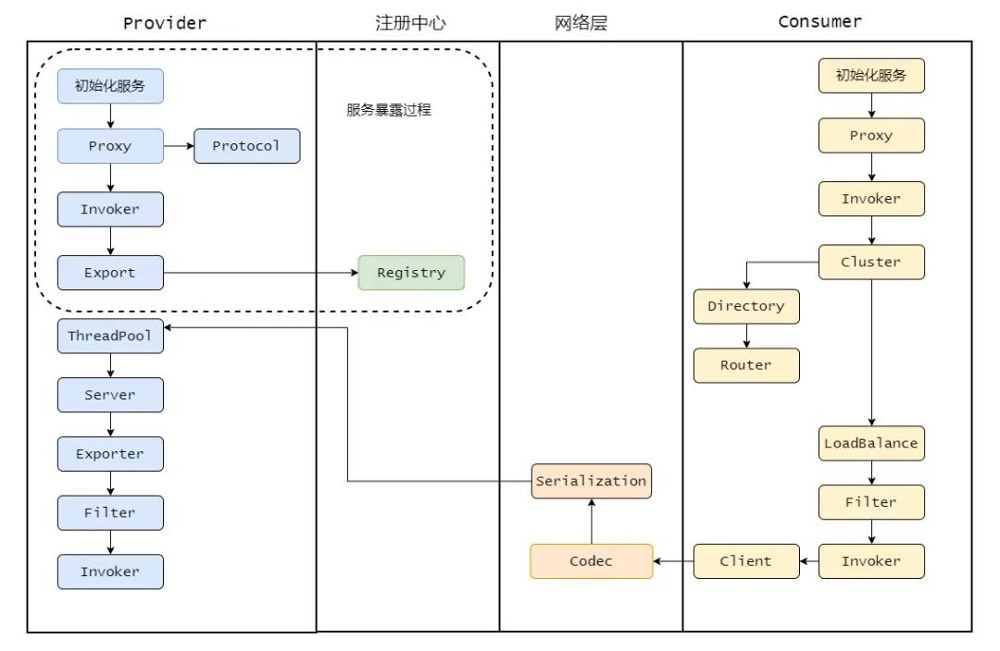

# Dubbo

## 什么是RPC
RPC 就是 Remote Procedure Call，远程过程调用，它相对应的是本地过程调用。

## 为什么要有RPC，HTTP不好吗
HTTP 只是传输协议，协议只是规范了一定的交流格式，而且 RPC 是早于 HTTP 的，所以真要问也是问有 RPC 为什么还要 HTTP。  
RPC 对比的是本地过程调用，是用来作为分布式系统之间的通信，它可以用 HTTP 来传输，也可以基于 TCP 自定义协议传输。  
RPC和HTTP不是一个层级的东西，没有可比性。HTTP对于实现RPC比较冗余，RPC一般都采用TCP/IP定制化。不过基于HTTP的RPC也是存在的。    

## 对Dubbo的了解
Dubbo 是阿里巴巴开源的一个基于 Java 的 RPC 框架，中间沉寂了一段时间，但在 2017 年阿里巴巴又重启了对 Dubbo 维护。
>
目前 Dubbo 社区主力维护的是 2.6.x 和 2.7.x 两大版本，2.6.x 版本主要是 bug 修复和少量功能增强为准，是稳定版本。  
2.7.5 版本的发布被 Dubbo 认为是里程碑式的版本发布，支持 gRPC，并且性能提升了 30%（这里不了解gRPC 和为什么性能提升的话就别说了，别给自己挖坑）。  
最新的 3.0 版本往云原生方向上探索着。  

以上不熟悉的话不说，主要说一下下面的总体架构。  
* Dubbo主要有以下几个角色
|节点|角色说明|
|----|----|
|Consumer|需要调用远程服务的服务消费方|
|Registry|注册中心|
|Provider|服务提供方|
|Container|服务运行的容器|
|Monitor|监控中心|
大致流程如下：  
* 首先服务提供者 Provider 启动然后向注册中心注册自己所能提供的服务。
* 服务消费者 Consumer 启动向注册中心订阅自己所需的服务。然后注册中心将提供者元信息通知给 Consumer， 之后 Consumer 因为已经从注册中心获取提供者的地址，因此可以通过负载均衡选择一个 Provider 直接调用 。
* 之后服务提供方元数据变更的话注册中心会把变更推送给服务消费者。
* 服务提供者和消费者都会在内存中记录着调用的次数和时间，然后定时的发送统计数据到监控中心。
## 服务暴露的流程
大致流程如下：
1. 服务的暴露起始于 Spring IOC 容器刷新完毕之后（观察者模式），会根据配置参数组装成 URL， 然后根据 URL 的参数来进行本地或者远程调用。
2. 会通过 `proxyFactory.getInvoker`，利用 javassist 来进行动态代理，封装真的实现类，然后再通过 URL 参数选择对应的协议来进行 protocol.export，默认是 Dubbo 协议。  
注：在第一次暴露的时候会调用 createServer 来创建 Server，默认是 NettyServer。
3. 然后将 export 得到的 exporter 存入一个 Map 中，供之后的远程调用查找，然后会向注册中心注册提供者的信息。

## 为什么要有本地暴露
因为可能存在同一个 JVM 内部引用自身服务的情况，因此**暴露的本地服务在内部调用的时候可以直接消费同一个 JVM 的服务避免了网络间的通信**。

## 服务引入的流程
服务的引入时机有两种，第一种是**饿汉式**，第二种是**懒汉式**，默认是懒汉式。  
**饿汉式就是加载完毕就会引入**   
**懒汉式是只有当这个服务被注入到其他类中时启动引入流程，默认是懒汉式。**  
1. 会先根据配置参数组装成 URL ，一般而言我们都会配置注册中心，所以会构建`RegistryDirectory`向注册中心注册消费者的信息，并且订阅提供者、配置、路由等节点。
2. 得知提供者的信息之后会进入 Dubbo 协议的引入，会创建 Invoker ，期间会包含 NettyClient，来进行远程通信，最后通过 Cluster 来包装 Invoker，默认是 FailoverCluster，最终返回代理类。
**注：**  
* Cluster是Dubbo的路由层，封装多个提供者的路由及负载均衡，并桥接注册中心，以 Invoker 为中心，扩展接口为 Cluster, Directory, Router, LoadBalance
* Failover Cluster是故障转移集群

## 服务调用的流程
1. 调用某个接口的方法会调用之前服务引入时生成的代理类，然后会从 cluster 中经过路由的过滤、负载均衡机制选择一个 invoker 发起远程调用，此时会记录此请求和请求的 ID 等待服务端的响应。
2. 服务端接受请求之后会通过参数找到之前服务暴露存储的 map，得到相应的 exporter ，然后最终调用真正的实现类，再组装好结果返回，这个响应会带上之前请求的 ID。
3. 消费者收到这个响应之后会通过 ID 去找之前记录的请求，然后找到请求之后将响应塞到对应的 Future 中，唤醒等待的线程，最后消费者得到响应，一个流程完毕。
4. 另外的，消费者和提供者都异步通知监控中心

* 关键的就是 cluster、路由、负载均衡，然后 Dubbo 默认是**异步**的，所以请求和响应是如何对应上的（通过全程统一的ID）。  

  

## 服务调用异步转同步是怎么做的
Dubbo默认是异步的，那么服务调用是怎么转为同步的？  

## Cluster层的作用
集群 Cluster 用途是**将多个服务提供者合并为一个 Cluster Invoker**，并将这个 Invoker 暴露给服务消费者。这样一来，**服务消费者只需通过这个 Invoker 进行远程调用即可**，至于**具体调用哪个服务提供者，以及调用失败后如何处理等问题，现在都交给集群模块去处理**。集群模块是服务提供者和服务消费者的中间层，**为服务消费者屏蔽了服务提供者的情况**，这样服务消费者就可以专心处理远程调用相关事宜。比如发请求，接受服务提供者返回的数据等。这就是集群的作用。

## SPI是什么
**SPI 是 Service Provider Interface，主要用于框架中，框架定义好接口，不同的使用者有不同的需求，因此需要有不同的实现，而 SPI 就通过定义一个特定的位置，Java SPI 约定在 Classpath 下的 META-INF/services/ 目录里创建一个以服务接口命名的文件，然后文件里面记录的是此 jar 包提供的具体实现类的全限定名。**  
**所以就可以通过接口找到对应的文件，获取具体的实现类然后加载即可，做到了灵活的替换具体的实现类。**  

## Dubbo为什么不用JDK的SPI，而自己实现？
* JDK的SPI代码在ServiceLoader.load()，流程就是约定一个目录，根据接口名去那个目录找到文件，文件解析得到实现类的全限定名，然后循环加载实现类和创建其实例。  
* Dubbo的SPI通过在文件里找到对应的实现类全限定名然后加载实例化即可。  
答案：因为 Java SPI 在查找扩展实现类的时候是**通过遍历 SPI 的配置文件并且将实现类全部实例化**，假设一个实现类初始化过程比较消耗资源且耗时，但是你的代码里面又用不上它，这就产生了**资源的浪费**。  
因此 Dubbo 就自己实现了一个 SPI，给每个实现类配了个名字，通过名字去文件里面找到对应的实现类全限定名然后加载实例化，**按需加载**。  

## 为什么Dubbo默认动态代理使用Javassist？
为什么用 Javassist：**很简单，就是快，且字节码生成方便。**  
https://blog.csdn.net/luanlouis/article/details/24589193 动态代理要抽时间补一篇文章  
另外也可以通过Dubbo SPI来扩展自己需要的动态代理方法。  

## 如果让你设计一个RPC，你会怎么设计？
以下来自三太子敖丙：  
首先需要实现高性能的网络传输，可以采用 Netty 来实现，不用自己重复造轮子，然后需要自定义协议，毕竟远程交互都需要遵循一定的协议，然后还需要定义好序列化协议，网络的传输毕竟都是二进制流传输的。  

然后可以搞一套描述服务的语言，即 IDL（Interface description language），让所有的服务都用 IDL 定义，再由框架转换为特定编程语言的接口，这样就能跨语言了。  

此时最近基本的功能已经有了，但是只是最基础的，工业级的话首先得易用，所以框架需要把上述的细节对使用者进行屏蔽，让他们感觉不到本地调用和远程调用的区别，所以需要代理实现   

然后还需要实现集群功能，因此的要服务发现、注册等功能，所以需要注册中心，当然细节还是需要屏蔽的。  

最后还需要一个完善的监控机制，埋点上报调用情况等等，便于运维。  

这样一个 RPC 框架的雏形就差不多了。  

大概总结一下就是从以下几个方面说：
1. 高性能网络通信
2. 多语言适配
3. 动态代理包装
4. 集群，服务发现，服务注册
5. 监控机制

## Dubbo中注册中心挂了可以通信吗？
**可以**，因为刚开始初始化的时候，消费者会将提供者的地址等信息拉取到 **本地缓存**，所以注册中心挂了可以继续通信。  

## Dubbo 负载均衡策略
* random
	**默认**，即随机调用实现负载均衡，可以对provider不同实例设置不同权重。
* roundrobin
	即**轮询**，均匀打给各个机器。但是如果各个机器的性能不一样，容易导致性能差的机器负载过高。所以此时需要调整权重，让性能差的机器承载权重小一些，流量少一些。
* leastactive 
	**最少活跃数**的随机调用，能够使慢的机器收到更少的调用。实现原理是：每个服务维护一个活跃数计数器，机器开始处理请求时该活跃数+1，处理完毕时则-1。此时若A机器与B机器都收到了一个请求，A没有处理完，B处理完了，则AB的活跃数分别是1和0。此时来了一个新的请求，则**选择活跃数最小**的B来执行，这样使慢的机器A收到少的请求。
* consistanthash  
	**一致性哈希**。相同参数的请求一定分发到一个 provider 上去， provider 挂掉的时候，会基于虚拟节点均匀分配剩余的流量，抖动不会太大。如果你需要的不是随机负载均衡，是要一类请求都到一个节点，那就走这个一致性 Hash 策略。  
	原理看这篇https://zhuanlan.zhihu.com/p/24440059  
	https://www.cnblogs.com/williamjie/p/9477852.html  
## Dubbo 集群容错策略
集群工作过程可分为两个阶段  
* 第一个阶段是在服务消费者初始化期间，集群 Cluster 实现类为服务消费者创建 Cluster Invoker 实例，即上图中的 merge 操作。  
* 第二个阶段是在服务消费者进行远程调用时。  
	以 FailoverClusterInvoker 为例，该类型 Cluster Invoker 首先会调用 Directory 的 list 方法列举 Invoker 列表（可将 Invoker 简单理解为服务提供者）。Directory 的用途是保存 Invoker，可简单类比为 List\<Invoker\>。其实现类 RegistryDirectory 是一个动态服务目录，可感知注册中心配置的变化，它所持有的 Invoker 列表会随着注册中心内容的变化而变化。每次变化后，RegistryDirectory 会动态增删 Invoker，并调用 Router 的 route 方法进行路由，过滤掉不符合路由规则的 Invoker。当 FailoverClusterInvoker 拿到 Directory 返回的 Invoker 列表后，它会通过 LoadBalance 从 Invoker 列表中选择一个 Invoker。最后 FailoverClusterInvoker 会将参数传给 LoadBalance 选择出的 Invoker 实例的 invoke 方法，进行真正的远程调用。   

这里集群容错策略在代码中的位置就是作为AbstractClusterInvoker的实现类，以可容错的方式调用Directory中保存的Invoker。  
**集群容错策略有以下几种：**
* failover Cluster
	默认，失败自动重试其他机器，常见于读操作。
* failfast Cluster
	一次调用失败则立即失败，常见于写操作
* failsafe Cluster
	出现异常时忽略掉，常用于不重要的接口调用，比如记录日志。
* failback Cluster
	失败了返回一个空结果给服务消费者，然后在后台定时重发，比较适合于写消息队列这种。
* forking Cluster
	并行调用多个 provider ，只要一个成功就立即返回。
