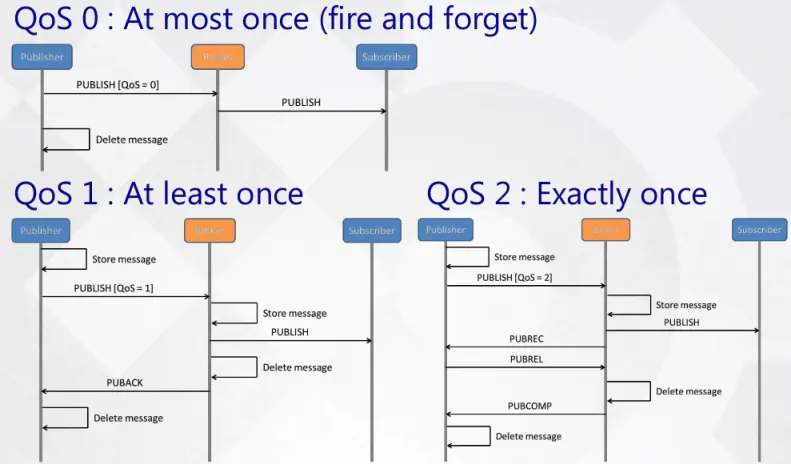

# MQTT协议
#### 概览
  * MQTT协议是全称是（Message Queuing Telemetry Transport，消息队列遥测传输协议），是一种基于**发布/订阅模式**的轻量级通讯协议，该协议构建在**TCP/IP之上**，是一种**应用层协议**  
  * MQTT是一种轻量，低开销，低带宽占用的即时通讯协议，利用有限带宽为远程设备提供实时可靠的消息服务  
  * MQTT主要为大量**计算能力有限，低带宽，不可靠的网络**的远程传感器和控制设备通讯二设计的协议
  * 使用发布订阅，提供一对多、多对多的消息发布，接触耦合
  * 对负载内容屏蔽的消息传输
  * 使用TCP/IP，适用范围广
  * 有三种消息发布的服务质量Qos：Qos0为“至多一次”，消息发布完全依赖TCP/IP，会发生消息丢失；Qos1 “至少一次”，确保消息到达，但可能发生消息重复；Qos2 “只有一次”，确保消息到达一次，此级别最高，最精确，开销也最大
  * 小型传输，开销很小，**固定长度的头部只有2字节**
  * 使用**遗嘱**和**心跳机制**通知客户端异常中断
#### 消息模型
  MQTT采用Topic作为消息传输的管道，发布者和订阅者利用同一个或多个Topic，传输不同类型的消息，一个发布者可以对应多个订阅者从而实现解耦，也提供了更大的扩展性。  
    

#### 服务质量
  * 至多一次（qos = 0），可能会出现丢包的现象。使用在对实时性要求不高的情况。这一级别可应用于如下情景，如环境传感器数据，丢失一次读记录无所谓，因为很快下一次读记录就会产生。
  * 至少一次（qos = 1），保证包会到达目的地，但是可能出现重包。
  * 正好一次（qos = 2），保证包会到达目的地，且不会出现重包的现象。这一级别可用于如计费系统等场景，在计费系统中，消息丢失或重复可能会导致生成错误的费用。  
        
#### MQTT固定头部
MQTT协议的固定报文头最少两个字节，第一个字节包含消息类型，Qos等级等标志位，第二个字节表示剩余长度，至少一个字节，最多四个字节，大端模式存储。  
        
* 消息类型  
    
* DUP Flag是用于保证消息可靠传输的位，默认为0.如果设置为1，则在下面可变头中增加MessageId，并且需要回复确认，以保证消息传输完成，但不能用于检测消息重复发送。
* Qos：消息发布服务质量  
           
* RETAIN：消息保留标识，表示服务器要保留这次推送的消息，如果有新的订阅者在此条消息发布之后订阅此Topic，那么将这条消息推送给他
* 剩余长度：用来保存变长头部和消息体的总大小，长度为一个字节，前7位保存长度，后1位标识扩展，如果为1，则下一个字节继续保存。
#### 可变头部
MQTT的可变头按顺序包含四个字段：协议名、协议级别、连接标志、保持连接
* 协议名：用六个字节表示，前两个字节为MSB（最低有效位）和LSB（最高有效位），后四个字节为UTF-8编码的字符串“MQTT“。如果协议名不正确，服务端则会断开和客户端的连接
* 协议级别：一个字节，用八位无符号表示协议的版本，如果发现了不支持的协议级别，则服务端发送一个0x01返回码的CONNACK报文来响应CONNECT报文，然后断开和客户端的连接。
* 连接标志：一个字节，指定六个MQTT行为的参数，还指出此数据包中，Payload字段是否存在。  
| 标志名称       | 位置                 | 意义                                                         |
| -------------- | -------------------- | ------------------------------------------------------------ |
| Clean Session  | 连接标志字节的第1位  | 告诉服务端是否需要基于客户端标识符，在对应的会话（session）中保存连接断开过程中收到的级别为Qos1和Qos2的消息并在连接恢复后想客户端进行分发 |
| Will Flag      | 连接标志的第2位      | 是否开启遗嘱消息模式，如果为YES，则服务端需要存储负载中客户端发送的will topic和will message |
| Will Qos       | 连接标志的第4和第3位 | 遗嘱消息的安全级别，占用2byte，值为0、1、2                   |
| Will Retain    | 连接标志的第5位      | 遗嘱消息是否需要作为保留消息发布                             |
| Password Flag  | 连接标志的第6位      | 是否需要密码                                                 |
| User Name Flag | 连接标志的第7位      | 是否需要用户名                                               |
* Keep Alive：两个字节，以秒为单位的最大时间间隔，表示客户端保证控制报文发送的时间间隔不超过KeepAlive的值，如果没有报文可以发送，则发送一个PINGREQ。若服务端在1.5倍Keep Alive时间内没有收到客户端发来的控制报文，则断开和客户端的服务连接；若服务端在发送PINGREQ之后KeepAlive时间内没有收到服务端发来的PINGRESP报文，则关闭到服务端的连接。  
最大时间为18小时12分15秒，这是从2^16/3600=18.2044得出的。为0则表示关闭保持连接功能，意味着客户端不断开连接。   
    
#### 遗嘱
服务端或者客户端异常断开（包括停电、断网等特殊场景）时，服务端需要将特定主题（will topic）的消息（will message）发送给订阅到该主题的所有客户端。  
遗嘱消息发布的条件包括但不限于：  
* 服务端检测到了一个I/O错误或者网络故障。
* 客户端在保持连接（Keep Alive）的时间内未能通讯。
* 客户端没有先发送DISCONNECT报文直接关闭了网络连接。
* 由于协议错误服务端关闭了网络连接。
客户端正常使用DISCONNECT断开连接的情况下，遗嘱不会被发送。
#### 心跳机制
  Keep Alive指定连接最大空闲时间T，当客户端检测到连接空闲时间超过T时，必须向Broker发送心跳报文PINGREQ，Broker收到心跳请求后返回心跳响应PINGRESP。若Broker超过1.5T时间没收到心跳请求则断开连接，并且投递遗嘱消息到订阅方；同样，若客户端超过一定时间仍没收到心跳响应PINGRESP则断开连接。  
  **连接空闲时发送心跳报文可以降低网络请求，弱化对带宽的依赖。**  
  KeepAlive是在创建连接时，在CONNECT报文中指定的，单位为秒。
* **特殊场景**：  
  客户端与Broker连接正常，然后客户端快速重启（小于1.5T），再重新连接Broker，在未达到1.5T这段时间内，客户端与Broker存在两条连接。   
  **处理措施： 先断开之前的连接再建立新的连接。**   
#### 参考文献
https://blog.csdn.net/yangguosb/article/details/78669874  
https://blog.csdn.net/qq_22279697/article/details/80508624  
https://blog.csdn.net/weixin_44060108/article/details/103629375  
https://www.jianshu.com/p/54e0238d3fae  
https://www.cnblogs.com/zhangyu1024/p/6141818.html  
https://www.jianshu.com/p/3d5b487c6860  
https://blog.csdn.net/anxianfeng55555/article/details/80908795  