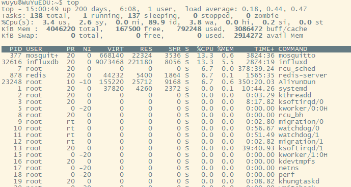

# Linux常用命令

## top

显示当前系统正在执行的进程相关信息，包括进程ID，内存占用，CPU占用等  

常用参数：

```
-c 显示完整的进程命令
-s 保密模式
-p <进程号> 指定进程显示
-n <次数>循环显示次数
```

常用交互：  

```
h 显示top交互命令帮助信息
c 切换显示命令名称和完整命令行
m 以内存使用率排序
P 根据CPU使用百分比大小进行排序
T 根据时间/累计时间进行排序
W 将当前设置写入~/.toprc文件中
o或者O 改变显示项目的顺序
```

实例：  

  

### 第一行：系统运行时间和平均负载

当前时间、系统运行时间、当前登陆用户的数量、最近5、10、15分钟的平均负载

### 第二行：任务Tasks

任务的总数，运行中任务的数量，睡眠任务的数量，停止任务的数量，僵尸任务的数量

### 第三行：CPU状态

**数值都是百分比**  

* us：user。运行用户进程（未调整优先级）的CPU时间
* sy：system。运行内核进程的CPU时间
* ni：niced。运行已调整优先级的用户进程的CPU时间
* id：idle。空闲时间
* wa：IO wait。用于等待IO完成的CPU时间
* hi：Hardware IRQ。处理硬件中断的CPU时间
* st：Software Interrupts。处理软中断占用CPU的时间

### 第四行：内存

全部可用内存，空闲内存，缓冲内存

### 第五行：Swap

全部交换空间，已使用交换空间，空闲交换空间，缓冲交换空间

### 第六行：空行

### 第七行及以下：各进程任务的状态监控

* PID — 进程id
* USER — 进程所有者
* PR — 进程优先级
* NI — nice值。负值表示高优先级，正值表示低优先级
* VIRT — 进程使用的虚拟内存总量，单位kb。VIRT=SWAP+RES
* RES — 进程使用的、未被换出的物理内存大小，单位kb。RES=CODE+DATA
* SHR — 共享内存大小，单位kb
* S — 进程状态。D=不可中断的睡眠状态 R=运行 S=睡眠 T=跟踪/停止 Z=僵尸进程
* %CPU — 上次更新到现在的CPU时间占用百分比
* %MEM — 进程使用的物理内存百分比
* TIME+ — 进程使用的CPU时间总计，单位1/100秒
* COMMAND — 进程名称（命令名/命令行）

## kill


## free 


## chmod 


## ls


## ps


## mv


## rm


## grep

