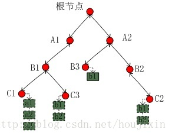

# 物联网平台中间件
## 中间件概述
中间件是物联网平台的数据汇总、分发的核心，起到承上启下的作用，其核心功能包括：**设备接入权限认证、数据上传与存储、数据与指令转发、为前端提供RESTful风格的API接口**。  
中间件以mosquitto为核心，利用mosquitto提供的权限接口，修改mosquitto源码。实现了**权限认证、数据存储与转发、设备配置、数据缓存、查询接口等功能**。

## 项目技术
Golang，mosquitto，MQTT，CGO，Redis，InfluxDB，RESTful
## mosquitto
### 简介
mosquitto是一款实现了消息推送协议MQTT v3.1 的开源消息代理软件，提供轻量级的，支持可发布/可订阅的的消息推送模式，使设备对设备之间的短消息通信变得简单，例如现在应用广泛的低功耗传感器，手机、嵌入式计算机、微型控制器等移动设备。  
Mosquitto采用发布/订阅的模式实现MQTT协议，这种设计模式将通信终端之间的关系统一到服务程序中进行管理，可极大减轻客户端的开发和维护工作。  
### 发布/订阅模式
发布订阅模式定义了如何向一个节点发布和订阅消息，这些节点被称为Topic。Topic可以被看作是消息传输的中介或管道，发布者publish消息到topic，订阅者subscribe topic而获得消息。这种模式使得发布者和订阅者保持相互独立，实现了解耦。  
在TCP连接中，每个连接都由<源IP，源端口，目的ip，目的端口，通信协议>这五个元素确定，在一条TCP连接建立后，它需要在一段时间内一直被通信双方保持，以备下次数据传输使用。如果通信数量多，那么需要每个终端维持它所有的通信关系。  
发布订阅模式就是为了解决这个问题，**使每个终端只需要保持自己与服务器之间的连接，而客户端之间的关系由中间件维护**，这种设计模式将复杂的通信关系维护工作从客户端剥离出来，方便了客户端的开发和维护。  
在mosquitto中，程序就是通过这种方式工作，将客户端之间的关系通过**一棵订阅树**来维持。  
### 订阅树
mosquitto通过一棵订阅树来维护所有的topic，对于每个topic用一个双向链表来存储订阅者。
#### 数据结构定义
```
// mosquitto中存储所有信息的总结构体
struct mosquitto_db{
	dbid_t last_db_id;
	// 订阅树的根节点
	struct mosquitto__subhier *subs;
	struct mosquitto__unpwd *unpwd;
	struct mosquitto__unpwd *psk_id;
	struct mosquitto *contexts_by_id;
	struct mosquitto *contexts_by_sock;
	struct mosquitto *contexts_for_free;
#ifdef WITH_BRIDGE
	struct mosquitto **bridges;
#endif
	// 检索订阅者的哈希表
	struct clientid__index_hash *clientid_index_hash;
	struct mosquitto_msg_store *msg_store;
	struct mosquitto_msg_store_load *msg_store_load;
#ifdef WITH_BRIDGE
	int bridge_count;
#endif
	int msg_store_count;
	unsigned long msg_store_bytes;
	char *config_file;
	struct mosquitto__config *config;
	int auth_plugin_count;
	bool verbose;
#ifdef WITH_SYS_TREE
	int subscription_count;
	int retained_count;
#endif
	int persistence_changes;
	struct mosquitto *ll_for_free;
#ifdef WITH_EPOLL
	int epollfd;
#endif
};
```
* 订阅树中的节点定义
```
struct mosquitto__subhier {
	UT_hash_handle hh;
	struct mosquitto__subhier *parent;
	struct mosquitto__subhier *children;
	// 维持该topic的订阅者的双向链表
	struct mosquitto__subleaf *subs;
	struct mosquitto_msg_store *retained;
	mosquitto__topic_element_uhpa topic;
	uint16_t topic_len;
};
```
* 双向链表的节点定义
```
struct mosquitto__subleaf {
	struct mosquitto__subleaf *prev;
	struct mosquitto__subleaf *next;
	// 订阅者
	struct mosquitto *context;
	int qos;
};
```
* 订阅者定义（截取主要部分）
```
struct mosquitto {
	mosq_sock_t sock;
#ifndef WITH_BROKER
	mosq_sock_t sockpairR, sockpairW;
#endif
#if defined(__GLIBC__) && defined(WITH_ADNS)
	struct gaicb *adns; /* For getaddrinfo_a */
#endif
	enum mosquitto__protocol protocol;
	char *address;
	char *id;
	char *username;
	char *password;
	uint16_t keepalive;
	uint16_t last_mid;
	enum mosquitto_client_state state;
	time_t last_msg_in;
	time_t next_msg_out;
	time_t ping_t;
	struct mosquitto__packet in_packet;
	struct mosquitto__packet *current_out_packet;
	// 链表维持的消息队列
	struct mosquitto__packet *out_packet;
	struct mosquitto_message *will;
}
```
#### 组织方式
首先mosquitto将所有的topic用 “ / ” 分割来组织成一棵树结构，从根节点到树中每个节点的路径都能组成该节点对应的一个topic，每个topic分别保存一个订阅列表，其中维持了订阅当前topic的客户端信息。  
* 示例如下：
```
客户端a1,a2,a3订阅了topic：A1/B1/C1

客户端b1,b2订阅了topic：A2/B2/C2

客户端c1,c2订阅了topic：A1/B1/C3

客户端d1订阅了topic：A2/B3
```
则对应的订阅树为  
  
* mosquitto在实现中根据topic中传输消息的性质将订阅树分为两棵子树：**业务子树和系统子树**，其分别保存的是**业务topic和系统topic**。前者主要是用户定义的业务topic；后者主要用于发布和维护mosquitto内部的系统消息。  
之所以要区分两种类型是因为其实现方式有许多差别：
  1. **生存周期不同**：系统topic无论是否有用户订阅，都会存在订阅树中，而业务topic不是（除非该业务topic中的消息retain字段设置为1）.
  2. **创建方式不同**：系统topic在消息发布时创建，业务topic可以在订阅时创建也可以在消息发布时创建（此时需要该消息retain字段为1）
  3. **消息保存方式不同**：凡是发布到系统topic的消息都会被保存下来，而业务消息将被挂到订阅列表各context的消息队列中，如果没有连接订阅或未设置retain字段，则消息不会被保存
#### 订阅树的原理
* 创建订阅树
	mosquitto启动时将初始化订阅树，该过程创建三个节点：订阅树总根节点、业务子树根节点、系统子树根节点。这两个子树根节点作为总根节点的子节点，总根节点和业务子树根节点的topic的值为空字符串，而系统子树根节点的topic为“$SYS”。  
	**注：该订阅树使用孩子兄弟链表法表示的**  
* 搭建订阅树
	系统子树和业务子树的搭建方式不同：系统子树是在系统消息发布时创建，而业务子树创建过程即可以在消息发布时创建也可以在客户端订阅时才创建。  
	其创建过程都是将topic用/分割，逐级查询，递归添加节点。
* 发布消息
	在mosquitto中，通过某个topic发送消息要通过遍历订阅树完成，具体过程为：
		1. 递归遍历订阅树找到指定topic中的订阅链表，并将此消息挂在链表中每个订阅者的消息队列中
		2. 如果消息的retain字段被设置为1，那么mosquitto还需要保存此消息，以备新订阅的客户端可以立即收到上次发送的消息；另外，发往系统topic的消息也会被mosquitto保存起来。  
* 从订阅树中删除订阅客户端  
	客户端可以向mosquitto发送取消对某个topic的订阅请求，服务器收到请求后，将从订阅树中删除该客户端，该过程需要**遍历订阅树**以找到其topic所在的位置，进而获取订阅列表，然后将其从订阅链表中删除。
#### 优缺点
* 优点：用树形结构来维护客户端之间的订阅与发布关系，这种方式逻辑清晰，便于开发和维护。
* 缺点：遍历效率较低，订阅、发布消息、取消订阅等过程都需要遍历，尤其是当客户端数量增加时，对效率的影响格外明显。
### epoll
在mosquitto1.5.0之前，使用的是poll机制，在1.5.0版本中加入了epoll作为其I/O机制。  
要介绍epoll，就要将UNIX中的三种I/O多路复用机制的前因后果，发展历程，select、poll、epoll都总结一下。  
俺总结的文章没了，只能先回想当时写的好的参考文献记下来了  
https://zhuanlan.zhihu.com/p/63179839  
https://www.zhihu.com/question/20122137/answer/14049112   蓝形参，静海听风
https://www.cnblogs.com/Anker/archive/2013/08/14/3258674.html  
https://zhuanlan.zhihu.com/p/95872805  


### 心跳机制 或 ping/pong机制
在MQTT那篇文章里有讲到  
用处就是判断连接是否异常断开，采用keep alive的参数来控制检查时间，如果服务器在1.5倍ka时间内没有收到来自该客户端的心跳消息（或任何消息），就认为该客户端离线，断开MQTT连接，如果客户端在一定时间内没有收到服务端的心跳消息，则也会断开。

### plugin
mosquitto中，向用户提供了一些用于开发身份认证功能的方法，开发人员可以通过这些方法实现更多功能。
#### 函数定义
```
// 返回插件版本，用于判断mosquitto是否支持此插件版本
int mosquitto_auth_plugin_version(void)

// 用于加载插件，成功返回0，否则返回>0
int mosquitto_auth_plugin_init(void **user_data, struct mosquitto_opt *auth_opts, int auth_opt_count)

// mosquitto退出之前调用
int mosquitto_auth_plugin_cleanup(void *user_data, struct mosquitto_opt *auth_opts, int auth_opt_count)

// 1，代理启动时运行
// 2，代理请求重新加载配置时调用（此时reload参数为true）。
int mosquitto_auth_security_init(void *user_data, struct mosquitto_opt *auth_opts, int auth_opt_count, bool reload)

// 1，代理退出时调用
// 2，代理请求重新加载配置时调用（在上一个函数之前调用）
int mosquitto_auth_security_cleanup(void *user_data, struct mosquitto_opt *auth_opts, int auth_opt_count, bool reload)

// 当用户名/密码必须被校验时调用
int mosquitto_auth_unpwd_check(void *user_data, const struct mosquitto *client, const char *username, const char *password)

// 当topic的访问权限被校验时调用（读权限，写权限，订阅权限）
int mosquitto_auth_acl_check(void *user_data, int access, const struct mosquitto *client, const struct mosquitto_acl_msg *msg)

// 重要！当publish发生时调用，msg结构体包含了消息的各种属性。很多功能都可以通过这个函数完成
int mosquitto_auth_handle_publish(void *user_data, const struct mosquitto *client, const struct mosquitto_acl_msg *msg)

// 客户端连接时调用
int mosquitto_auth_handle_connect(void *user_data, const struct mosquitto *client)

// 客户端断开连接时调用
int mosquitto_auth_handle_disconnect(void *user_data, const struct mosquitto *client, bool socket_error)

// 当客户端使用TLS/PSK连接到listener时由mosquitto调用。这用于检索与客户端关联的预共享密钥。
int mosquitto_auth_psk_key_get(void *user_data, const struct mosquitto *client, const char *hint, const char *identity, char *key, int max_key_len)
```
#### CGO
我们的plugin是通过将Go语言编写的函数编译为C语言的.h文件，进一步由mosquiitto调用的。  
至于Go到C，C到Go，其中的细节后续在Go语言的总结文章里面写。

#### 自定义plugin实现的功能
* 设备接入认证、 Web/App客户端接入认证、topic数据权限认证
* 设备在线、离线状态同步
* 转发数据
* 转发控制指令
* 提供RESTful接口
* 接收前端下发的设备配置，并转而下发给设备
#### 具体逻辑
##### 设备、app接入认证
mosquitto的设备接入需要三样东西：clientID、username、password  
* 将设备和app的username设置不同的标志位，用来区分Dev和App  
* 将校验方式拼接在clientID中，中间件解析出传来的校验方式，以相同的方式进行加密，对比加密结果。  
* clientID中拼接了时间戳timestamp，当id中的timestamp与本地timestamp的interval大于预先设定的时间间隔时，校验失败
##### topic权限认证
设备和app在某个topic上发布、接收消息的权限认证。认证机制如下  
* 将topic分为三类，subscribe，read和write，分别用三个数组存储。subscribe和read的区别在于，subscribe允许中间件拒绝设备通过通配符接入中间件。  
* mosquitto会将access字段（也分为三个MOSQ_ACL_SUBSCRIBE、MOSQ_ACL_READ或MOSQ_ACL_WRITE）传给plugin，同时传递了请求的topic。
* 然后我们就可以根据access的种类去查找我们已经分类好的topic，与mosquitto传递过来的topic进行比对，如果比对成功则说明该设备有在此topic上实施对应操作的权限，否则没有。  
##### 设备在线、离线状态同步
* 前端的在线、离线是通过调用后端接口**查询redis**中的PRD_PK 下面的key DEV_DK_status查到的。
* redis中的status是中间件在onconnect和disconnect时设置的。
* **这里有status会出错，是不是并发的问题？**
##### 接收数据，转发或存储
中间件接收的数据有两种：一种是设备定时发送的采集数据；另一种是前端下发控制指令之后，中间件收到设备返回的新状态。  
* 对于采集数据，中间件会将其贴上timestamp，包装成为InfluxDB的一个数据点，存入InfluxDB中
* 对于返回的状态，中间件会将其更新入Redis。
##### 控制指令
控制指令（继电器状态的设置和查询）是前端直接下发给设备的，没有经过plugin。而设备的返回topic被前端和中间件都订阅了。  
中间件收到返回值之后，去Redis中存储响应的值。  
##### 提供RESTful接口
中间件目前只提供了**下发更新**的接口。其中分为产品层面的下发更新和设备层面的下发更新。  
配置通过JSON下发到中间件后，由中间件从解析出配置内容，下发更新至设备，设备收到配置内容并配置成功后，返回成功码。中间件在收到成功码之后，将配置内容存入Redis。  
设备同。
##### 提供设备自动初始化配置
设备在Login中间件时，会请求Redis中存储的最新的产品和设备配置，中间件收到请求后去Redis中查找并返回。