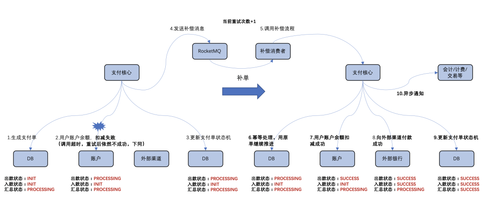
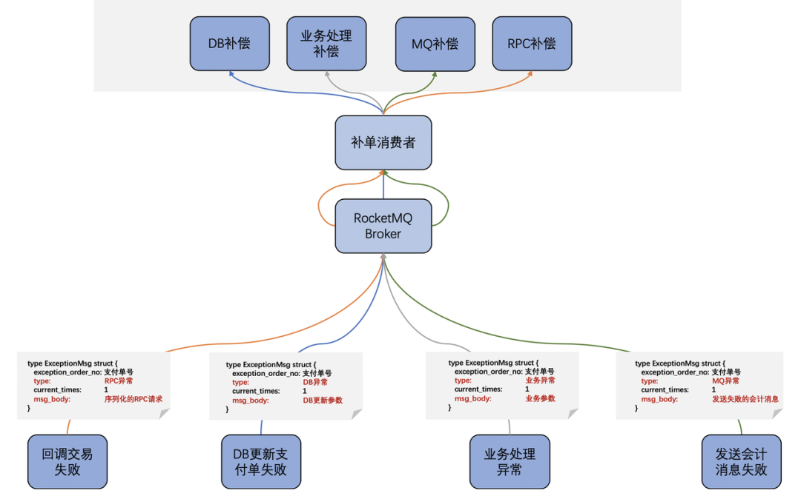
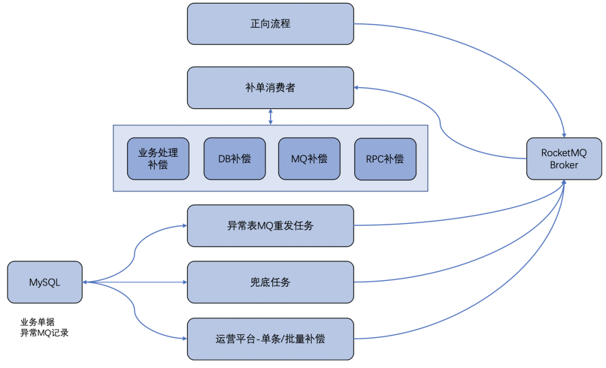

# 项目总结

## 风控

### 架构以及负责部分

部门是toB的小额贷款，总体结构分为业务风控，风控又分为风控服务，风控引擎，预警系统，数据系统。  

* 风控服务是核心服务，提供风控的对外接口，包括各类数据的查询，风控引擎的调用，订单的查询和补单等  
* 风控引擎提供订单的风控结果，只能由风控服务调用
* 预警系统提供风控预警服务
* 数据系统为风控提供数据支撑，主要对接其他部门和其他的数据方

负责的部分是风控服务和预警系统中的一部分，在风控服务中主要负责一些管理系统的接口，以及历史订单重跑。在预警系统中主要负责贷中预警的开发  

### 技术组件

SpringBoot、MySQL、Redis、Dubbo、RocketMQ、Apollo、Elastic-Job  

### 核心数据表

主要订单逻辑：

* 业务请求进来，需要判断是否是历史请求，则历史请求落盘的请求表

* 订单落盘需要订单表（请求用的ID是业务ID，而订单表中的ID是风控自己的ID）
* 订单对应风控引擎的规则不一样，需要产品表、场景表
* 产品场景和订单的关联表
* 订单对应的主体需要一张信息表

历史订单重跑：

* 历史订单重跑任务表
* 历史订单表

风控预警：

* 预警任务表
* 预警订单和结果表

名单库：

* 黑名单表
* 白名单表
* 第三方名单表

### 难点

#### 1. MQ异步调用风控请求接口

在风控的历史订单重跑和贷中预警时，都是采用了定时任务的方式，**定时任务触发时，扫描订单表，灌进风控引擎去重跑订单，采取分页查询降低了数据库压力，但是可能会多个定时任务同时触发，同时调用，重跑的订单可能同时调用风控接口，造成数据库压力很大。所以采用MQ异步，削峰，将数据先打入MQ中，然后消费方一条一条逐步消费，缓解数据库压力**    

如果MQ消息发送失败了怎么办？ catch异常，重试发送，直到发送成功。设置一个最大重试次数，如果超过重试次数还没有发送成功，则将数据放入一个异常消息表，由后台的定时任务扫表重试发送。但是对于目前RocketMQ的可用性来说，异常消息一般不会发生。

#### 2. 风控接口幂等

幂等性是指，同一个接口的多次调用，对目标产生相同的影响。   

在风控系统中，一个订单的流程是单向的，唯一的，同一个订单多次调用不能打破原本订单的流程，即满足了幂等性。  

实现订单唯一性采用了：唯一订单ID，分布式锁，乐观锁刷盘。另外订单状态修改要加行级排他锁  

订单如果因为网络原因或者引擎原因卡单了，会有一个定时任务补单。    

##### 这里为什么要分布式锁，先查后存，而不是直接存，让数据库把冲突异常抛出来呢？

因为如果直接insert，那么检测到冲突键时，会对数据库中这条冲突数据加**Next-key lock**，影响后续其他事务的提交。所以先加分布式锁，如果枷锁成功，说明目前没有这个订单正在运行，然后查询，说明这个历史订单，查询不会加锁，而是MVCC快照读；如果查不到，再进行Insert，这时Insert不会有冲突数据，会加隐式锁，隐式锁不是锁，只会在其他事务竞争锁的时候才生成锁结构。这样**减轻数据库压力，让数据库做尽可能少的操作**  

##### 为什么要用乐观锁？

其实前面已经保证幂等了，利用乐观锁数据对比的方式将订单状态刷盘，不直接刷盘的原因是，保障系统幂等安全，多加一层防护。加Version字段防止ABA现象  

##### 为什么用乐观锁不用悲观锁？

* 数据库表中数据量比较大，用排他锁开销太大，我们希望尽量降低数据库压力
* 我们并发比较低，冲突概率低，用乐观锁失败概率小·
* 也不能用synchronized，因为本地重锁在分布式环境下无效
* 不能用分布式锁，因为我们希望尽量减少加锁的成本。而且分布式锁需要依赖其他服务，不可靠

#### 3. 同步转异步

利用线程池 + FutureTask，将原本的同步调用转为异步调用。

#### 4. 风控和业务方双向认证保证调用安全

双向tls，两边都用自己的公钥放在数字证书里，发送给对方，认证自己的公钥是完整的，并且接下来用Hash做摘要，用私钥做数字签名，发送消息给对方，对方可以用公钥解开签名，说明消息确实是对方发出的，并用同样的Hash做摘要，验证消息没有被篡改。  

这里数字证书可以用自签数字证书，需要证书的接收方，手动添加信任的证书。但无需CA认证，节约成本。  

#### 5. 子查询优化

分页查询`SELECT * FROM employee WHERE posId = 33 LIMIT 10,10`，其中posId没有加索引，如果偏移量很大，那么会扫描前面很多数据，才取到当前数据，并且会把前面扫描掉的数据丢掉  

可以利用子查询优化，先把满足条件的第一条数据主键id查出来，再在这条数据后面顺序查

```
SELECT * FROM employee WHERE posId = 33 AND id >= (SELECT id FROM employee WHERE posId = 33 LIMIT 10, 1) LIMIT 10;
```

或者先利用索引查询把匹配条件的id全都查出来，这时候是走索引的，然后再在已经匹配的信息子表里面limit  

```
EXPLAIN SELECT * FROM employee_copy1 INNER JOIN (SELECT id FROM employee_copy1 WHERE posId = 33) as a USING(id) LIMIT 10, 10
```

或者使用ON（这里注意区别ON 和 USING）

```
EXPLAIN SELECT * FROM employee_copy1 INNER JOIN (SELECT id FROM employee_copy1 WHERE posId = 33) as a ON(employee_copy1.id = a.id) LIMIT 10, 10
```


#### 6. 补单

https://mp.weixin.qq.com/s/9Z-N3cfWu7oMVJsTDkbb-Q  

请求进来，如果是重复请求ID，则分两种情况，一种是参数也相同，则说明是**业务方补单**，则风控检查一下单子是不是卡单（订单超时了还没有到达终态）了，如果卡单了则风控内部补一单，并且返回给调用方，订单的状态以及补单的信息；另一种是参数不同，说明两个请求订单的ID重复了，返回错误。    

一般补单采用**定时任务扫表的方式**，实时性不够，但对于小额贷款的业务场景是适合的。另外补单的定时任务并没有直接去做补偿工作，而是通过RPC调用暴露出来的补偿接口。这么做的原因是**将逻辑收敛到一处，便于维护**。      

##### 如果是支付流程，补单需要实时性怎么办

##### 1. 初级版支付补单 

  


如果支付过程中失败，重试依然失败，则更新状态机之后，利用RocketMQ发送补偿信息。补偿消费者调用支付核心的补偿接口来补偿。  

如此补偿会出现三个问题：

1. RocketMQ消息发送失败了怎么办？
2. 补偿消费者补偿失败怎么办？（原因可能是补偿请求没过去，或者是补偿接口调用超时，但是实际补偿成功了）
3. 补偿消费者到达重试次数，补单依旧失败怎么办？

##### 2. 改进版支付补单

* 针对问题1：如果重试依然发送失败，我们通过引入一张异常消息表，将发送失败的消息落库来解决。表中记录了订单号、当前的重试次数、异常分类、记录状态、消息体等字段。如果第 4 步消息发送失败，就将这笔订单放入 DB 中的一张异常表中，会设置一个定时任务去处理。以目前 RocketMQ 的可用性来说，异常数据很少会出现。
* 针对问题2：如果补偿消费者调用补偿接口失败，不论什么原因。Handler一定会将异常或者error抛出，利用RocketMQ的重试机制（返回给RocketMQ以这个结果：ConsumeConcurrentlyStatus.RECONSUME_LATER），当消费重试次数达到一定次数时（默认16次），进入死信队列。这种情况一般是支付核心服务问题或者是网络问题，去排查问题之后，再从死信队列拉这些消息统一处理。  （在RocketMQ中，可以通过使用console控制台对死信队列中的消息进行重发来使得消费者实例再次进行消费。）
* 针对问题3：超过最大次数，仍然补单失败，一般是下游出问题了，这种情况也将他们存到异常表中。针对这类问题，放入异常表之后，需要支持单条/批量支付单补单的能力，以支持人工介入。最好有一个业务低峰期的兜底定时任务，扫表补单。

另外，兜底补单会造成短暂的订单堆积，可能会影响线上的实时补单。**将兜底补单和实时补单的MQ Topic分开**

##### 3. 最终版支付补单

其实补单并不是必须要走完完整的流程，如果只是**异常通知类的操作出现了异常，缺啥补啥即可**。将异常划分为多种类型，精细化管理。  

  

- 通知下游的 MQ 失败，就将这个消息体重发一次即可；
- 通知交易的回调 RPC 失败，可将 RPC 请求序列化到消息体中，补偿时通过反序列化消息体中的 RPC 请求，直接再发起一次 RPC 即可；
- 对于更新 DB 失败，将更新参数序列化到消息体中，补单时再次发起一次更新；
- 如果在业务处理时遇到了异常情况，需要再走一遍业务补偿；

#### 最终形成的支付补单体系

  

